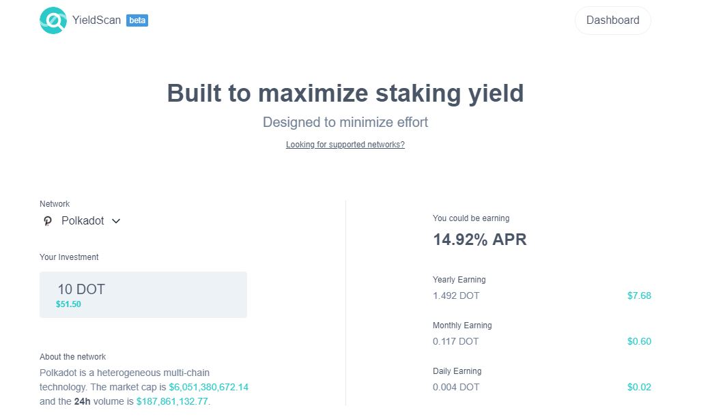
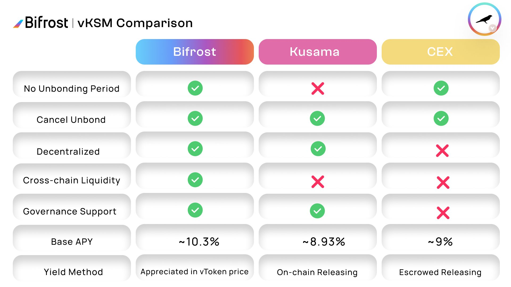
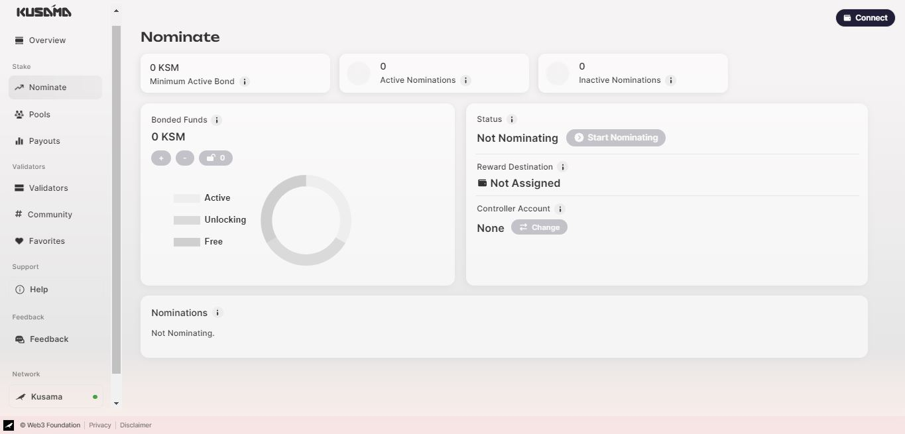
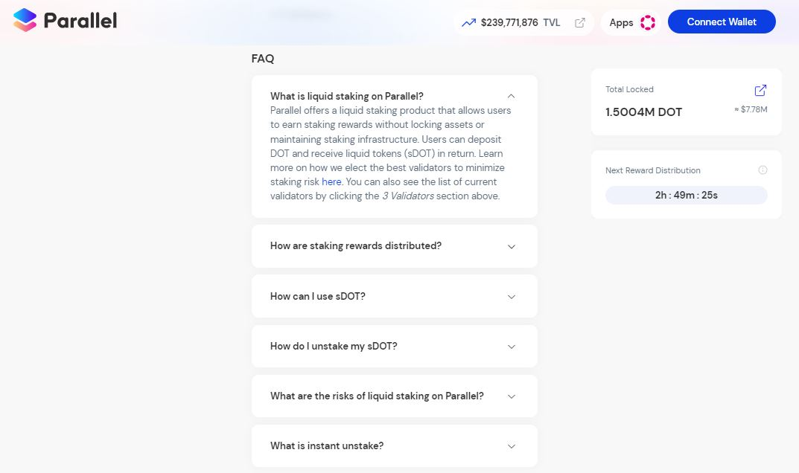
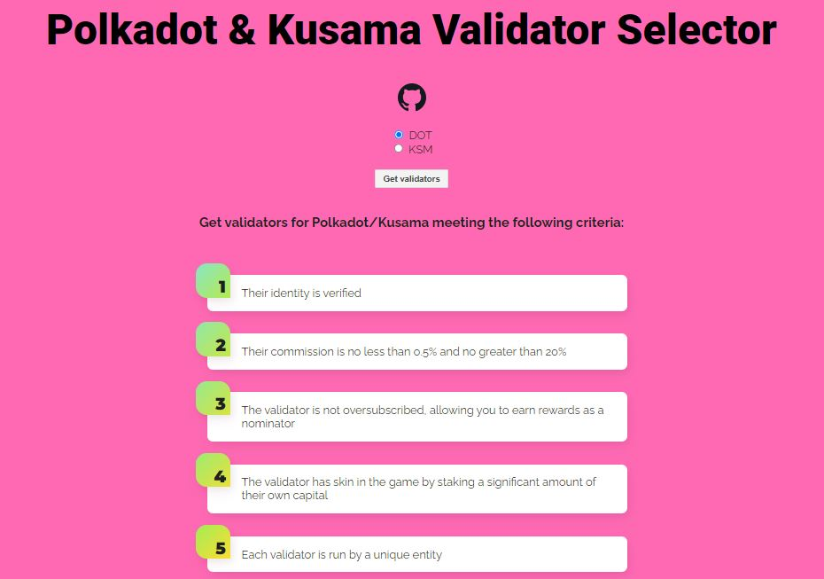
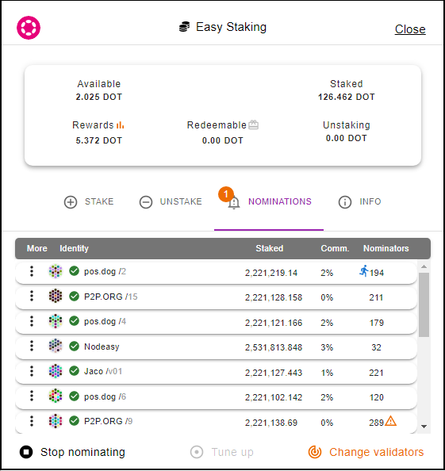

# Nominating

## Who are Nominators?

Nominators play a central role in the election of the validators who approve transactions and produce blocks. By locking their funds in staking protocols, they are not only helping protect the network from bad actors, but also maximising returns for themselves.

<figure><figcaption>
<a href="https://yieldscan.app/">YieldScan</a> empowers nominators to optimise their staking operations.
</figcaption></figure>

### **How-to: Selecting Staking Platforms**

Broadly-speaking, nominators have many options for participating in staking operations. There are relay chain-based options such as On-chain staking and Nomination pools, but there are also exchange-based options, namely Liquid staking on DEXes, and Earning programmes on CEXes.

<figure><figcaption>
A <a href="https://bifrost.app/vstaking/vKSM">comparison</a> of staking options for KSM.
</figcaption></figure>

Staking directly on Relay chains involves bonding a minimum amount of tokens (i.e 0.1 KSM on Kusama and 10 DOT on Polkadot), selecting suitable validators (i.e up to 24 on Kusama and up to 16 on Polkadot), and claiming/receiving rewards. Recently, Nomination pools have been introduced to lower staking requirements. Token holders can start earning rewards with 1 DOT and the validators selection is tasked upon the pool administrator. However, pool participants cannot use their bonded tokens to participate in [governance](../voting/) and the use of staking proxies is not yet permitted.

<figure><figcaption>
The <a href="https://staking.polkadot.network/#/nominate">Staking dashboard</a> is a one-stop platform for managing staking operations on Relay chains.
</figcaption></figure>

By contrast, exchanges offer more flexible ways to stake your funds. Liquid staking eliminates the unbonding period (i.e 7 days on Kusama and 28 days on Polkadot) and provides users with staking derivative tokens that they can use across ecosystem DEXes. Meanwhile, CEXes often compete in providing participants with high staking returns in exchange for locking their funds on their platforms. An important point to note is that staking operations are entirely controlled by exchanges and comes with a mandatory acceptance of their terms and conditions.

<figure><figcaption>
FAQ on <a href="https://app.parallel.fi/staking">ParallelFi's Liquid staking</a> procedures.
</figcaption></figure>

### **Risks: Safety Checks for Nominating Validators**

Risk management best practices fall under three categories: using secure setups, choosing reliable validators, and monitoring staking parameters.

For optimal security, you need to separate the stash account that holds and bonds your funds from the controller account that unbonds funds and nominates validators. Preferably, you should leave your stash in [cold storage ](../../2.storage/cold-storage-devices.md)and use either a staking proxy for On-chain staking or a non-transfer proxy for Nomination pools. In case one of your private keys gets phished, this configuration will ensure that your bonded tokens and your staking income cannot be simultaneously accessed by the thief.

<figure><figcaption>
Secure staking setups are supported by a wide range of Treasury-funded <a href="https://support.polkadot.network/support/solutions/articles/65000068702-where-to-store-dot-polkadot-wallet-options">wallets</a> in the Polkadot ecosystem.
</figcaption></figure>

It is recommended to avoid picking validators that are operating "at capacity," as they may already be oversubscribed, which prevents you from getting any rewards. You should also consider choosing validators with a combination of low commission, minimal or no slash history, and sizable self-stake. In support of decentralisation, you could also select your validators from different geographic locations or with noticeable community involvement.

<figure><figcaption>
The <a href="https://james-sangalli.github.io/dot-validator-selector/">Validator selector</a> tool screens and picks network validators according to specific criteria.
</figcaption></figure>

Finally, remember to monitor your validators to ensure that you remain eligible for rewards throughout the entire duration of your staking operations. As a safety measure, you should regularly check that your validators' commission fees are consistent, as these rates can be changed at any time and reduce your overall staking income.

<figure><figcaption>
<a href="https://polkagate.xyz/">Polkagate wallet</a>'s user interface makes it easy to manage nominations.
</figcaption></figure>

