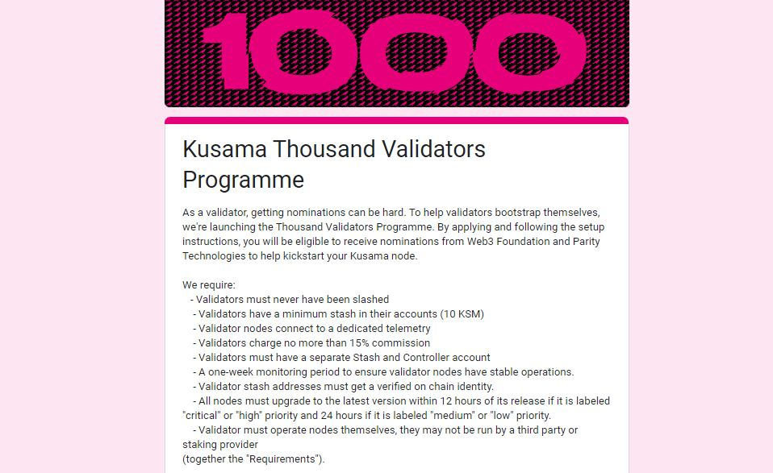
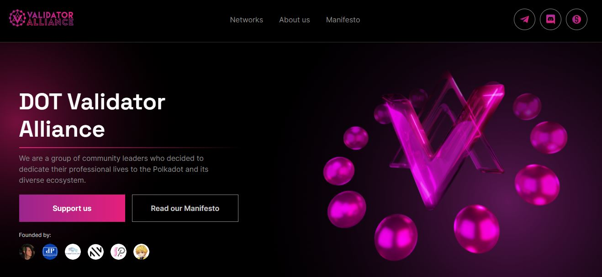

# Validating

## Who are Validators?

Validators are tasked with the production of Relay chains blocks and the verification of the state of Parachains. As part of the Nominated Proof-of-Stake (also called NPoS) model, validators are elected via an algorithm that takes into account both the number and the stake of [nominators](nominating.md) that have selected them.

<figure><figcaption>
The application form for the <a href="https://polkadot.network/blog/join-kusamas-thousand-validators-programme">Kusama 1KV programme</a> summarising core requirements.
</figcaption></figure>

### How-to: Providing Network Security&#x20;

Becoming a node operator requires infrastructure that can be scaled to handle current and future demand for blockspace on the network. These setups can be deployed on bare metal machines located at data centres or on virtual machines from cloud providers. Depending on the type of infrastructure that they choose, validators can get more control over the costs, deployment, performance, geo-location and environmental impact of their operations.

Aside sourcing reliable infrastructure, validators need to sync chain’s data, set up stash and controller accounts for their nodes, obtain different session keys for each of their nodes, and decide on a viable commission. There are a wide range of monitoring [tools](../../../useful-tools/staking-tools.md) that can be used by validators to inspect, diagnostic, and prevent issues related to syncing, disputes, and slashes.

To receive rewards, each validator has to be elected into the active set. This automated process involves weighing the stake owned by and lent to each validator to maximise the amount of tokens locked in securing the network. Some operators choose to split their stake across multiple instances in different geolocations to increase their odds at getting elected.&#x20;

Though block rewards are shared equally between elected validators regardless of their overall stake, other factors such as era points and tips can increase the total value of the rewards received. Validators are free to set their own staking commission fees, which will be deducted from the total rewards received before these are shared with nominators.

<figure><figcaption>
The <a href="https://dotvalidators.org/">DOT Validator Alliance</a> is a DAO for node operators who uphold the principles of decentralisation over profits.
</figcaption></figure>

### Risks: Managing On-chain Behaviours

Setting up a validator on Relay chains in the Polkadot ecosystem is a thorough and demanding process, as operators need to be technically-inclined to handle both hardware and software issues as they arise. Mishaps such as encountering downtimes, exposing/mishandling session keys, or running deprecated clients are automatically recorded by ecosystem-wide tracking tools, which will negatively impact a validator's on-chain reputation.&#x20;

There are also specific risks associated with [infrastructure](../../5.regulations/networks/infrastructure.md) setups. When operating from cloud servers, it is good practice to use separate geolocations for primary and standby instances in case a restart is deemed necessary. Similarly, bare metal operators tend to carry all the responsibilities for node management, including maintenance and troubleshooting. It is therefore important to consider your own availability and technical capabilities before you set up validator nodes.

Finally, it is recommended to avoid setting high commission fees, as this deters nominators and could prevent your validator from getting into the active set. Prospective validators can seek more guidance on running a node by enrolling into the [1KV program.](https://polkadot.network/blog/supporting-decentralization-join-the-polkadot-thousand-validators-programme) This initiative helps new and existing validators improve their ranking through a point system linked to specific behaviours and metrics which include participating in governance, operating from unique geolocations, bond size, etc.&#x20;

