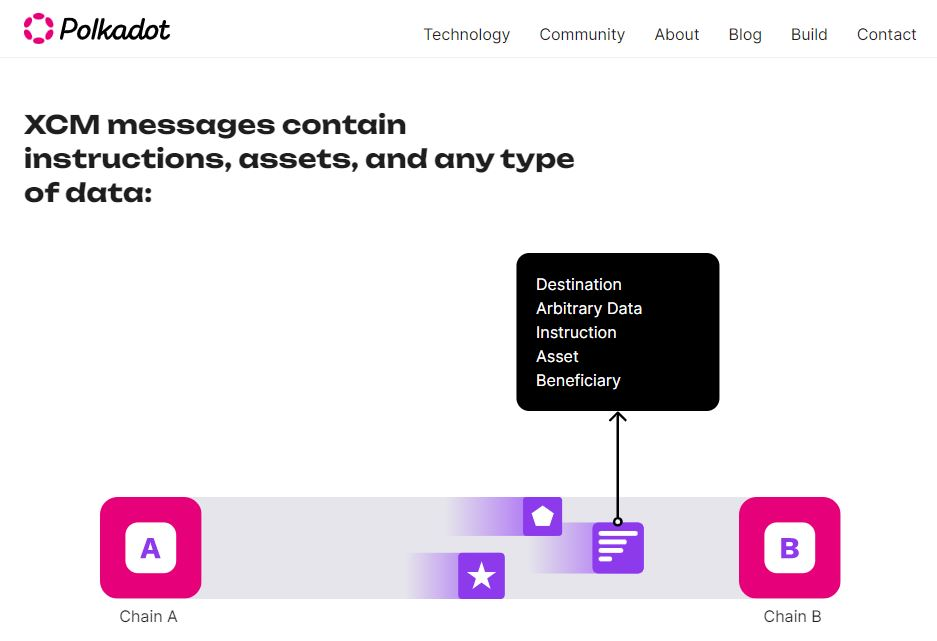

# Swapping

Swapping tokens sits at the core of Decentralised finance (DeFi) operations undertaken on Decentralized exchanges (DEXes), because it enables users to retain full control of their funds, [access a wider range of providers](pairs-availability.md), and spread portfolio risk across different assets.

In the Polkadot ecosystem, swapping functionalities are further boosted by interoperability protocols which allow parachains to leverage each other's assets without any intermediaries.

<figure><figcaption>
The <a href="https://polkadot.network/cross-chain-communication/">XCMP protocol</a> underpins trustless cross-chain swaps within the Polkadot ecosystem.
</figcaption></figure>

