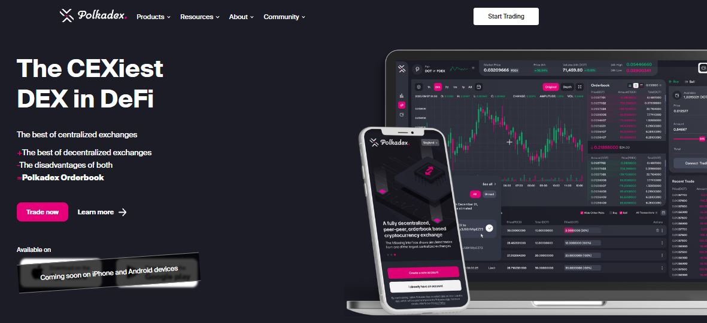
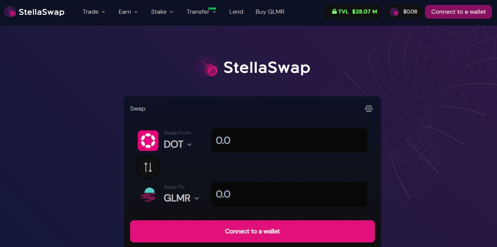
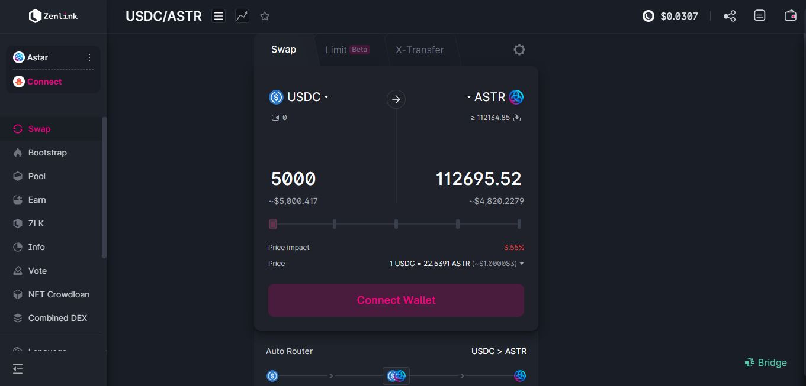
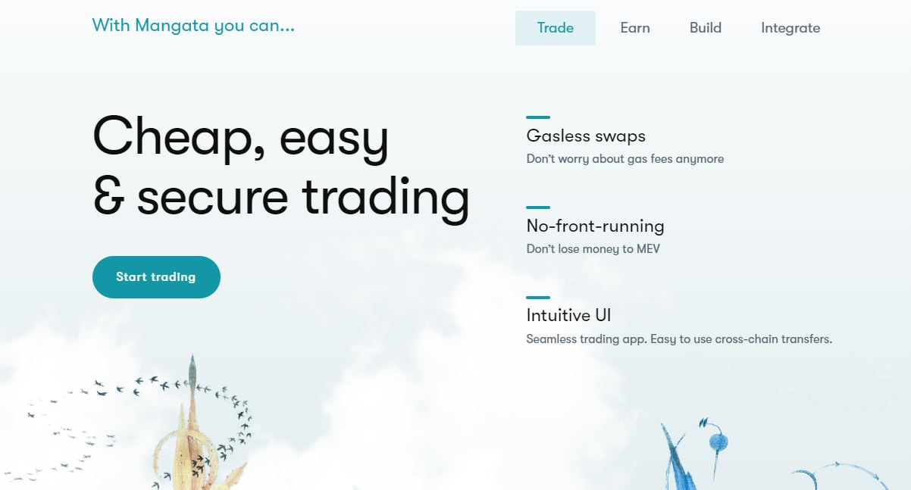

# Token Swaps

_<mark style="background-color:red;">Disclaimer: This article is written by</mark> <mark style="background-color:red;"></mark><mark style="background-color:red;">**Dot.alert()**</mark> <mark style="background-color:red;"></mark><mark style="background-color:red;">contributors for educational purposes only. This article should not be used as a substitute for competent legal or financial advice from a licensed professional in your country.</mark>_

## What are Token Swaps ?

Token swaps involve exchanging cryptocurrencies without drawing on fiat. On Decentralised Exchanges (DEXes), these operations rely on the Automated Market Marker (AMM) model where a liquidity pool holds a pair of tokens and an algorithm is used to maintain a specific balance of tokens in the pool. The price of each token is adjusted dynamically, based on the ratio within the pair at the time the transaction is executed.

<figure><figcaption>
Kagla Finance's app from the Astar ecosystem supports token swaps across multiple networks.
</figcaption></figure>

### How-to: Swapping tokens on DEXes

Traditional token trading on Centralized Exchanges involves using the Orderbook model to match buyers and sellers of particular assets and for specific prices. This setup is entirely managed by custodians who handle all operations on behalf of their users. By contrast, swaps take place on non-custodial platforms with no registration requirements.

<figure><figcaption>
Polkadex Orderbook combines functionalities of Centralised and Decentralised exchanges. 
</figcaption></figure>

While token swaps used to have the reputation of being costly in transaction fees, this is no longer the case with application-specific chains. In the Polkadot ecosystem, the majority of DEXes are native to their parachains, which allows for an extensive customisation of their fee model. Some platforms operate with a "flexible fee" schedule whereby users can select any token they hold to pay for their [transactions](../../1.acquisition/transaction-explorers.md). Other platforms run with feeless transactions either temporarily, as part of a special offer, or permanently.

<figure><figcaption>
Acala network implements minimal transaction fees that are payable in any token.
</figcaption></figure>

A unique feature of the swapping experience within the Polkadot ecosystem is the ability to carry operations across parachains without relying on any bridge or relayer. Communications between DEXes are handled by a cross-chain protocol supported by the relay chains (HRMP), which brings convenience, efficiency, and security to users while seamlessly validating transactions.

<figure><figcaption>
Stellaswap deployed on Moonbeam network integrates cross-chain and multichain functionalities.
</figcaption></figure>

It is also worth mentioning that most ecosystem DEXes have integrated bridging protocols for EVM compatibility. Therefore, they support transactions to and from other popular blockchains like Ethereum, Polygon, and Avalanche from the same interface. This enables hitch-free multichain swaps for a variety of token standards.

### Risks: Safety checks for AMM-based Token Swaps

The most notable downside of AMM-based swaps is slippage. When there isn't enough liquidity for a given pair on a platform, users have to pay above market prices for their swaps. As a result, the larger the value of the tokens requested, the costlier the swap operation. To minimise slippage, some DEXes use various protocols to source liquidity within and outside the ecosystem, however users can also manually set slippage limits while swapping to avoid unexpected losses.

<figure><figcaption>
Zenlink DEX's interface provides warnings about high slippage swaps.
</figcaption></figure>

Another drawback of swaps is front-running, which occurs when market participants watch information about upcoming transactions and manipulate network [operations](../) to their advantage. Bots are used to swiftly buy tokens in a given pair at low prices and then sell these to ordinary users at much higher prices. DEX users should take care to review their swaps information carefully before approving a transaction, as token valuations can quickly change from one moment to the next.

<figure><figcaption>
Mangata DEX offers protection against frontrunning.
</figcaption></figure>

