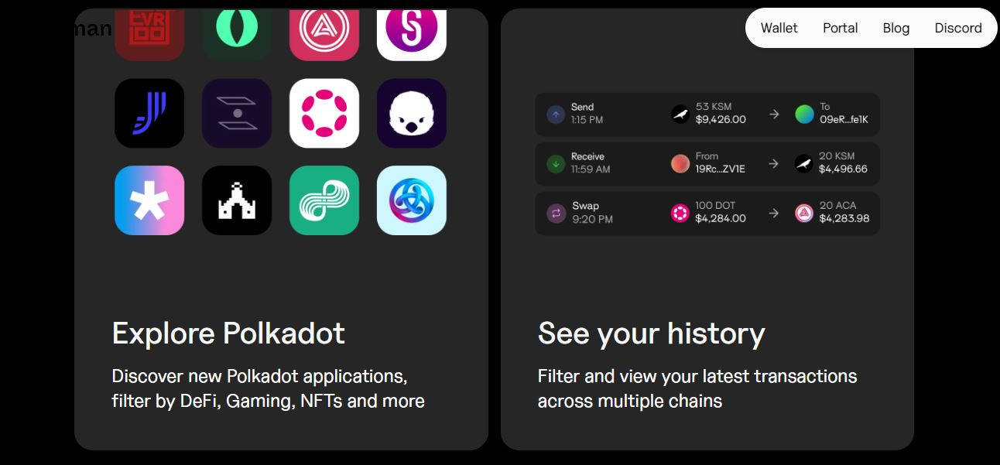
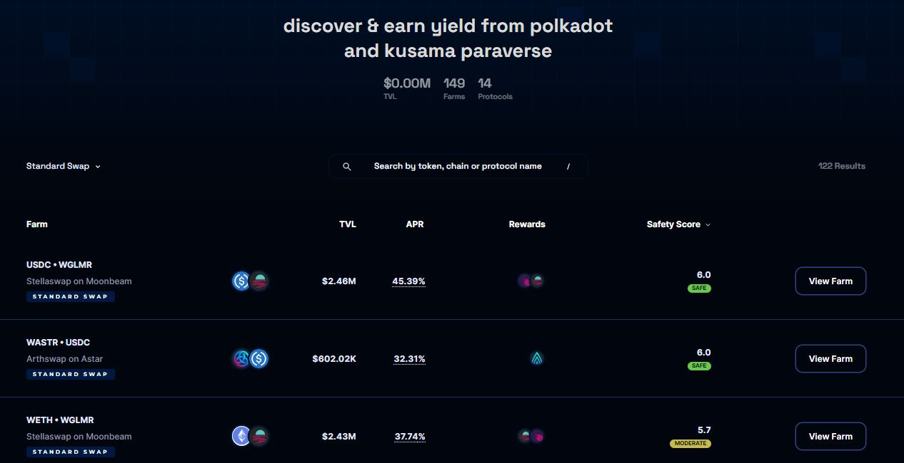
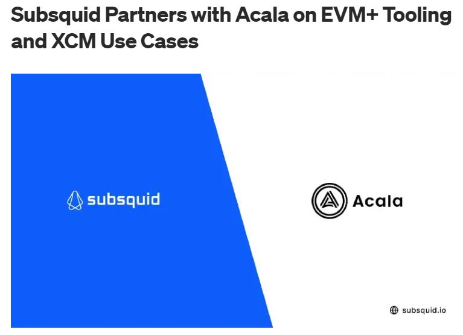
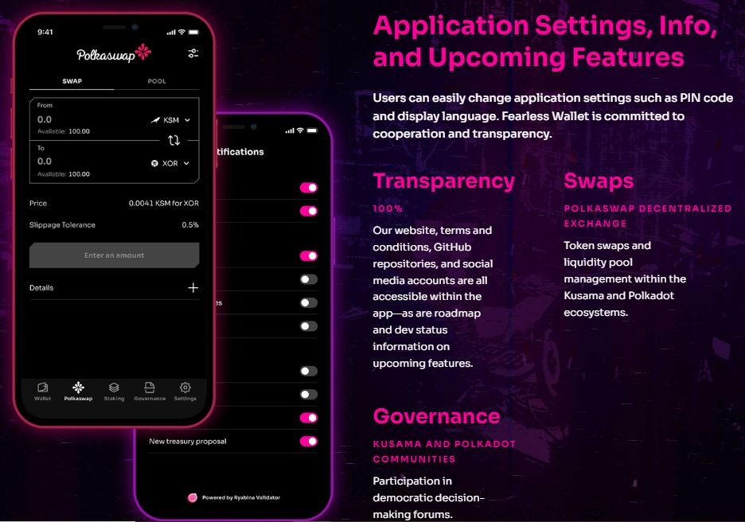
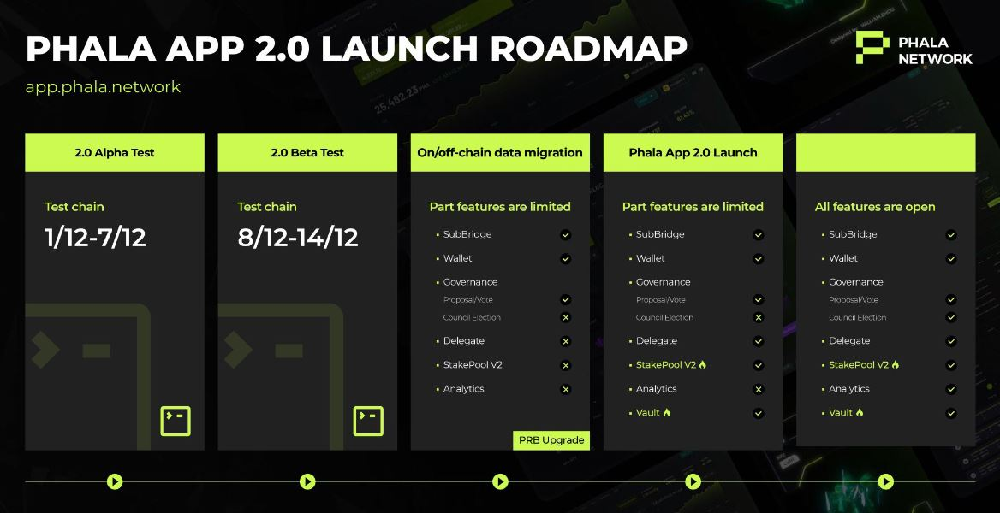

# Portfolio management

Portfolio management encompasses a range of operations that allow users to monitor, preserve, and grow their assets. Because assets valuations can vary greatly over a short period of time, sourcing suitable tools is key to maintaining or increasing  acquired value while dealing with uncertainties.&#x20;

## How-to:

Portfolio management tools are wallets and dapps that summarise the number and the fiat value of tokens held in an account across multiple networks and blockchains. These applications vary slightly in functionalities, but they usually possess the following features:

• non-custodial and open source software

• real-time market data

• cross-chain or multichain transaction history&#x20;

• staking and crowdloans support

<figure><figcaption>
<a href="https://www.talisman.xyz/portal">Talisman wallet's portal</a> offers a range of portfolio management tools.
</figcaption></figure>

During periods of high price fluctuations, experienced users often carry out arbitrage transactions to rebalance or increase the value of their portfolio. They do so by buying assets sold at a cheaper price on one platform and selling them on any platform where they are valued at higher price. In the Polkadot ecosystem, this practice is facilitated by cross-chain communication protocols which support cheap and fast transfers of assets from one network to another.&#x20;

<figure><figcaption>
<a href="https://list.yieldbay.io/">Yieldbay</a>'s dashboard summarises yield farming opportunities for the Polkadot ecosystem.
</figcaption></figure>

As there is [a growing number of assets](token-swaps.md) (i.e stablecoins, network tokens, NFTs, staking and crowdloan derivatives, etc.) that are traded over different dapps, users need customisable interfaces to build an in-depth view of their holdings. DeFi platforms and Data aggregators are partnering to give advanced network participants the opportunity to build their own native swapping solutions. Some of these include watching token pairs activities, retrieving price feeds, or running arbitrage bots.

<figure><figcaption>
<a href="https://medium.com/subsquid/subsquid-partners-with-acala-on-evm-tooling-and-xcm-use-cases-9de22255b6b4">Subsquid and Acala</a> are developing interoperable tooling support for developers and DeFi users. 
</figcaption></figure>

## Risks:&#x20;

A major drawback to using third-party tools to manage your portfolio is that new assets and/or all networks are not always supported in real-time. Users might have to go through a waiting period before they can transact with their tokens from the interface. These delays may inadvertently impact your monitoring and tracking procedures.

<figure><figcaption>
Fearless wallet's <a href="https://fearlesswallet.io/#Roadmap">integration of Polkaswap AMM functionalities</a> is in development.
</figcaption></figure>

It is also important to remember that Parachains go through regular runtime upgrades that can affect the platforms that are built on top of them. In the case of DeFi aggregators, a discrepancy could occur on the data that is pushed onto users' dashboards. It is therefore essential to check that your chosen portfolio management tool is well-maintained and kept up-to-date.

<figure><figcaption>
<a href="https://app.phala.network/">Phala app</a> has gone through multiple improvements in line with network's upgrades.
</figcaption></figure>

Furthermore, engaging in arbitrage is not always a straightforward operation. On the one hand, custom-made tools might suffer bugs and hacks, and subsequently fail to execute the desired swaps. On the other hand, there may not be enough liquidity to conduct a sell transaction at the desired price, which could lead to noticeable losses.&#x20;

