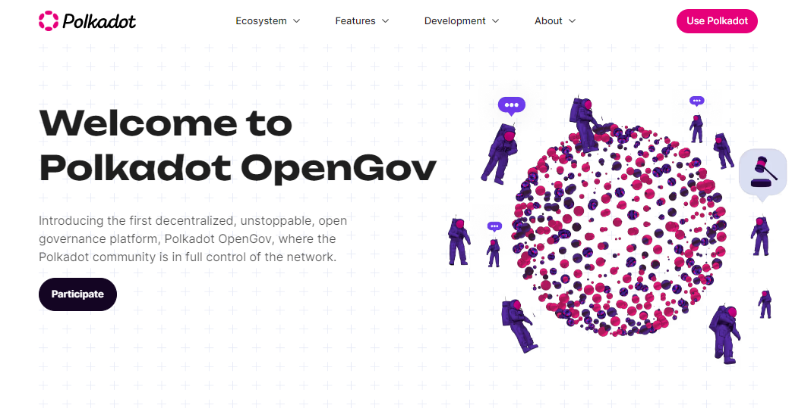

# Voting

Voting is the decision-making power given to all DOT token holders in the Polkadot ecosystem. Principally, partaking in on-chain governance means using/locking tokens to vote for or against proposed changes to current network operations.&#x20;

Every token holder has the opportunity to:&#x20;

* [vote directly](direct-democracy.md) on OpenGov referenda
* [delegate their voting power](democracy-delegation.md) to someone else

<figure><figcaption>
<a href="https://polkadot.network/features/opengov/">Polkadot OpenGov</a> gives the decision-making power of the network to token holders.
</figcaption></figure>

