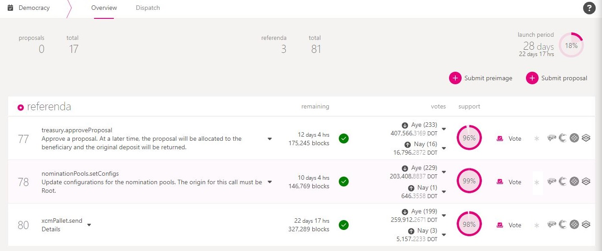

# Voting

Voting is the democratic power given to all token holders in the Polkadot ecosystem. Principally, partaking in on-chain governance means using your tokens to vote for or against proposed changes to current network operations.&#x20;

Every token holder has the liberty to:&#x20;

* endorse referendum proposal
* vote directly for referenda
* delegate their voting power to someone else

<figure><figcaption>
Overview of referenda voting for Polkadot network on <a href="https://polkadot.js.org/apps/?rpc=wss%3A%2F%2Fpolkadot.public.curie.radiumblock.io%2Fws#/democracy">Polkadot-JS Apps</a>.
</figcaption></figure>

