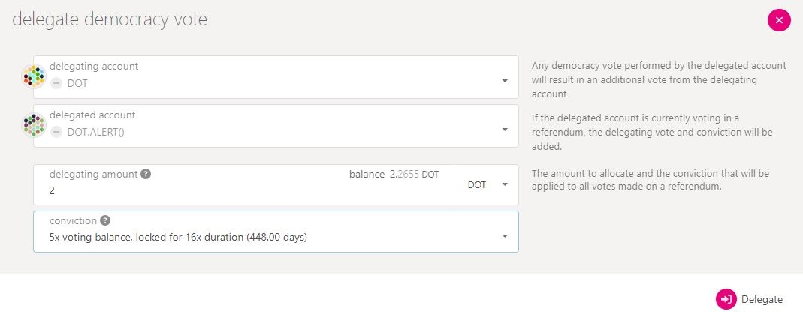
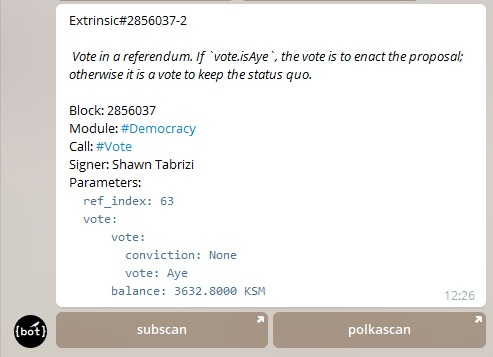

# Democracy Delegation

## What is Democracy Delegation?

Democracy delegation is when you delegate your funds to another account to represent you for voting. It works almost the same way as [direct democracy](direct-democracy.md) in terms of setups for amounts and conviction. Only that, this time, your voting power is at the discretion of a third-party user called "delegated account".

<figure><figcaption>
<a href="https://polkadot.js.org/apps/?rpc=wss%3A%2F%2Fpublic-rpc.pinknode.io%2Fpolkadot#/accounts">Polkadot-JS Apps</a> provides an interface for delegating democracy votes.
</figcaption></figure>

### How-to: Participating in Governance via Democracy Delegation

In the current governance system, token holders can only delegate to one account at a time, and this account represents them for all governance decisions. In this setup, delegated accounts get the delegating account's voting balance, voting conviction, and lockup duration added to their own personal voting preferences at all time.&#x20;

With OpenGov (also called Governance 2.0), there will be a more flexible option for vote delegation, since different referendum classes will run in parallel, each carrying many proposals. This will enable multirole delegation, a process in which voters delegate their power to different accounts across different referendum classes.

<figure><figcaption>
A selection of referendum classes from the upcoming <a href="https://polkadot.network/blog/gov2-polkadots-next-generation-of-decentralised-governance/">Gov 2.0 upgrade</a>.
</figcaption></figure>

This is a huge improvement to the current modus operandi, as not all delegated accounts can be trusted to consistently take the best decisions in all governance activities. While one delegate may be best to handle _MediumSpender_ proposals, another may be a better fit for handling _Root origin_ proposals.

In light of this, one could devise a series of criteria for choosing their representative for each referendum class. A useful checklist can include:

* the account's previous track record of decision-making in a governance activity that matches the referendum class in question.&#x20;
* the account’s role in the ecosystem; as a member of a certain rank from the Polkadot fellowship may be a better delegate for the _Root origin_ class.
* the account's community activities in relation to a particular referendum class.&#x20;
* the account's ability to make rational choices in [governance-related discussions](../../4.social-support/polkassembly.md) and debates.

### **Risks: Mitigation Strategies for** Democracy Delegation procedures

Democracy delegation should never be a set-and-forget endeavour. Handing over your voting power is a risky sacrifice that may result in unwanted outcomes if not managed properly. Delegated accounts can end up being victims of a hack and,  although your delegated funds are non-transferable by nature, this attack may result in a subsequent leverage of your votes for malicious proposals.&#x20;

<figure><figcaption>
<a href="https://ryabina.medium.com/track-anything-ultimate-guide-for-polkadot-and-kusama-telegram-bots-a47aa913f8b">Ryabina Telegram bots</a> allow users to keep track of ecosystem governance activities. 
</figcaption></figure>

Hence the need to constantly review, or if need be, regularly change your delegates to ensure alignment of interests. To incentivise this safety measure, a follow-up governance improvement called "Gov2.5" will allow free undelegation transactions for all delegating accounts, within reasonable limits.&#x20;

