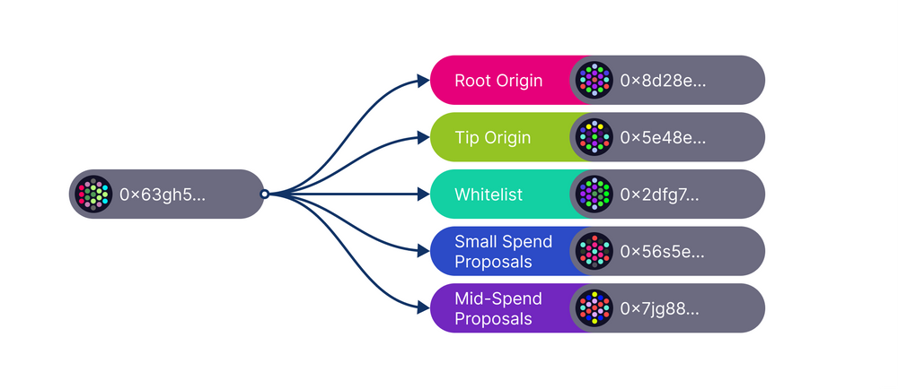
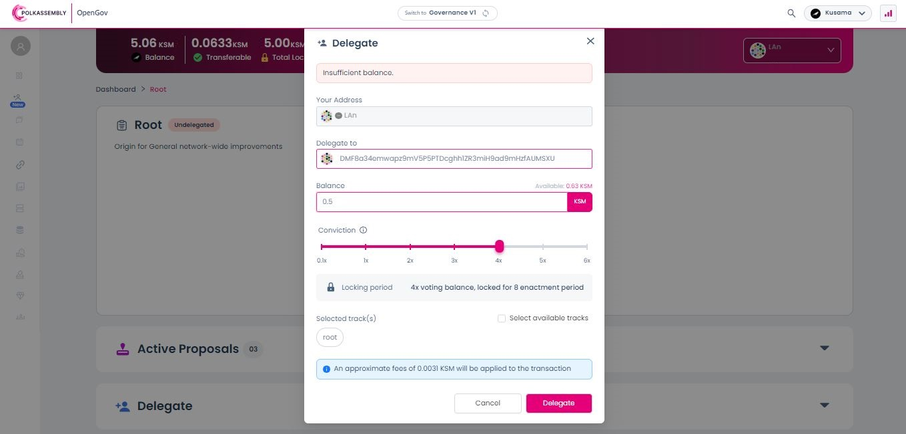

# Democracy Delegation

## What is Democracy Delegation?

Democracy delegation is when you delegate your funds to another account to represent you for voting. It works almost the same way as [direct democracy](direct-democracy.md) in terms of setups for amounts and conviction. Only that, this time, your voting power is at the discretion of a third-party user called "delegated account".

### How-to: Participating in Governance via Democracy Delegation

Under the previous governance system, token holders could only delegate to one account at a time, and this account represented them for all governance decisions. Back then, delegated accounts inherited the delegating account's voting balance, voting conviction, and lockup duration which were added to their own personal voting preferences.&#x20;

With OpenGov, there is a much more flexible option for vote delegation, since different multiple referendum classes run in parallel, each carrying many proposals. This enables multirole delegation, a process in which voters delegate their power to different accounts across different referendum classes also known as "origins".

<figure><figcaption>
A selection of referendum origins implemented on <a href="https://guide.kusama.network/docs/maintain-guides-opengov/#origins-and-tracks">OpenGov</a>.
</figcaption></figure>

This represents a huge improvement in coordination, as not all delegated accounts can be trusted to consistently take the best decisions in all governance activities. While one delegate may be best to handle _MediumSpender_ proposals, another may be a better fit for handling _Root origin_ proposals.

In light of this, one could devise a series of criteria for choosing their representative for each referendum class. A useful checklist can include:

* the account's previous track record of decision-making in a governance activity that matches the referendum class in question.&#x20;
* the account’s role in the ecosystem; as a member of a certain rank from the Polkadot Fellowship may be a better delegate for the _Root origin_.
* the account's community activities in relation to a particular referendum class.&#x20;
* the account's ability to make rational choices in [governance-related discussions](../../4.social-support/polkassembly.md) and debates.

<figure><figcaption>
Polkassembly provides an interface for delegating OpenGov votes.
</figcaption></figure>

### **Risks: Mitigation Strategies for** Democracy Delegation procedures

Democracy delegation should never be a set-and-forget endeavour. Handing over your voting power is a risky sacrifice that may result in unwanted outcomes if not managed properly. Delegated accounts can end up being victims of a hack and, although your delegated funds are non-transferable by nature, this attack may result in a subsequent leverage of your votes for malicious proposals.&#x20;

Hence the need to constantly review, or if need be, regularly change your delegates to ensure alignment of interests. To incentivise this safety measure, a follow-up governance improvement is planned to allow free undelegation transactions for all delegating accounts, within reasonable limits.&#x20;

