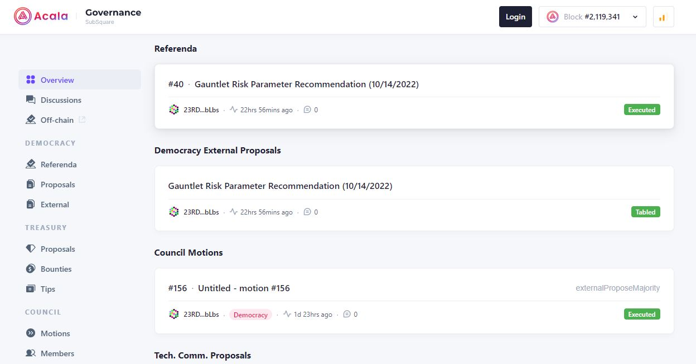
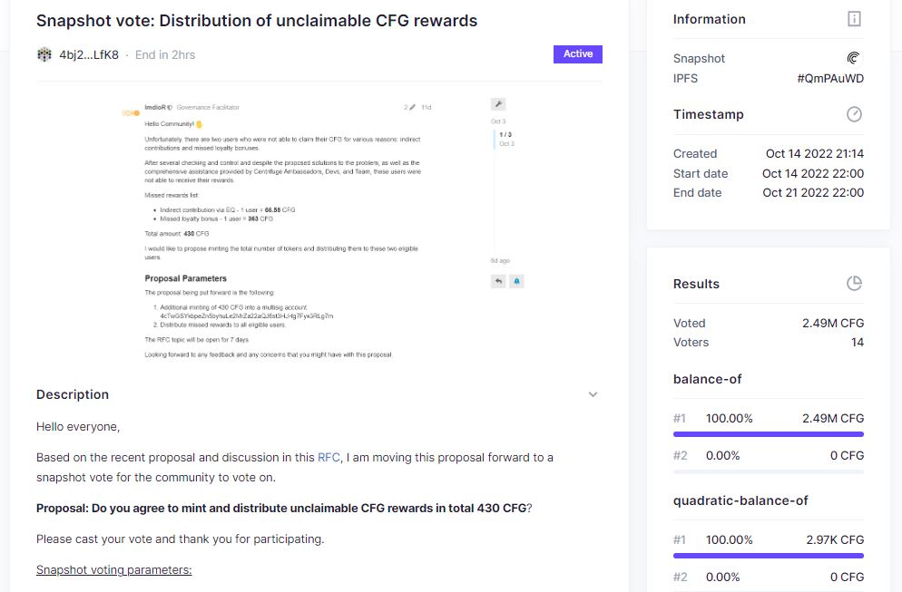

# Direct democracy

Direct voting is when you cast your votes from your own Polkadot account(s). This can be carried out using different setups. You can use a standard account that contains all your funds to complete your every day operations, including voting. You can also use a separate governance proxy account to sign democracy transactions on behalf of your every day account.

<figure><figcaption>
Direct voting is rewarded with NFTs on <a href="https://www.proofofchaos.app/">Proof of Chaos</a>.
</figcaption></figure>

Slightly different from voting is endorsing proposals submitted by other community members. It entails locking up your tokens for an indeterminate amount of time on any proposal you find interesting. This helps move that proposal up the queue, giving it a higher chance of being picked to be a referendum soon after. It is essential to note that the [Gov 2.0 (also called OpenGov)](https://polkadot.network/blog/gov2-polkadots-next-generation-of-decentralised-governance/) upgrade will entirely overhaul this endorsement process and allow many different classes of referendum to take place at the same time.

## How-to:

In the Polkadot ecosystem, the main governance platforms that can be used for voting are _Polkadot-JS Apps, Polkassembly, OpenSquare_, _SubSquare, Commonwealth and Proof of Chaos_. Most of these platforms have integrated parachains into their interfaces because ecosystem projects need token holders to vote on decisions in a decentralised manner.

<figure><figcaption>
Acala network's governance operations are supported on <a href="https://www.subsquare.io/">Subsquare</a>.
</figcaption></figure>

When voting, you select an amount out of your staked or available coins that you are willing to lock for the duration of the vote. You can also lock your coins for a longer time to multiply the value of your vote within the overall turnout. Furthermore, some platforms use [Quadratic voting](https://vote.polkadot.network/) strategies to determine the final outcome of a vote, which are useful to prevent token-rich holders from taking control of all governance decisions.

<figure><figcaption>
<a href="https://voting.opensquare.io/">OpenSquare</a> has built an off-chain quadratic voting system that integrates Centrifuge.
</figcaption></figure>

## **Risks:**

Every time you use your Polkadot account to sign a transaction, be it voting on a referendum or transferring funds, your private keys are used. This exposes them to potential attacks by hackers, especially if you are using new platforms or third-party dapps. For this reason, it is recommended to use of a governance proxy account, as an extra layer of security for your main account and its funds.

<figure><figcaption>
Setting up a proxy account for governance on <a href="https://polkadot.js.org/apps/?rpc=wss%3A%2F%2Fpublic-rpc.pinknode.io%2Fkusama#/accounts">Polkadot-JS Apps</a>.
</figcaption></figure>

Conviction locks are an essential mechanism for giving governance power to token holders, since they can give more weight to their vote in support or against a proposal. It is important to remember that you will not be able to transfer your coins until the locking period is complete, which can put some of your other holdings at risk if you are participating in DeFi operations that require more collateral over time.&#x20;

<figure><figcaption>
Summary of <a href="https://support.polkadot.network/support/solutions/articles/65000181870-how-to-remove-expired-democracy-locks">democracy locks</a> applied to a Polkadot account's balances.
</figcaption></figure>

