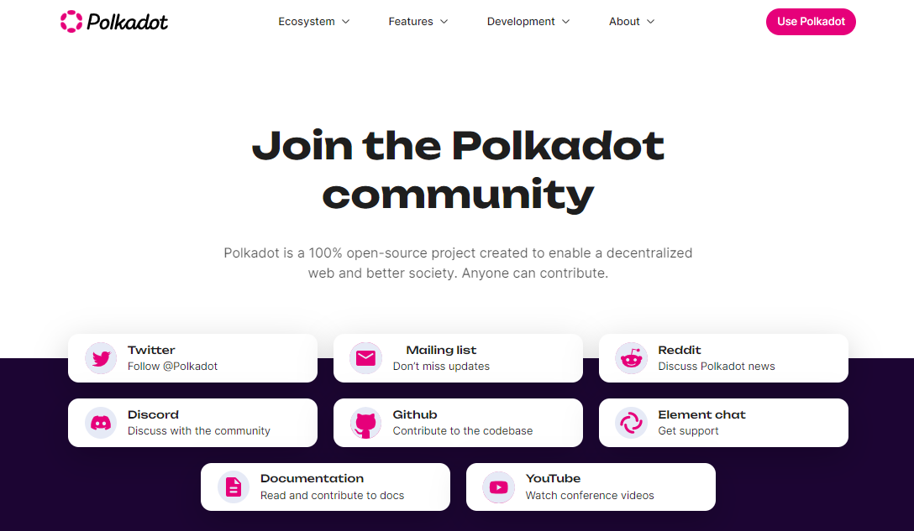

# 4.Support

With so much innovation happening in the Polkadot ecosystem, you will need to find a way to keep up with the latest tech developments. An update can make a big difference in how people manage their assets, so users often **source information** in the following ways:

* directly from project team members (Founders, Community managers, Ambassadors)
* indirectly from projects publications ([Docs](docs.md), [GitHub,](github.md) [Polkassembly](polkassembly.md))
* from official social media ([Discord](discord.md), [Twitter](twitter.md), [Telegram](telegram.md), [Polkaverse](polkaverse.md))
* from unofficial threads and tags ([Reddit](reddit.md), [Youtube](youtube.md), [Grill](grill.md))

<figure><figcaption>
Overview of the various platforms that host <a href="https://polkadot.network/community/">Polkadot Communities</a>.
</figcaption></figure>

Decentralised networks are made of communities that are not always visible or vocal, and this gives a lot of room for bad actors to run their schemes at the expenses of new or confused users.

**In this section, we present how to troubleshoot Polkadot-related issues and how to handle security settings when discussing and reviewing assets on social networks.**
