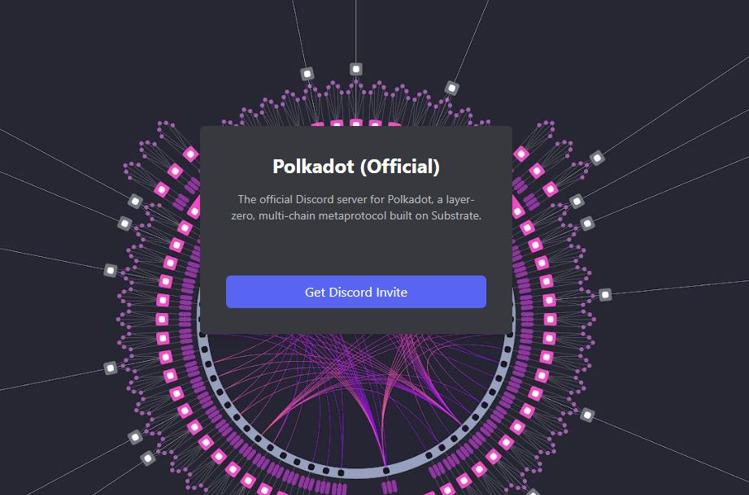
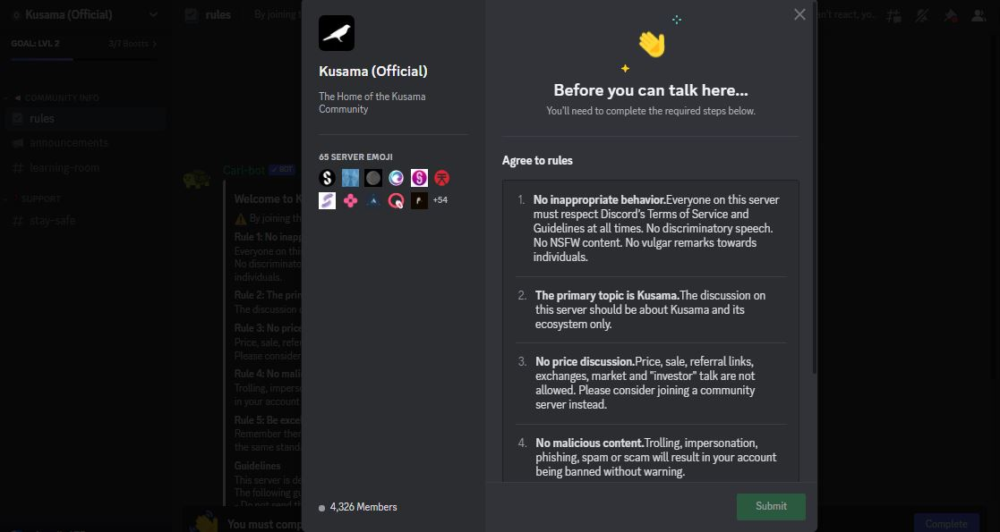
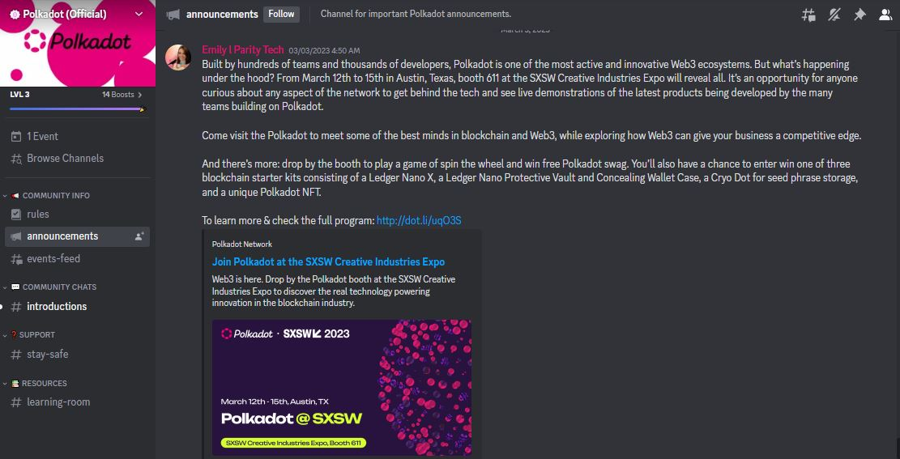
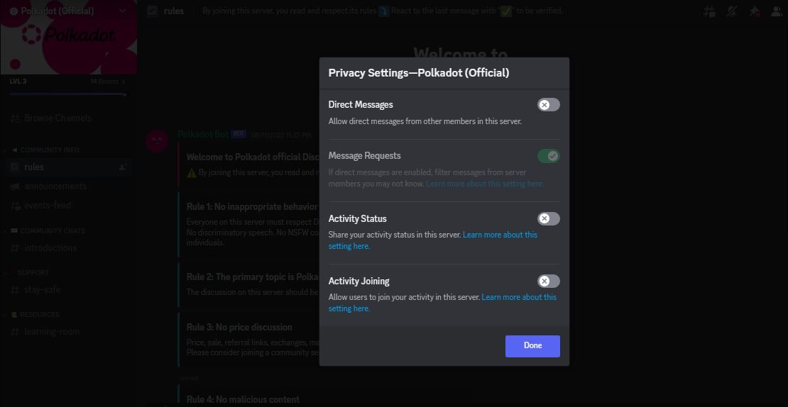

# Discord

## What is Discord?

Discord is a social networking and communication platform that supports live group messaging and voice/video calls via IRC rooms (also called "servers"). In the Polkadot ecosystem, project teams set up Discord channels to disseminate information and streamline conversations within their respective communities.

<figure><figcaption>
Access to the official <a href="https://polkadot-discord.w3f.tools/">Polkadot Discord server</a> is done via a self-generated link for security purposes.
</figcaption></figure>

### How-to: Exploring the structure of ecosystem servers

Discord servers are established, run and maintained by various stakeholders; whether they be officials (admin, developers, founders) or community members (ambassadors, project partners, special guests). Each server is subsequently broken down into different channels or "chat rooms" with assigned topics for discussions, including non-English spaces and VIP lounges.

<figure><figcaption>
An overview of some common rules in place across ecosystem servers. 
</figcaption></figure>

A code of conduct is shared with participants right from the landing page of the server to establish what type of content and information can be posted, and how often. There is usually a team of moderators on each server whose responsibility is to ensure that these rules are respected and also to remind members about basic safety setups at regular intervals.

<figure><figcaption>
Official ecosystem communications are published in a dedicated "announcements" channel.
</figcaption></figure>

Discord servers are a major hub for ecosystem communications, as they host various activities such as announcements, governance discussions, AMA sessions, FAQs, user support tickets, and community roundups. Visitors can contribute by initiating discussions, creating promotional content, giving feedback on dapps, and reporting issues.  Depending on servers' permissions, participants might also be able to share video/audio files, images, tweets, or external links.

### Risks: Managing messages and privacy settings

Discord servers are open to the general public and accessible without much screening. This means that they could end up being hijacked by malicious participants posting inaccurate information, sharing links leading to phishing websites, or impersonating moderators in their messages. To mitigate this risk, members can use the search functionality available on Discord servers to screen the profile and history of all participants, and block users they suspect to be bots.&#x20;

<figure><figcaption>
An example of good practice for managing <a href="https://discord.com/safety/360043857751-four-steps-to-a-super-safe-account">Privacy settings</a> on Discord servers.
</figcaption></figure>

There has been instances in which hackers have attacked Discord servers from popular projects, right at the time of peak activity. During such incidents, members are at their most vulnerable because information previously shared with administrators could be exposed and later used against them. While CAPTCHA verification is an important step in preserving the integrity of Discord servers, members must also take the time to review their own privacy settings, restrict direct messages from unknown users/admins, and reject unnecessary friend requests.

