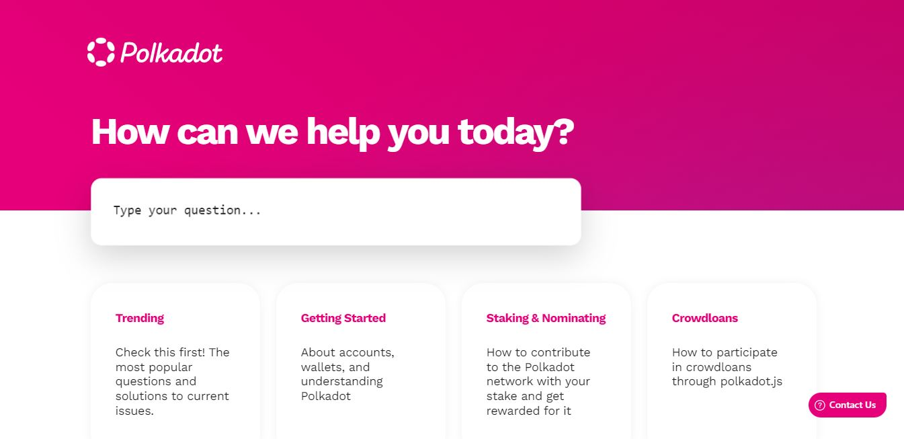
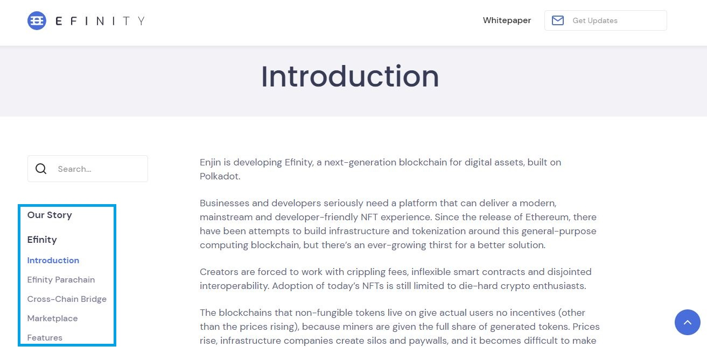
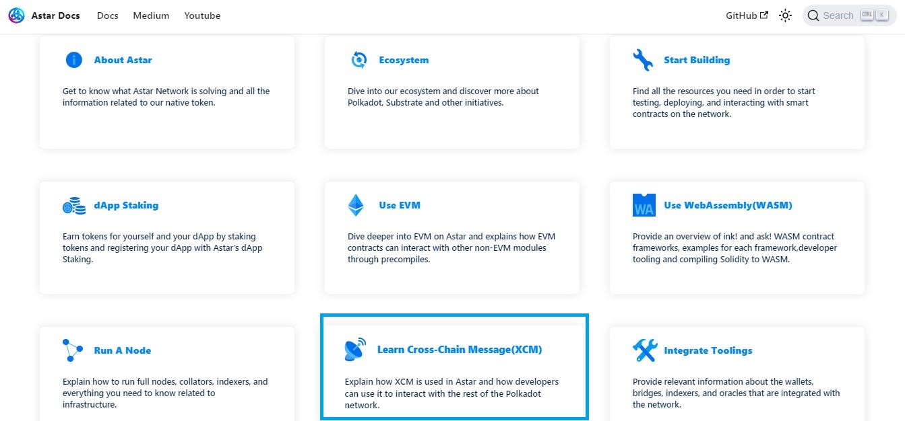
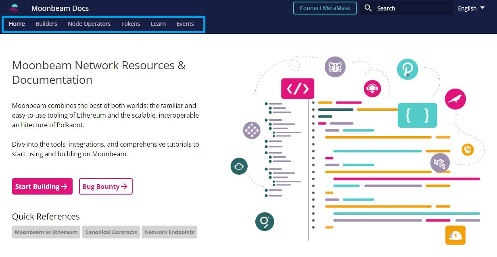
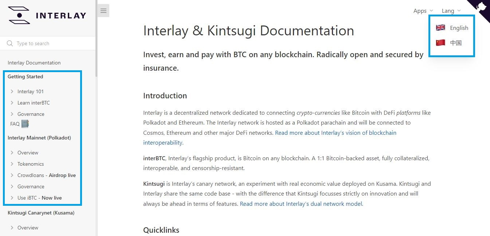
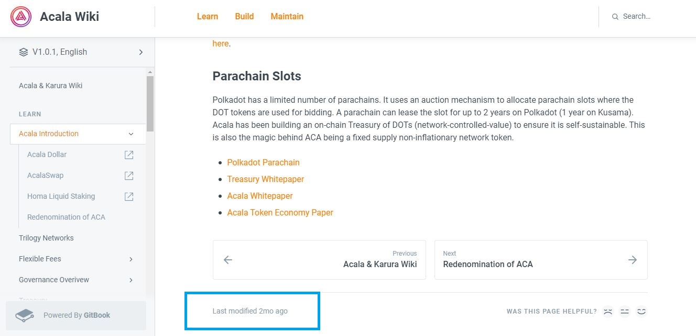

# Docs

Docs or Documentation (also called Wiki or Guide) serve as the single source of truth for most ecosystem projects because they are produced under the direct supervision of project team members. Docs provide essential information to a wide range of people: users, node operators, developers, investors, marketing reps, Press, etc.

<figure><figcaption>
Overview of the <a href="https://support.polkadot.network/support/home">support knowledgebase</a> of Polkadot.
</figcaption></figure>

## How-to:

There is no set content that docs must present to the general public: each project is free to organise and publish articles as they see fit.&#x20;

At minima, docs provide the following information:

* History and Vision
* Roadmap
* Tokenomics
* Whitepaper
* Network guides (for node operators)
* Technical guides (for dapp developers)
* Tutorials and faucets (for platform users and testers)

<figure><figcaption>
<em></em><a href="https://efinity.io/whitepaper/introduction"><em>Efinity network's docs</em></a> summarise key points about the project.
</figcaption></figure>

Docs can also provide a condensed summary of core blockchain concepts as well as an overview of how new technologies can be integrated into the network that is being developed. For this reason, some docs can be used as a learning resource for the non-technical audience looking to get a stronger understanding of the DotSama ecosystem at large.&#x20;

<figure><figcaption>
<em></em><a href="https://docs.astar.network/"><em>Astar's docs</em></a> include an extensive summary on XCM technologies.
</figcaption></figure>

## Risks:

Docs are often used to evaluate the quality of a project, especially at inception. They should always give a breakdown of what the team is trying to achieve, within which timeframes, and from which resources. A project that doesn't present its objectives clearly or doesn't have any meaningful content in its docs should always put you on alert as to its ability to provide value to users.

<figure><figcaption>
<a href="https://docs.moonbeam.network/"><em>Moonbeam docs</em></a> centralise comprehensive information about the network.
</figcaption></figure>

Since Docs are not standardised and evolve alongside a project, their structure and content might be lacking in early stages. This is because teams often prioritise technical developments and will not always put forward the time and resources needed to prepare a documentation that accessible for the general audience. Users who attempt to operate on the project's platform without the minimal guidance provided by the docs are therefore at risk of losing their assets through human errors.

<figure><figcaption>
User-friendly structure of <a href="https://docs.interlay.io/#/"><em>Interlay's docs</em></a>.
</figcaption></figure>

More often than not, docs are the last thing that a project team will update after a major change to their network's operations. This means that users will not always have access to the latest and most accurate information about the live platform, which can make troubleshooting issues very challenging. In these occasions, it is best to reach out to the project's team directly through social networks for a quicker resolution.

<figure><figcaption>
 <a href="https://wiki.acala.network/">Acala's docs</a> reflect the frequency of network's updates.
</figcaption></figure>

