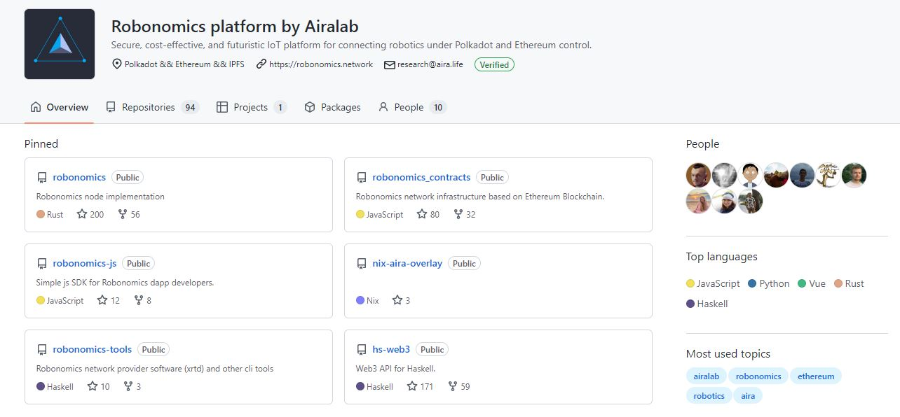
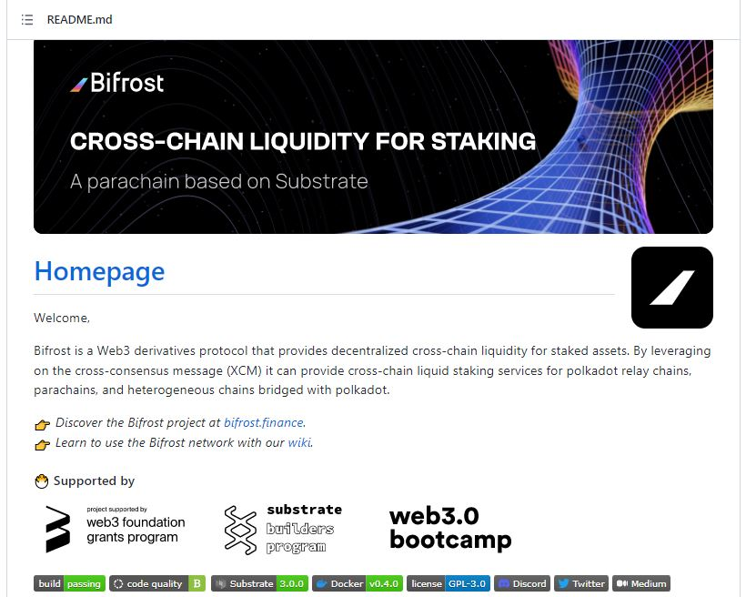
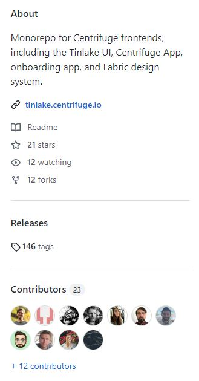
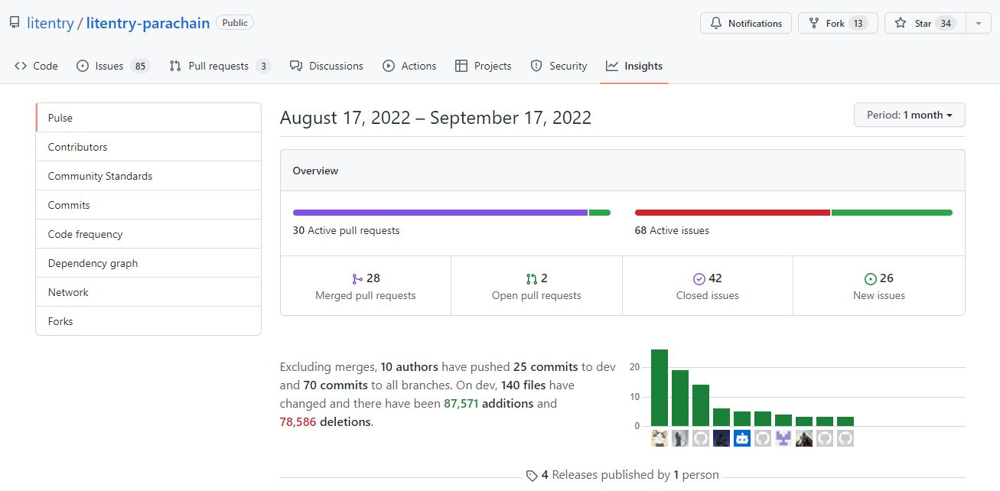

# GitHub

## What is GitHub?

GitHub is a platform on which open source projects collaborate and coordinate efforts to improve their code. Within the Polkadot ecosystem, GitHub plays an essential role in giving investors, developers, and users a sneak peek into projects and their potentially innovative solutions.

<figure><figcaption>
Overview of <a href="https://github.com/airalab">Robonomics</a>' solutions on GitHub.
</figcaption></figure>

### How-to: Accessing Projects' Github Repositories

At a basic level, the code is organised into different folders called repositories. Each repository represents a unit of work (i.e a dapp, a wallet, a node, a Software Development Kit, etc) created from specific web languages (i.e Rust, Typescript, HTML, etc) by various contributors (i.e founders, developers, non-tech staff, etc). There are usually a few notes posted within each repository to explain what the code does and how.

<figure><figcaption>
Landing page of <a href="https://github.com/bifrost-finance/bifrost">Bifrost</a>'s main repository.
</figcaption></figure>

All GitHub repositories come under a license that is specified by the team of developers. This license indicates what permissions and restrictions are given to people who want to use the code for their personal and organisational needs. Most Polkadot projects run under various forms of [Open source licensing](https://www.digitalocean.com/community/tutorials/understanding-open-source-software-licenses) so that people can use, change, and distribute the software through forks.&#x20;

### Risks: Monitoring Projects' Progress on Github

Although open source software gives project teams the opportunity to support each other and refine their solutions, this process can only happen gradually, over time. This means that you should always pay attention to the number of contributors assigned to GitHub repositories when evaluating a project. A project that has less than three contributors is at greater risk of failing because the departure of one contributor could easily interrupt the developments.

<figure><figcaption>
A summary of contributions to <a href="https://github.com/centrifuge/apps">Centrifuge</a>'s Tinlake.
</figcaption></figure>

GitHub repositories allow viewers to track the frequency of updates (also called "Commits") and the quality of reviews (also called "Pull requests" or "PR"). This transparent data can be used as evidence that a project is making progress towards its roadmap and objectives. A lack of regular activity on GitHub repositories often indicates that a project has been neglected or completely abandoned by its developers, which should always put you on alert.

<figure><figcaption>
Insights into <a href="https://github.com/litentry/litentry-parachain/pulse/monthly">Litentry</a>'s GitHub activities over 1 month.
</figcaption></figure>

Projects that are bringing creative solutions tend to garner a lot of engagement from the community of users and developers. There will likely be a lot of commits as well as numerous issues reported in their repositories. Efficient project teams will strive to track, address, and close these issues promptly to ensure that their products are secure and respond to users' needs. By contrast, dwindling projects accumulate a lot of unresolved issues, some of which can potentially be used to attack their platforms and steal assets from users.

