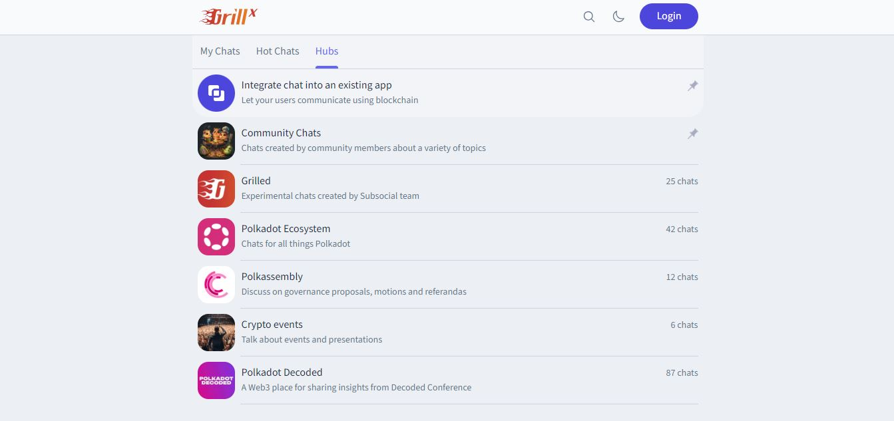
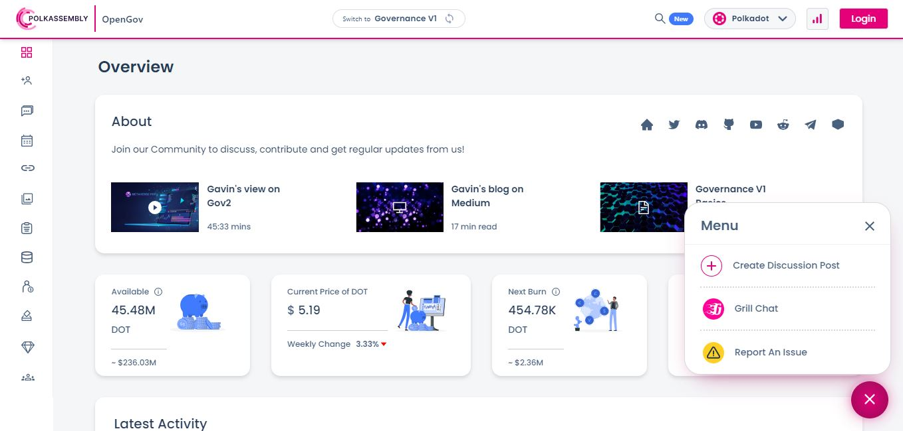

# Grill

## What is Grill?

Grill is a lightweight and mobile-focused chat application that supports the frictionless creation of Web3 accounts and the management of anonymous discussion topics. It aims to provide fast on-chain messaging and multichain Social Finance (i.e SocialFi) services for crypto community members. _DappForce_ (a team of open-source developers) maintains the source code of Grill, while the platform runs on xSocial (an experimental solochain of the Subsocial parachain).&#x20;

<figure><figcaption>
An overview of featured community hubs on <a href="https://grill.chat/hubs">Grill</a>.
</figcaption></figure>

### How-to: Joining Chats for Anonymous Discussions

Users can onboard Grill at any time and from any device because first-time onboarding automatically generates a custom username and [private key](../2.storage/seed-secret-phrases.md).  However, visitors who want to keep their anonymous Polkadot account will need to backup of their private key for future use via ecosystem wallets. Users also have the option to link their Ethereum accounts to their profile.

Grill aggregates instant chats created by community members for sharing opinions on certain topics. There are also more generic discussion hubs which are provided by the Subsocial team to tie together different chats in relation to technologies, governance proposals, events, and conferences. Additionally, it is possible for multichain wallet users to view and send assets such as stablecoins, tokens, and NFTs from the Ethereum and Polygon ecosystems.

Community managers from ecosystem projects can leverage Grill to launch custom hubs for generic communications and to request anonymous feedback from their users. As a portable platform that runs on open source code, Grill can be integrated into any Web2 app or Web3 dApp. For this purpose, it comes as a ready-made widget that displays a chat intercom window at the bottom of the user's screen.&#x20;

<figure><figcaption>
Polkassembly has integrated Grill into its interface.
</figcaption></figure>

### Risks: Managing Credentials and Personal Safety

Users' credentials are auto-generated by the platform to promote anonymous exchanges, which means that there are no [account backup](../2.storage/json-backups.md) reminders provided. In this context, users will need to make informed choices about when to keep or discard their newly-generated accounts, as well as whether or not to use their Ethereum Naming System (also called ENS) identities for social interactions.

Grill is designed to be censor-free to ensure that users can liberally discuss any topic and any content without fear of backlash and/or cancellation. There is no code of conduct or built-in moderation feature on the platform, which means that users could come across posts with strong language, offensive content, and controversial narratives. &#x20;

As with any messaging platforms, the risk of being socially-engineered increases with the absence of active spam prevention measures. Scammers and hackers will often take the time to become familiar with their target audience to obtain critical information that they will re-use at a later date. It is therefore important to have a clear strategy for interacting with anonymous users in self-generated chats, and avoid sharing any kind of personal information.

