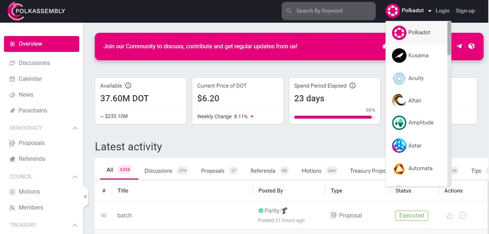
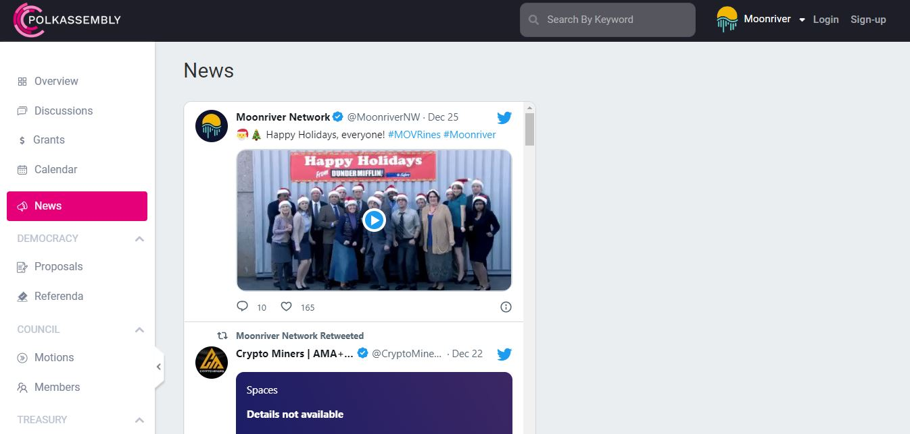
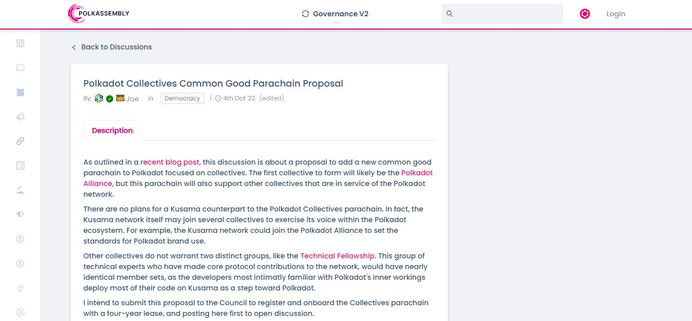
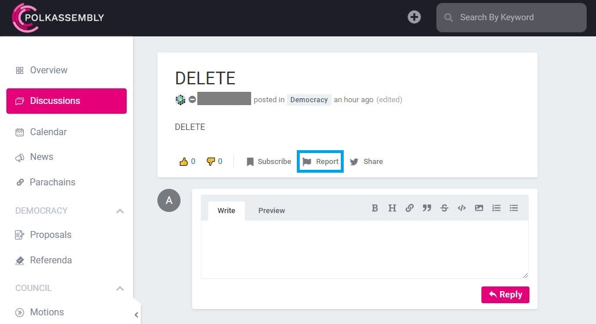
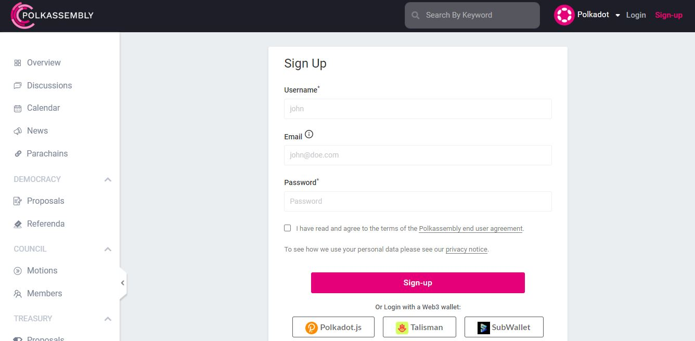

# Polkassembly

## What is Polkassembly?&#x20;

Polkassembly is a platform that provides special-purpose forum functionalities to Substrate-based chains. It is managed by _Premiurly_ (a registered company) and its operations are funded by the Polkadot and Kusama Treasuries. Polkassembly plays an essential role in the Polkadot ecosystem by streamlining data related to community discussions and governance decisions.

<figure><figcaption>
<a href="https://polkadot.polkassembly.io/">Polkassembly</a> has integrated a variety of ecosystem networks.
</figcaption></figure>

###

### How-to: Onboarding Polkassembly for Governance Operations

Polkassembly aggregates and presents a wide range of information about Relay chain and Parachain networks such as token valuations, upcoming on-chain events, and news from official channels. There is also an ecosystem directory of auction-related metrics for Relay chains which include the number of live parachains, the percentage of total supply locked in [crowdloans](https://dot-alert.gitbook.io/dot.alert/content/3.operations/crowdfunding/crowdloans), and the number of finalised auctions.&#x20;

<figure><figcaption>
Official news feed of the Moonriver network on Polkassembly.
</figcaption></figure>

Polkassembly is currently the go-to platform for governance decisions on Relay chains. You can start a topic for discussion to share information about matters that are causes for concerns on the [network](https://dot-alert.gitbook.io/dot.alert/content/5.regulations/networks), whether it be democracy procedures (voting, nominating, campaigning, etc. ) or network operations (commissions, deposits, schedules, etc).&#x20;

<figure><figcaption>
A governance-related proposal for discussion on <a href="https://polkadot.polkassembly.io/post/1318">Polkadot</a>.
</figcaption></figure>

Treasury-related communications are also available on Polkassembly to allow ecosystem participants to review and give feedback on prospective spends. After receiving tips or funding, proponents often use the platform to garner further support from the general public and/or build a reputation around their capabilities for future references.&#x20;

<figure><figcaption>
A snapshot of on-chain bounty proposals made on <a href="https://kusama.polkassembly.io/bounties">Kusama</a>.
</figcaption></figure>

### Risks: Mitigating the Limitations of Polkassembly

Because Polkassembly is an open platform and entirely automated, there is no active moderation on content and comments. In this context, it is often difficult to eliminate spam and/or offensive comments in real-time. Instead, users are invited to report any post that they judge irrelevant to or unsuitable for the topics in discussion.&#x20;

<figure><figcaption>
Visitors can report unsuitable posts or threads for removal.
</figcaption></figure>

As a Web3 platform, Polkassembly operates with the pseudonymity and self-made identities of its users, which can incite bad actors to join in. In recent times, some Treasury-related communications have led to heated debates during which unidentifiable users thrived on relaying uninformed but aggressive views. Unfortunately, such episodes can cause irreparable damages to proponents who are working on establishing trust with ecosystem participants.

<figure><figcaption>
Community members can sign up with credentials or login with a wallet.
</figcaption></figure>

Polkassembly currently operates with an email-based notification system for all discussion threads. This means that proponents must register an email address alongside their Web3 address to receive updates about their Treasury proposals. Users who fail to complete this step run the risk of missing on important communications from the community, which could jeopardise the overall progress of their initiative.

