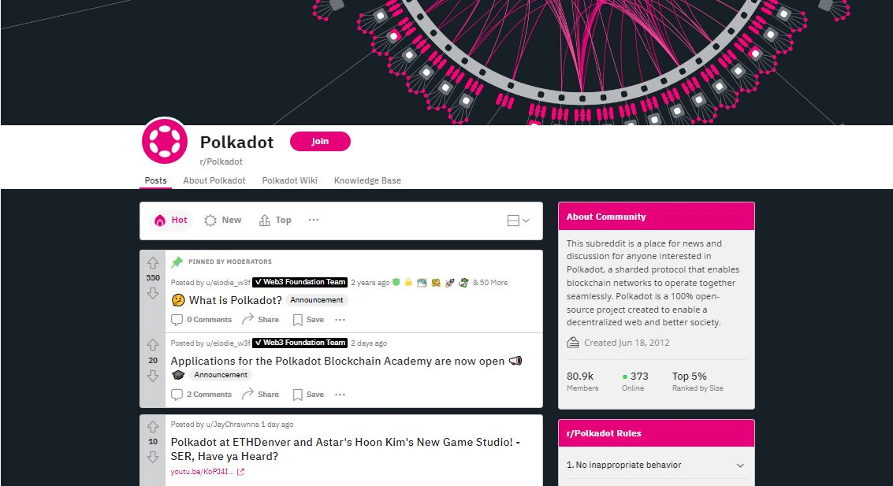
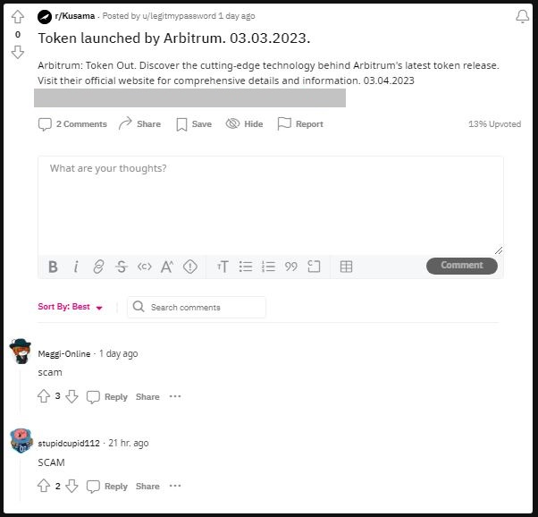

# Reddit

## What is Reddit?

Reddit is a social networking platform that hosts a variety of communities for like-minded individuals with similar interests. In the Polkadot ecosystem, Relay chains and Parachains use subreddits to provide custom forums for informal and formal discussions to network [participants](../5.regulations/networks/participation.md).

<figure><figcaption>
<a href="https://www.reddit.com/r/Polkadot/">r/Polkadot</a> is one of the official subreddits for the Polkadot network.
</figcaption></figure>

### How-to: Navigating Ecosystem-related Subreddits

Each subreddit represents a specific project and comes with its own set of rules regarding topics, threads, resources, languages, and behaviours. Some subreddits operate in restricted mode, so that members can view posts from the team, but not create posts themselves. Regardless, subreddit members can always send a strong signal to project teams by upvoting or downvoting posts from a given topic/presentation.

Subreddits are usually maintained by moderators who relay important information to the community, provide technical support, and ensure that rules are followed within the forum. They also play a central role in encouraging [community interactions](./) with comments, awards, or mentions. Members can also cross-post information that they feel is relevant to the project, ask questions, answer queries, and share useful resources within subreddits.

&#x20;

### Risks: Limiting Potentially Harmful Interactions

Since subreddits make their own recommendations about what content can or cannot be posted on their forum, it is important that users take the time to read and adhere to these codes of conduct. Failure to do so can lead to your post being reported to moderators and your Reddit account being temporarily restricted or permanently sanctioned with a ban.

Despite having a moderation team in place, it is still possible for bad actors to post phishing links or promote scams to defraud unsuspecting subreddit members. To avoid falling for these schemes, users should carefully scrutinise links sent to them and make use of incognito mode as much as possible when visiting external links to avoid leaking browser information.

<figure><figcaption>
An example of community members reporting and flagging a harmful post on <a href="https://www.reddit.com/r/Kusama/">r/kusama</a>. 
</figcaption></figure>

Finally, community members should ensure that they follow general safety rules with regards to unsolicited support messages, urgent requests, and demands for [Seed/secret phrase](../2.storage/seed-secret-phrases.md) information. Besides reporting these incidents to the public and moderators, users should take steps to block spammers/bots immediately. Further security measures include limiting the amount of personal information shared in your public profile and reviewing your account's Safety and Privacy settings.\
