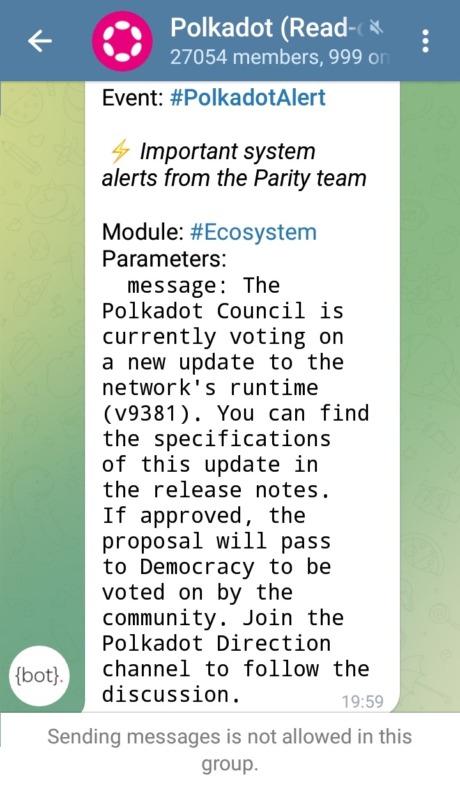
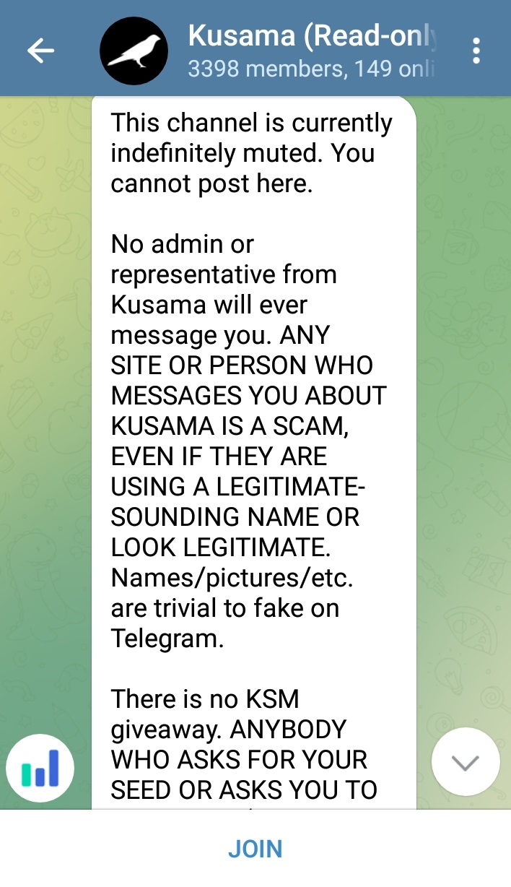

# Telegram

## What is Telegram?

Telegram is a mobile-friendly instant messaging service that supports chats and content sharing with minimal moderation features. Polkadot parachains and community-led projects primarily launch Telegram channels to onboard mobile-first users and contributors from developing countries.

<figure><figcaption>
An important system alert on <a href="https://t.me/PolkadotOfficial">Polkadot's official Telegram channel</a>.
</figcaption></figure>

### How-to: Joining Ecosystem Channels

Ecosystem teams usually run multiple official channels on Telegram: some of them are strictly for announcements or ambassador programmes, others are dedicated to community discussions and networking. As part of their communication and outreach strategies, some projects use Telegram to host exclusive community-focused initiatives such as AMA sessions, Deep-dives, Request For Proposals, giveaways or airdrops. However, there are also a number of unofficial channels created by community members to evaluate [projects](../5.regulations/networks/) through informal discussions.

Every channel come with its unique set of rules to curate information and ensure that conversations stay on topic. Moderation tends to be kept to the minimum on Telegram channels, as community members are encouraged to flag unrelated communications and disrespectful posts to help regulate the channel. New users are routinely invited to check pinned messages to access the latest community updates in real-time.

Projects tend to integrate a variety of Telegram bots into their channels to provide users with in-demand data from areas such as tokenomics, on-chain [governance](../3.operations/voting/), staking analytics, or marketplace activities. A more advanced use of bots involves serving reminders ahead of major community events, running community quizzes, and undertaking search engines functionalities. Nevertheless, there is always an admin team working in the background to provide clarifications on the project and direct users to useful resources or tools.&#x20;

<figure><figcaption>
The disclaimer and rules of Kusama Telegram channel.
</figcaption></figure>

### Risks: Screening Group Conversations

Given that there is little to no verification required to join Telegram, ecosystem-related groups will equally attract new users and seasoned scammers. For this reason, most official admin teams attach unique badges to their usernames; which differentiates them from other members in general, and impersonators in particular. Users should be extremely cautious when joining unofficial Telegram groups found on search engines or social media, as they are often populated by spam bots to generate fake engagement.

Telegram groups are perceived as open censorship-free spaces for community members to share resources and opinions on ecosystem projects. However, this setup can also open the door to ill-intentioned people spreading misleading or false information. To regulate the flow of conversations and content sharing during times of peak activity, admin teams often implement "Slow mode", which controls how often members can post a message and ultimately improves the quality and soundness of exchanges.&#x20;

<figure><figcaption>
An overview of Privacy and Security settings on Telegram.
</figcaption></figure>

It is imperative to stay alert while interacting in the Telegram community. Avoid clicking on links shared by other members, revealing personal details, and linking other social media accounts; as these can be used by attackers for phishing purposes later on. Before joining any [ecosystem](../5.regulations/networks/) channel, make sure to review your privacy settings and switch most, if not all, options to "Nobody". This will prevent random people from adding you to unofficial groups.

