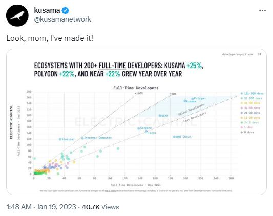
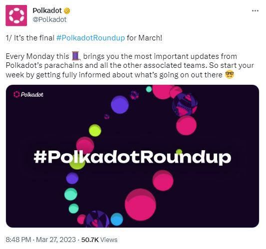
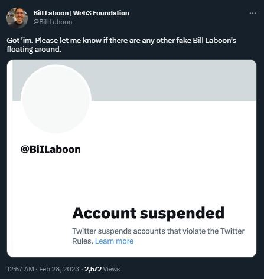
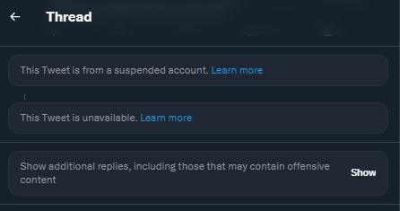

# Twitter

## What is Twitter?

Twitter is social networking platform that facilitates the circulation of short and frequent messages and media via specific keywords (also called "hashtags"). Project teams of the Polkadot ecosystem use their Twitter handle to drive community engagement for their products and build distinct brands within the Web3 space.&#x20;

<figure><figcaption>
@Polkadot's official tweet for a <a href="https://twitter.com/Polkadot/status/1636059197912539138">new icon set</a>.
</figcaption></figure>

### How-to: Navigating Key Ecosystem Hashtags

Setting up an identifiable account on Twitter account is a mandatory part of the lifecycle of Web3 projects, and this serves as an official point of contact for the team in the absence of a formal website. Twitter pages usually feature information such as latest product updates, fundraising announcements, new partnerships, and upcoming events or conferences. Some projects also provide in-depth summaries of their developments through charts, user-friendly infographics, and detailed threads.

<figure><figcaption>
@kusamanetwork sharing a <a href="https://twitter.com/kusamanetwork/status/1615722848877772805">data report on developers growth</a>.
</figcaption></figure>

Building a community on Twitter also involves finding commonalities and sharing good practice with peers. The most active project teams have appointed an official "Head of Growth" who often  reaches out to other teams by mentioning their handle or timetabling Twitter spaces for discussions. For smaller projects, giving an existing project a mention helps lay the groundwork for future collaborations or partnerships. It is also possible for users to get direct support and assistance from project teams via Twitter.

The Polkadot ecosystem currently hosts over 50 parachains, hundreds of dapps, and many more community initiatives. This daily flow of information is streamlined with custom hashtags to guide the general audience. **#Polkadot** is the primary hook used within the ecosystem to post core developments and general information, while **#PolkadotRoundup** remains the best way to get access to both recent and previous news summaries. **#PolkadotDecoded** redirects visitors to the flagship conference of the ecosystem that takes place every June, and token tickers such as **#DOT** or **$DOT** link to tweets that involve competitions, giveaways, or price talks.

<figure><figcaption>
<a href="https://twitter.com/Polkadot/status/1640289592749223937">#PolkadotRoundup</a> gives access to essential ecosystem updates.
</figcaption></figure>

Twitter is also used by ecosystem teams to rally stakeholders in anticipation for network-defining events or causes. In the past, there have been numerous examples of calls to action sent to the community regarding the removal of sudo, the redenomination of $DOT, the integration of Nomination pools, the introduction of _OpenGov_, as well as regular invitations to vote on referenda and share feedback on new functionalities or planned improvements.

### Risks: Countering Social Engineering Attacks

When using social media platforms, users need to keep in mind that they are at risk of falling prey to social engineering schemes. On Twitter, these attacks can target community members from the moment they create an account, but more often when users are actively taking part in discussions, following popular handles, or garnering more engagement on their tweets. To limit your exposure to these attackers, it is important to systematically check the profiles of the accounts that interact with your tweets to determine if they genuinely share your interests. It is not recommended to follow accounts just because they follow you, as they might use your feed to spread their schemes out to a larger audience.

<figure><figcaption>
<a href="https://twitter.com/BillLaboon">Bill Laboon</a> shares good practice needed to help flag impostor handles.
</figcaption></figure>

Although the Polkadot ecosystem has put in place sound anti-scam initiatives, there is still the possibility that a few bogus accounts will try to impersonate public personas and officials on Twitter. These fake accounts can sport usernames nearly identical to the original handle and won't necessarily have the blue watermark signalling a verified account. Oftentimes, these impostor handles will feature retweets of legitimate accounts all over their timelines, which makes it challenging for everyday users to identify them in the wild and report them. Input from the community is therefore very valuable in these circumstances.

<figure><figcaption>
<a href="https://help.twitter.com/en/safety-and-security/control-your-twitter-experience">Muting, blocking or reporting Twitter accounts</a> are essential operations for a cleaner feed.
</figcaption></figure>

While using hashtags to customise feeds is good practice for navigating ecosystem content on Twitter, users should exercise due diligence before interacting with the information displayed in the search results. This is because popular hashtags tend to be clogged with spam from bot accounts and advertising campaigns from unrelated projects. It is recommended to mute or block suspicious accounts as a safety measure and to prevent potentially harmful interactions. Another mitigation strategy would be to routinely use incognito navigation to determine the validity of URLs in relation to public giveaways or competitions.&#x20;

