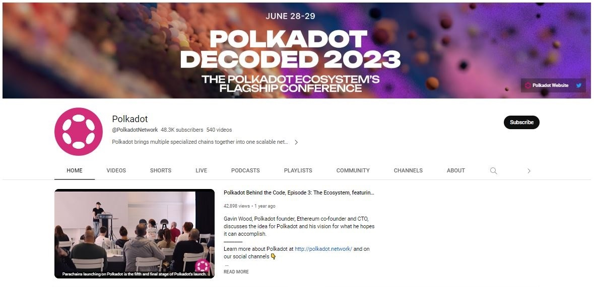
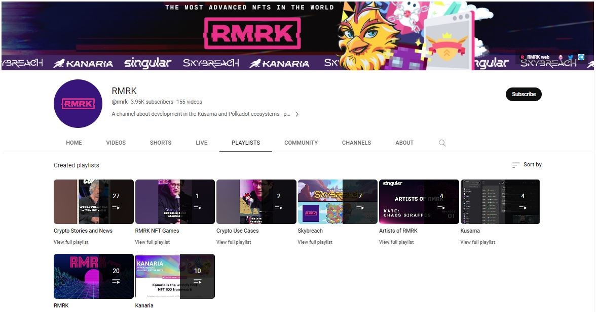
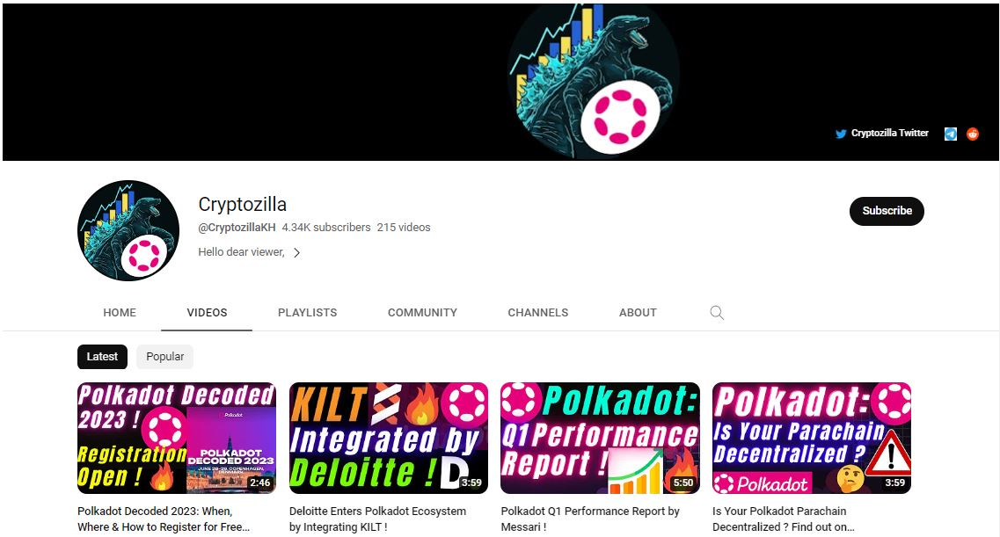
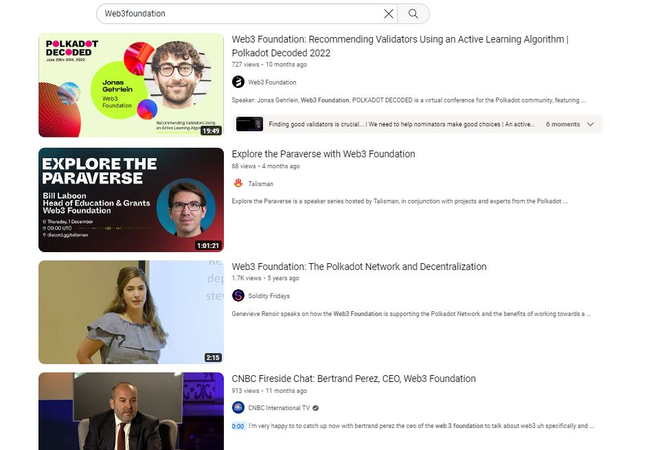

# Youtube

## What is Youtube?

Youtube is a video-sharing platform that facilitates the creation of self-curated lists (also called "playlists") based on users' personal interests. In the Polkadot ecosystem, stakeholders maintain Youtube channels to anchor their marketing and educational initiatives for the long haul.

<figure><figcaption>
The official <a href="https://www.youtube.com/channel/UCB7PbjuZLEba_znc7mEGNgw">Youtube channel of Polkadot network</a>.
</figcaption></figure>

### How-To: Streamlining Ecosystem Playlists

Generally-speaking, ecosystem-related content on Youtube can be split into three different categories: Official, Treasury-funded, and Community-made.

Official content is featured on the main Youtube channel of the project and carefully selected to support the promotion of project's solutions, technologies, and developments to the general public. Videos often cover multiple aspects of the project's roadmap, such as public demos, community round-ups, AMAs sessions, products launches, talks at major events/conferences, collaborative webinars, and technical workshops.&#x20;

<figure><figcaption>
<a href="https://www.youtube.com/@rmrk/playlists">RMRK's playlists</a> provide a very comprehensive overview of the project's roadmap.
</figcaption></figure>

There is also [Treasury-funded](../3.operations/crowdfunding/treasury-spends.md) content hosted on standalone channels, which are maintained based on pre-agreed terms and conditions to ensure quality delivery and output. The playlists cover a range of topics that are in-demand within the community, such as breaking news, on-chain governance-related updates, interviews of key ecosystem players, and live tutorials. The production of the content follows a strict schedule that keeps the community engaged and informed throughout the year.&#x20;

<figure><figcaption>
<a href="https://www.youtube.com/@PolkadotInsider">Polkadot Insider</a> is a Treasury-funded project that produces multimedia educational resources for the Polkadot ecosystem.
</figcaption></figure>

Several independent content creators and marketers run their own generic Youtube channels in both English-speaking and non-English communities. Although they might publish how-to videos on Relay chain operations and share news about specific ecosystem projects, they will also discuss and review blockchain ecosystems external to Polkadot. Oftentimes, they are focused on sponsored videos, with content touching on crypto markets, token prices, and adverts for the latest DeFi dapps or NFT marketplaces.

<figure><figcaption>
<a href="https://www.youtube.com/@CryptozillaKH/videos">Cryptozilla</a> is committed to curating Polkadot-related news and technical developments for the community. 
</figcaption></figure>

### Risks: Cross-referencing Critical Information

While Youtube is often seen as a go-to source of information for most users who are interested in blockchain technologies, videos published on the platform still need to be critically assessed to determine their relevance and accuracy. A lot of projects still routinely employ bot services to post blanket endorsements on their channels and give a false sense of community engagement. It is important not to take everything said about a given project at face value and, instead, gather information from other [social media platforms](./) to obtain more comprehensive insights.

<figure><figcaption>
A sample of videos proposed when searching for "<a href="https://web3.foundation/">Web3foundation</a>" on Youtube. 
</figcaption></figure>

Like many social media platforms, Youtube lacks tools for dealing with fake accounts and impersonators in real time. This means that a lot of people are getting phished through bogus product announcements, sham community airdrops, and phoney financial advice. When browsing through videos and comments posted in relation to Polkadot ecosystem projects, users need to pay attention to the creation date of the video and the history of the account that is posting, which can help rule out bad actors.

<figure><figcaption>
A video by the Polkadot Anti Scam team with <a href="https://www.youtube.com/watch?v=ARsdXZycJAg">recommendations for wallet and account safety</a>.
</figcaption></figure>

