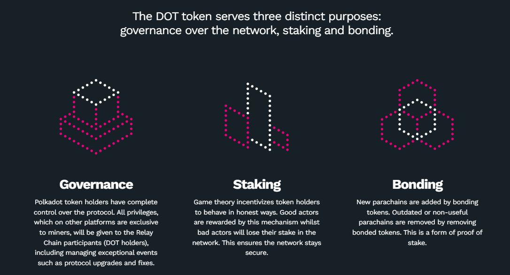
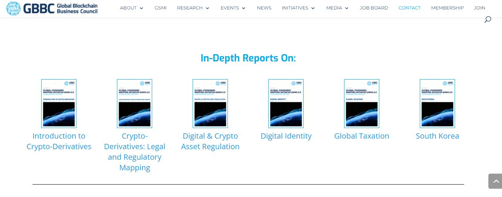

# 5.Regulations

There are still a lot of legal unknowns in this ecosystem, because there are new protocols being coded every day and also because existing protocols are being routinely upgraded. The range of testing environments provided ahead of deployment are mainly used by developers and a few tech-savvy project supporters, not by ordinary users nor regulators.&#x20;

<figure><figcaption>
Overview of Polkadot network's primary asset: the <a href="https://polkadot.network/dot-token/">DOT token</a>.
</figcaption></figure>

In the DotSama ecosystem, the same asset can take on various forms because of concepts such as:

* canary networks
* common good chains
* remark tokens
* liquid crowdloans
* staking derivatives

Depending on jurisdictions, this modularity can introduce further complexity in regulatory risk management for the holders.

<figure><figcaption>
The <a href="https://gbbcouncil.org/gsmi/">GBBC</a> proposes comprehensive resources on Blockchain-related legislations.
</figcaption></figure>

In the end, the burden of **compliance** remains the biggest challenge for users, investors, project teams, and VC institutions alike.

****

**In this section, we cross-reference DotSama technologies with existing legislations and review some essential ecosystem tools for assets management.**&#x20;

&#x20;
