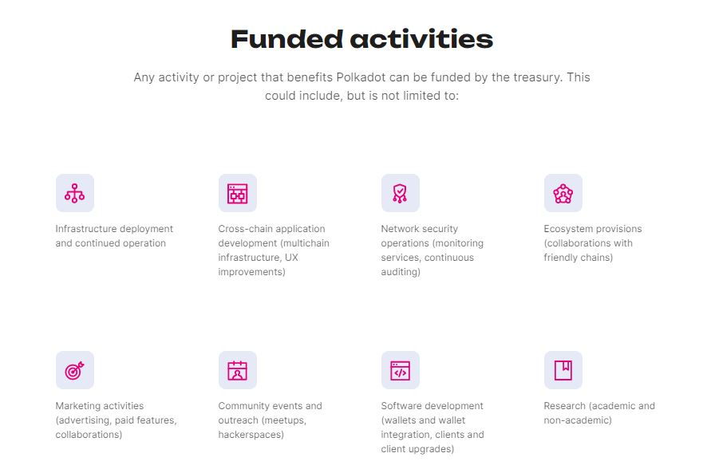

# Investments

The Polkadot ecosystem is home to a growing diversity of projects that attempt to leverage third-generation blockchain technologies to build new financial and social systems.

Project teams can take advantage of special-purpose Web3 solutions that expand on traditional financial instruments to sustain themselves, create quality consumer-facing products, and establish their brand.&#x20;

<figure><figcaption>
Categories of initiatives funded by the <a href="https://polkadot.network/ecosystem/treasury/">Polkadot Treasury</a>.
</figcaption></figure>

As blockchain-based companies adopt [digital assets offerings](issuance.md) to kickstart their operations and  make provision for [industry standards](insurance.md), cryptocurrencies gain more recognition within [government institutions](taxation.md) and the global economy.

