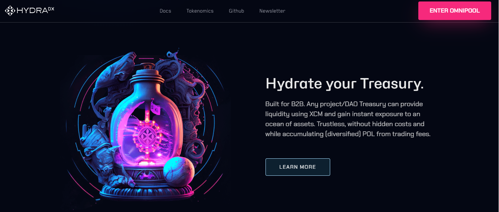
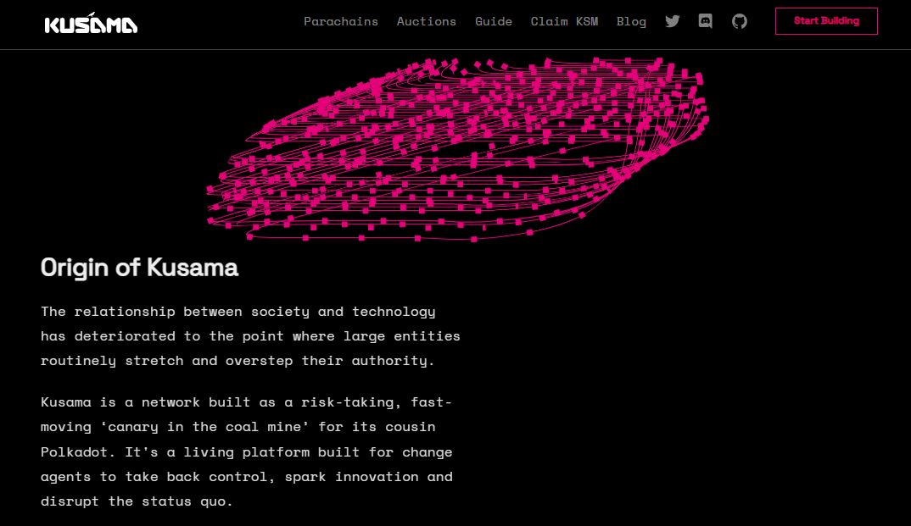

# Insurance

_<mark style="background-color:red;">Disclaimer: This article is written by</mark> <mark style="background-color:red;"></mark><mark style="background-color:red;">**Dot.alert()**</mark> <mark style="background-color:red;"></mark><mark style="background-color:red;">contributors for educational purposes only. This article should not be used as a substitute for competent legal advice from a licensed professional lawyer or attorney in your country.</mark>_

Cryptocurrencies are digital assets used and exchanged across blockchain networks whose valuations depend on the quality and the security of the services that they sustain. In the Polkadot ecosystem, the development of blockchain-based products is systematised at multiple levels to ensure high standards of Quality Assurance.

## Legal Frameworks:

### Asset Custody

Cryptocurrencies are a relatively new and complex asset class, requiring a range of technical knowledge and skills to be acquired, stored, and put to use. The average user looking to access blockchain-based products first needs to become familiar with concepts such as private keys, account addresses, as well as the irreversibility of transactions. Aside learning to use different wallets for different blockchain ecosystems, users also need to navigate an array of Decentralised applications (dApps) with diverse workflows and niche use cases.&#x20;

To simplify the onboarding process, blockchain-based projects resort to different strategies. Some choose to partner with Centralised exchanges (CEXes) that favour custodial solutions whereby traders [forsake the ownership of their assets to the admin team](https://www.fdic.gov/news/financial-institution-letters/2022/fil22035b.pdf). Others have adopted existing token standards so that their assets can be supported by popular non-custodial wallets. In the Polkadot ecosystem, native wallets have developed solutions whereby cryptocurrencies and digital assets issued on Relay chain, Parachains, and external chains can be seamlessly bought, held, transferred, teleported, and traded.

<figure><figcaption>
<a href="https://hydradx.io/">HydraDX</a>'s Ominpool allows blockchain-based projects to list their tokens on their own terms.
</figcaption></figure>

Still, the infrastructure needed for the mass adoption of cryptocurrencies remains elusive, despite continued developments. Venture Capital (VC) funding to blockchain companies is unequally distributed, with more money going into established projects whose assets are already well-supported and integrated by default, leaving newly-issued cryptocurrencies very illiquid. In this context, many investors acquire digital assets exclusively for speculation on prices, and this has led to over-leveraging, liquidations, and crashes in valuations. In recent times, regulatory bodies across the world have started to propose their own framework for the insurance of crypto holdings administered by Virtual Assets Service Providers (VASPs). That said, activities conducted via dApps remain out of the reach of legislators.&#x20;

### Crypto Insurance 

Crypto insurance is a form of [digital assets protection](https://papers.ssrn.com/sol3/papers.cfm?abstract\_id=3756619) that has been put forward by blockchain companies and blockchain-based projects to protect users' assets under very specific Terms and Conditions. At a base level, it provides coverage for losses and damages that result from a variety of events, such as theft of private keys, exchange hacks, and market volatility. Crypto insurance can take on many different forms, including insurance policies, emergency reserves, certificates of authenticity, or bailout mechanisms. Most of the crypto insurance offering isn’t always readily available for everyday users, because it is targeted at blockchain startups and investors operating within crypto markets.&#x20;

But there are also non-financial use cases for blockchains, and these also require users to come up with strategies for preserving their assets over time. The Polkadot ecosystem provides unique blockchain-based alternatives to traditional insurance models. Kusama, the canary network for Polkadot network, proposes an experimental and risk-tolerant environment for developers to test new ideas with real value and refine Minimum Viable Products (MVPs). In this interoperable environment, the unfolding of a hack or other security breach can be mitigated through freezes initiated by on-chain governance. Proxy, multisig, and social recovery setups also contribute to more resilient self-custody practices.

<figure><figcaption>
<a href="https://kusama.network/">Kusama network</a> provides a real-world environment and a decentralised community for experimental ideas and products.
</figcaption></figure>

Cryptocurrencies and digital assets have become increasingly popular in recent years as investment vehicles, which has put them under the radar of regulators. This is because the unpredictability of crypto markets and the untested features of some blockchain-based products create a high-risk environment that can threaten investors on a greater scale. Nevertheless, expanding insurance policies to the blockchain industry has challenges because of the lack of industry-wide risk assessment practices and the absence of a confirmed user base for blockchain-based products.

## Risk Management: 

### Jurisdictional risks

The traditional insurance industry is highly regulated and insurance policies are subject to certain requirements that must be met before being offered to consumers. By contrast, the risks associated with cryptocurrencies and blockchain-based products are constantly evolving, leading to new services designed to mitigate emerging attack vectors. Crypto insurance aims to provide custom solutions for blockchain companies through a [restricted set of policies](https://news.bloomberglaw.com/insurance/crypto-insurance-policies-popping-up-to-meet-frenetic-demand). And since there is currently no specific framework for crypto insurance offerings, the legitimacy of these types of services can always be questioned in court.&#x20;

Depending on the jurisdiction, regulators can impose strict guidelines on the issuance of crypto insurance products, which could ultimately limit the development of innovative solutions. Similarly, both insurers and blockchain-based projects may face regulatory scrutiny over the indirect promotion of high-risk activities like yield farming or leverage trading on smart contracts that can fail. For this reason, most crypto-related products must provide clear disclaimers and advanced warnings about their associated risks to prospective users.

<figure><figcaption>
The disclaimer on <a href="https://polkadot.network/">Polkadot.network</a> clarifies the Terms of Use of the website for all visitors.
</figcaption></figure>

### Operational Risks 

The [logistics of crypto insurance](https://anziif.com/professional-development/the-journal/volume-45/issue-4/insurance-for-cryptocurrency-how-can-we-cover-digital-currencies) pose meaningful challenges in practice. Depending on the type of cover provided, insurance providers might be required to hold significant amounts of capital in cryptocurrencies and other digital assets to cover potential claims. This implies having an additional operational layer in place to safeguard these reserves from bad actors over the long term. For crypto insurers who elect to store their capital within the traditional banking system, a lot of resources are needed to meet compliance standards, bookkeeping reports, and tax-related receipts. This creates a lot of inefficiencies and frictions in the use of reserves, which often translates into high premiums for customers.&#x20;

The cost of insurance itself is often largely dependent on the valuation of digital assets, which is very volatile. And this has several implications for both insurance providers and insured parties.  Evaluating industry-wide risks under regulatory oversight becomes more complicated as crypto markets become more sophisticated and globalised, which requires crypto insurance providers to upgrade their on-chain analysis tools more frequently. In the same vein, blockchain-based projects and companies are faced with a less favourable environment for raising capital and maintaining their operations. And this can make it challenging to obtain adequate coverage, ultimately leaving them and their customers partially exposed.

