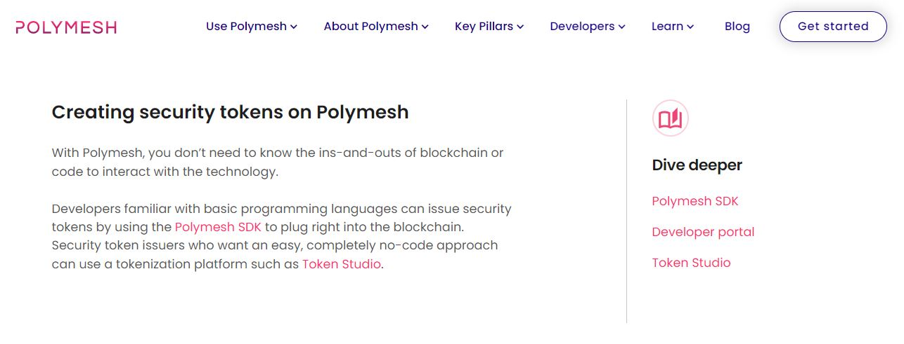
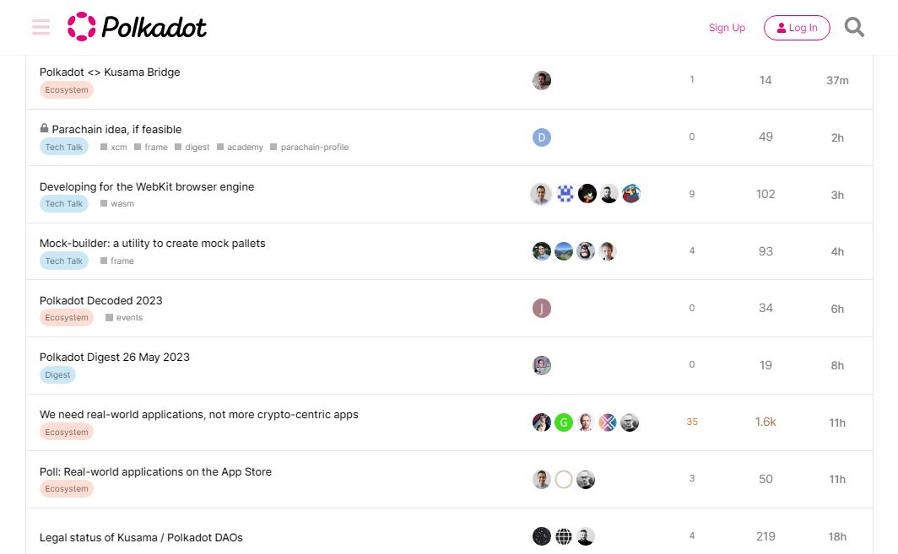
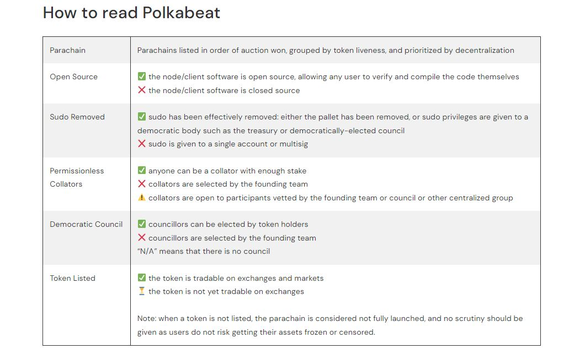

# Issuance

_<mark style="background-color:red;">Disclaimer: This article is written by</mark> <mark style="background-color:red;"></mark><mark style="background-color:red;">**Dot.alert()**</mark> <mark style="background-color:red;"></mark><mark style="background-color:red;">contributors for educational purposes only. This article should not be used as a substitute for competent legal advice from a licensed professional lawyer or attorney in your country.</mark>_

Blockchain-based projects propose a range of digital assets as part of their network and development operations. In the Polkadot ecosystem, this issuance process plays an important role in tracking the speed of deployment of Web3 technologies and contributes to quantifying the adoption of decentralised solutions.

## Legal Frameworks:

### Asset Types

Blockchain projects are entreprises, ventures, and initiatives supported by digital ledgers that obtain, gain, and retain their value by servicing their communities of investors, [operators](../../3.operations/staking/validating.md), and users. In the Polkadot ecosystem, Relay chains facilitate communications between parachains in a secure environment, while Parachains specialise in providing custom use cases for their technologies to ecosystem participants. There are Common good parachains, intended to service the ecosystem as whole, and infrastructure parachains that support the deployment of multi-chain dApps and Smart contracts. There are also bridge chains that provide multichain transfer functionalities, as well as Decentralized Autonomous Organizations (DAOs) that let communities collectively govern themselves through treasuries.

By releasing a range of assets to a varied audience, blockchain projects seek to grow their real-world valuation and adoption. These assets consist of fungible tokens and non-fungible tokens (NFTs) which are issued to investors to raise funds through various avenues such as private rounds with Venture Capital (VCs), public rounds on launchpads, Initial Exchange Offerings (IEOs), [Initial DEX Offerings (IDOs)](../../3.operations/crowdfunding/initial-dex-offerings.md), pre-mines, and other rewards. In the Polkadot ecosystem, Relay chain-issued assets come with pre-established use cases such as on-chain governance, staking, and crowdloans. In turn, ecosystem platforms extend these primary use cases by allowing users to mint derivatives for DeFi transactions or create wrapped assets for multichain operations on external blockchains.

<figure><figcaption>
<a href="https://polymesh.network/">Polymesh</a>'s institutional-grade infrastructure facilitates the issuance of regulated assets.
</figcaption></figure>

Given that network assets can be held and traded internationally, some lawmakers are worried that they will eventually threaten the [monetary and financial sovereignty](https://www.un.org/development/desa/dpad/publication/world-economic-situation-and-prospects-august-2022-briefing-no-163/) of developing countries around the world. A widespread perspective is that the absence of a global framework for monitoring the flow of these assets is problematic and the circulation of large amounts of capital between both lawful and illicit enterprises on the global scale could make legislation difficult to enforce by regulatory bodies.

### Tokenomics

Blockchain projects come with their own tokenomics, which outline the mechanisms behind the issuance of tokens so that both the demand and the supply for the token determine its price at any given point in time. Most blockchain networks tie the value of their tokens to the use cases deployed on their technologies (i.e staking, voting, [transactions](../../1.acquisition/transaction-explorers.md), etc.); meanwhile DAOs often require their investors to own NFTs as a proof of membership and for exclusive benefits that will gradually be provided.

Blockchain [networks ](../networks/)further manage their token issuance by adopting a capped supply, implementing token burns, and scheduling redistribution events and airdrops. Projects that do not set a maximum token supply are driven to grow their technologies and use cases at a rapid pace, and this inflationary aspect plays an important role in pushing its adoption beyond the small circle of initial investors. In the Polkadot ecosystem, investors tend to look at metrics such as the rate of issuance and the number of tokens locked in various protocols to evaluate the performance of networks’ tokens.

<figure><figcaption>
Analytics tracking balance changes for the top DOT holders on <a href="https://dolpha.com/">Dotsama Insights</a>. 
</figcaption></figure>

Regulators are concerned that the monetary nature of cryptocurrencies and their apparent value as a medium of exchange [mask their inherent volatility](https://moneysmart.gov.au/investment-warnings/cryptocurrencies) in the eyes of unsuspecting consumers. The analysis of blockchain projects and the acquisition of digital assets are highly specialised endeavours that expose participants to different kinds of risks. As a result, regulators are increasingly scrutinising issuance processes to protect investors and prevent bad actors from engaging in exploitative practices.

## Risk Management:

### Operational Risks&#x20;

Blockchain-based projects come with a multitude of operations-related risks that need to be mitigated before their decentralised solutions can [reach critical mass adoption](https://www.bnymellon.com/us/en/insights/all-insights/digital-assets-from-fringe-to-future.html). The irreversibility of transactions that is touted to solve the double-spend problem on blockchain networks is a major issue for new users who are unfamiliar with these protocols. For each use case, there are multiple implementations and procedures that can induce users in errors and make them lose their assets in the mix.

Projects in the Polkadot ecosystem attempt to provide solutions to these problems through a standardised approach to protocol development based on the Substrate framework and its libraries, documentation, and tools. On-chain governance alongside [admin support](../../4.social-support/) on social platforms routinely assist in troubleshooting issues reported by developers and users, with the oversight of communities. Even though concerns around hacks remain, collaboration between blockchain projects is increasing to better serve and protect stakeholders.

<figure><figcaption>
The <a href="https://forum.polkadot.network/">Polkadot Forum</a> offers a space for ecosystem coordination between investors, builders, and end-users.
</figcaption></figure>

### Financial Risks

As a largely unregulated sector, the blockchain industry has seen its share of scams and fraudulent activities since inception. In 2022 alone, major crypto projects declared bankruptcy leading to billions of dollars in losses for investors. There are small circles of initial investors who regularly issue coins and tokens with no real use cases and use “pump and dump” schemes to defraud retailers. There is also the pervasive issue of [lack of due diligence](https://www2.deloitte.com/content/dam/Deloitte/at/Documents/risk/at-market-integrity-considerations-for-digital-assets-2023.pdf) when it comes to disclosure of conflicts of interest. For these reasons, regulators keep raising the alarm about early stage investing in crypto projects with no industry-wide risk assessment practices.

Web3 projects seek to overcome these challenges through decentralisation, which is extensively considered and analysed through reports on their Nakamoto Coefficient. In the Polkadot ecosystem, anti-scam and educational initiatives work on tackling the issue of predatory actors and dubious projects by removing scam sites, fake social media profiles, and phishing dapps. Similarly, ambassadors and moderators work to shield communities from raids and social engineering attacks. These programmes enable the reduction of financial exploitation schemes and help protect network [participants](../networks/participation.md) more efficiently over time.

<figure><figcaption>
<a href="https://polkabeat.org/polkabeat/">Polkabeat</a> analyses the decentralisation of Polkadot parachains with publicly-traded tokens.
</figcaption></figure>

### Jurisdictional Risks:&#x20;

The relative pseudonymity of blockchain participants works to blur the links between digital identities and real-world identifiers like names and addresses. This increases the concerns around lack of [compliance](../platforms/compliance.md) for financial reporting. Given the global nature of crypto, monitoring suspicious activities requires an international regulatory framework that doesn’t exist yet. This leaves most centralised projects at risk of being shut down at any time through local governments and authorities' sanctions.

As blockchains continue to develop, new technologies continue to pose more complex challenges to legislators. The increasing need for privacy has led to a spike in the implementation of Zero-Knowledge Proof (ZKP) protocols on public blockchains, which can then be used to hide investment returns from governments and ultimately affect the financial well-being of nation-states. As a result, numerous developed economies are choosing to delay their laws relative to blockchain-based investments, which will impact the [amount of funding available](https://www.galaxy.com/research/insights/crypto-venture-capital-q1-2023/) to sustain existing and future projects.

