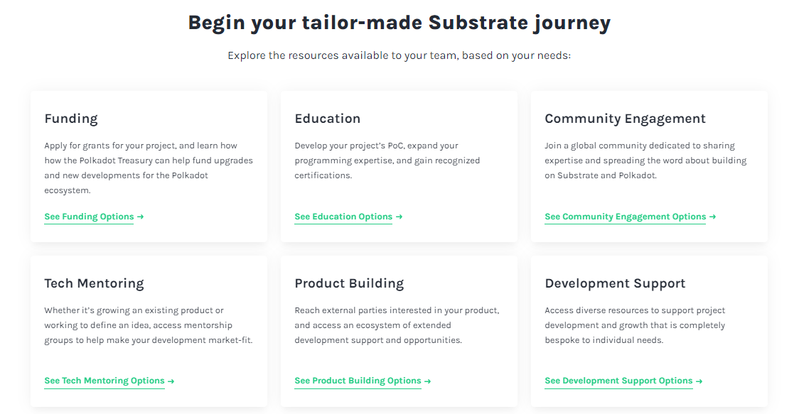

# Taxation

_<mark style="background-color:red;">Disclaimer: This article is written by</mark> <mark style="background-color:red;"></mark><mark style="background-color:red;">**Dot.alert()**</mark> <mark style="background-color:red;"></mark><mark style="background-color:red;">contributors for educational purposes only. This article should not be used as a substitute for competent legal advice from a licensed professional lawyer or attorney in your country.</mark>_

Decentralised applications (dApps) facilitate the acquisition, storage, and trade of digital assets in line with the Web3 services that they underpin. In the Polkadot ecosystem, interconnected and interoperable platforms support the extraction of events-related data for blockchain transactions that assists in cementing accountability.

## Legal Frameworks:

### Asset Monitoring&#x20;

Decentralised applications are designed to remove the majority of intermediaries and third-parties traditionally involved in a wide range of valuable transactions. They provide direct access to the blockchain ledger for submitting and viewing operations involving multiple cryptocurrencies and network assets. dApps are the first point of entry into the blockchain industry for new users and prospective investors alike, because they allow the purchase, exchange, and disposal of digital assets in a peer-to-peer manner and without any upper limit.&#x20;

Since blockchain networks come in many forms, there are no mandated processes for handling their related assets. Therefore, dApps compete to offer the most comprehensive functionalities to their users, in line with multichain use cases. In the Polkadot ecosystem, there is a large choice of [blockchain explorers](../../../useful-tools/explorers.md), wallets, and historical data aggregators that help with tracking assets held on parachains and blockchain projects as they launch. While these products built by open source teams have historically focused on servicing everyday users, recent developments are more geared towards power users such as institutional investors and enterprise-grade projects.

<figure><figcaption>
<a href="https://polkasafe.xyz/">PolkaSafe</a> facilitates multisig accounts management for corporate users of Polkadot.
</figcaption></figure>

Still, despite accelerated initiatives to facilitate the onboarding to Web3 services, handling digital assets remain a challenge across the board for all users. Currently, there are very few analytic solutions for linking on-chain data with off-chain data to provide context to certain operations. For many bookkeepers, auditors, and legal practitioners who are tasked with managing tax affairs for their customers, separating charitable endeavours (i.e crypto donations and gifts), commercial transactions (i.e crypto payments) and financial instruments (i.e crypto investments) is perceived as a time-consuming and inefficient procedure.

### Taxable Events &#x20;

Cryptocurrencies are a novel form of digital assets issued and managed independently from banks and central authorities. They are often considered to be a standalone asset class because they can be used both as a form of money (aka medium of exchange) and property (aka store of value). Although the majority of users acquire digital assets as investments, the industry attracts researchers, technologists, and workers who design, build, and promote new protocols. In the course of their business, they interact with network participants from around the world and create new political, social, financial narratives. In response, established government agencies propose new fiscal frameworks to capture the economic value that is generated by[ blockchain stakeholders](../platforms/services.md).

<figure><figcaption>
The platform <a href="https://substrate.io/ecosystem/square-one/">Square One</a> offers tailored guidance to prospective ecosystem participants.
</figcaption></figure>

The tax treatment of cryptocurrency transactions tend to follow the principles of common taxation mechanisms which are _Capital Gain Tax (CGT), Income Tax (IT), Goods and Services Tax (GST) or Value Added Tax (VAT)_. Users who regularly buy, swap, and sell crypto coins and tokens are often liable to pay CGT on the gains made during their trades, which often comes at discounted rates under certain conditions. They also have the option to register losses that will be used to offset gains at a later time. Workers in the blockchain industry are required to declare any income made in the course of their contracts or internships, just like recipients of staking rewards, airdrops, royalties, and lottery prizes can be liable for IT. As a sub-class of digital assets that can be self-sufficient or  representative of real world assets, NFTs can be tied to GST and VAT in the case of primary and secondary sales.&#x20;

For blockchain companies, investors, and users who operate across multiple ecosystems with many digital asset types, multichain aggregators are a critical piece of infrastructure that assist with [tax reporting and decentralisation](https://www.imf.org/en/Blogs/Articles/2023/07/05/crypto-poses-significant-tax-problems-and-they-could-get-worse). In the Polkadot ecosystem, on-chain data is itemised to provide more context to transactions, flexibility in operations, and opportunities for automation. _XCM (aka_ the Polkadot-native cross-chain communication protocol) allows appchains to extend their business logic by borrowing the capabilities of other ecosystem chains. _Runtimes_ themselves are made of smaller modules that define the kind of operations that can be conducted on a given appchain. Within these modules, _Extrinsics_ denote information that can be manually submitted from the outside world onto the chain, meanwhile _Events_ indicate data that can be generated by the chain itself. These technologies support unique solutions such as nomination pools, proof-of-liquidity staking, and derivative token voting which can help limit the occurrence of CGT and GST events.

## Risk Management:

### Jurisdictional Risks&#x20;

As a new type of asset class, cryptocurrencies attract different tax treatments based on many factors, such as the entity that is reporting, the timing of the report and, more importantly, the country where the report is lodged. While certain states provide a tax-free environment for crypto traders and operators, others maintain high tax rates on crypto assets as a mean to control the flow of capital and increase their revenues. Consequently, individuals with considerable net worth and blockchain entities that operate entirely in the digital space often choose to migrate to countries with more [supportive fiscal policies](https://www.globalcitizensolutions.com/crypto-tax-haven/).

In recent times, international agencies have begun to investigate the opportunities and the challenges of cryptocurrencies, in particular how they can be traded [without any compliant intermediaries](insurance.md). However, tax laws are complex to define and implement without a coherent leadership and a proven framework that can be replicated across the world. Therefore, many countries are still hesitating between the complete rejection of cryptocurrencies and the stringent taxation of digital assets. In practice, local branches from multinational mining companies or centralised crypto exchanges can be forced to shut down in one jurisdiction, while parent offices are allowed to maintain their operations elsewhere.

### Legal Risks

The extreme [variability of tax laws relative to cryptocurrencies](https://chasebuchanan.com/crypto-taxation-portugal-traders-investors/) is gradually leading to reduced risk appetite for the asset class. For many retail users and entrepreneurs, it is often difficult to source reliable information on tax reporting procedures and timelines that match their personal and professional situations. Given that failing to declare some crypto income or assets can be interpreted as tax evasion in some countries and lead to hefty fines, it is much easier to avoid transacting and operating on blockchain networks altogether.&#x20;

As cryptocurrencies experience boom and bust cycles, government agencies increase their monitoring activities to review the accuracy of tax declarations. Aside issuing reminders and warnings to targeted individuals and companies, they are using on-chain tracking tools to build cases for new lawsuits. Despite the promises of [privacy-preserving technologies](../networks/privacy.md), mandatory offramp KYC on CEXes and the rise of on-chain sleuthing contribute to revealing the entire history of pseudonymous users or entities' activities (aka "doxxing"), including patterns that could lead to class actions from legal authorities at a future date.

