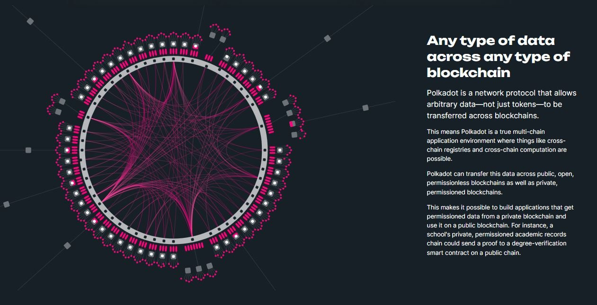

# Networks

The Polkadot ecosystem is made of various networks that:

* interact with the Polkadot and Kusama relay chains (i.e Shared security)
* interoperate via protocols (i.e XCMP/HRMP, bridges, smart contracts)&#x20;
* intersect functionalities (i.e DeFi, DID, Privacy, IoT, etc.)
* interchange data (i.e Coins, tokens, NFTs, on-chain identities, etc)

<figure><figcaption>
Summary of the capabilities of <a href="https://polkadot.network/technology/">Polkadot network's technologies</a>.
</figcaption></figure>

This novel architecture of the digital space represents opportunities for builders who [create its infrastructure](infrastructure.md), operators who [participate in its consensus](participation.md), and activists who [advocate for privacy-preservation](privacy.md).

