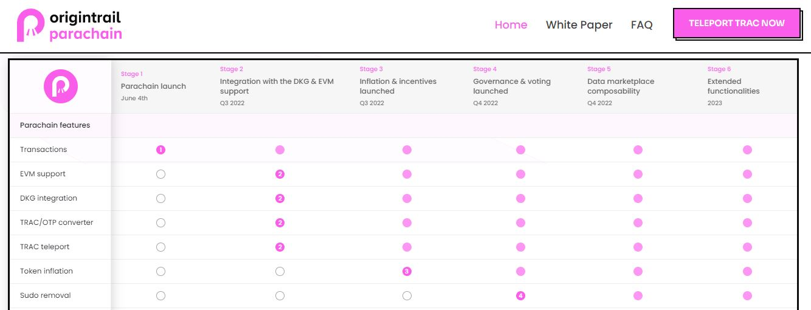
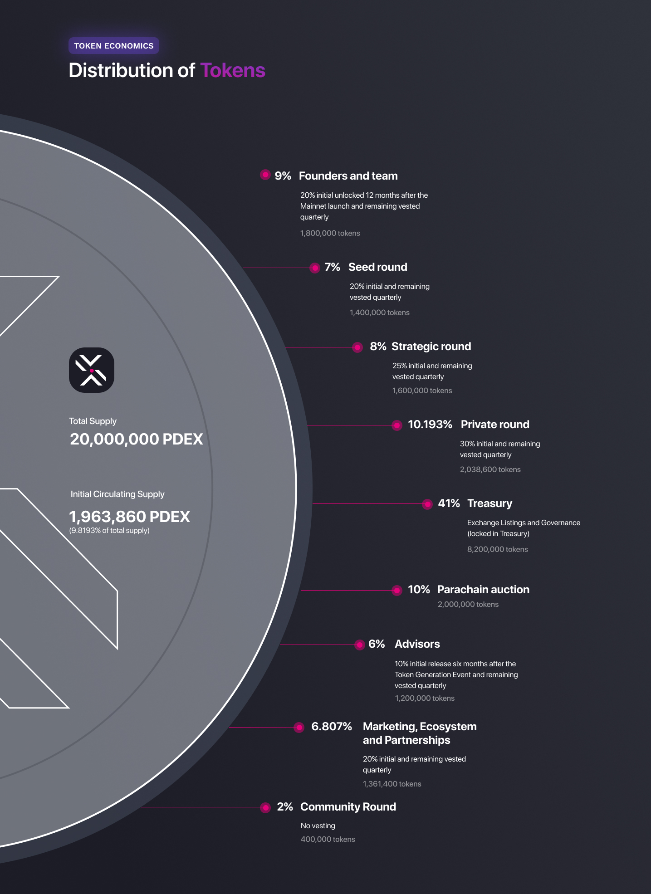
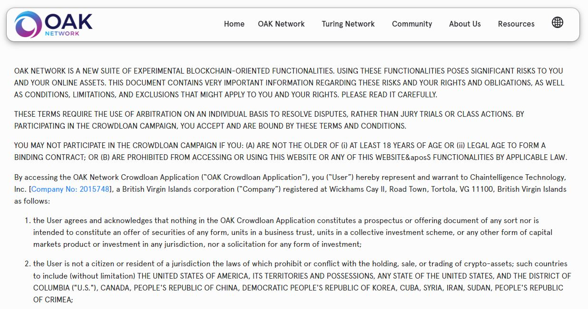
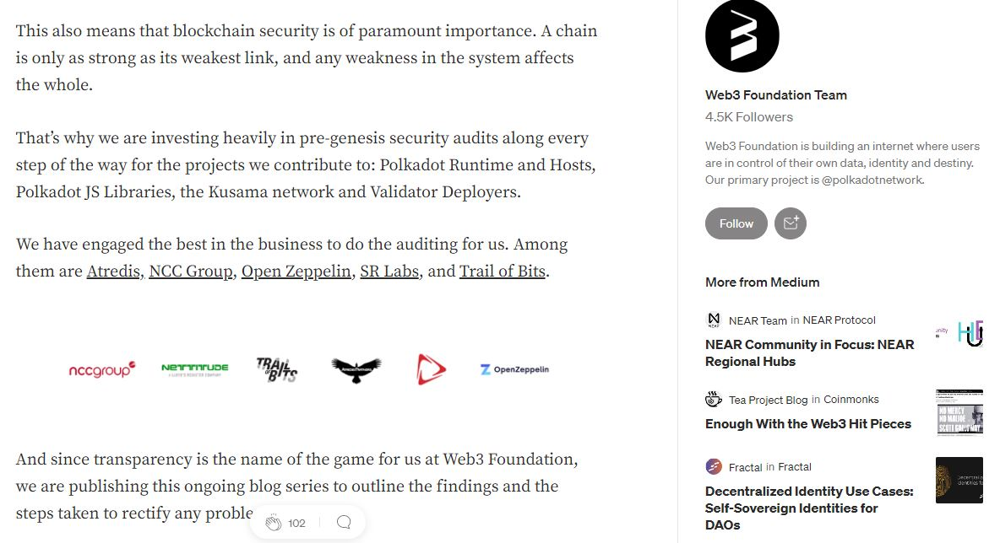

# Infrastructure

_<mark style="background-color:red;">Disclaimer: This article is written by</mark> <mark style="background-color:red;"></mark><mark style="background-color:red;">**Dot.alert()**</mark> <mark style="background-color:red;"></mark><mark style="background-color:red;">contributors for educational purposes only. This article should not be used as a substitute for competent legal advice from a licensed professional lawyer or attorney in your country.</mark>_

Blockchain infrastructure represents the hardware and software needed to provide access to Digital Ledger Technology (DLT) to end-users. In the Polkadot ecosystem, Substrate is the core component of this infrastructure; with blockchain engineers, application developers, user interface designers, and users all interacting with the framework at different levels.

## Legal Frameworks:

### Blockchain Networks

Substrate is used to build a variety of private or permissioned chains that go through a series of steps to become fully permissionless. This process, which involves building a runtime, authorising nodes, running a testnet and issuing a token, culminates in the removal of a superuser called "sudo" through governance vote.&#x20;

<figure><figcaption>
Extract from Origin Trail parachain's roadmap.
</figcaption></figure>

Currently, there isn't any comprehensive law or bill that gives clear guidelines for establishing whether a [network](https://dot-alert.gitbook.io/dot.alert/content/5.regulations/networks) is decentralised or centralised. Most of the literature on this topic is written by technologists and developers in the course of their research and/or experiments. However, the question of decentralisation remains important in defining whether the assets issued on a given network can be classified as [financial products](https://www.consilium.europa.eu/en/press/press-releases/2022/06/30/digital-finance-agreement-reached-on-european-crypto-assets-regulation-mica/).

### Network Assets

With the exception of Common Good parachains, all chains that are currently running in the Polkadot ecosystem use a native token that was launched at genesis. Networks often give a general outline of the terms and conditions attached to the distribution, release, and use cases of their native coin in the Tokenomics section of their whitepaper. Similarly, most active community projects and/or DAOs make use of tokens (fungible or not) to give certain rights to the holders.&#x20;

<figure><figcaption>
Token economics of Polkadex.
</figcaption></figure>

From a regulatory perspective, matching digital assets to existing financial instruments would be one way to give them some legitimacy while enforcing current directives. Under this approach, utility tokens would be considered the blockchain equivalent of commodities and/or securities, and thus be subject to laws related to disclosure documentation. Meanwhile, derivative tokens would be comparable to futures, options, swaps, and CFDs; all of which come with specific rules regarding [consumer protection](https://www.sec.gov/news/speech/gensler-sec-speaks-090822).&#x20;

## Risk Management:&#x20;

### Jurisdictional Risks

The major threat to a network infrastructure lies in whether or not the procedures that were put in place at the time the network completed its public token offerings violated any of the existing national and international regulations relative to financial markets and products. However, in the absence of a unified perspective on this matter, it is still down to each nation or state to define and adopt its own regulatory framework.

<figure><figcaption>
Extract from <a href="https://oak.tech/">OAK network</a>'s crowdloan Terms and conditions.
</figcaption></figure>

In recent times, some [lawsuits](https://www.sec.gov/news/press-release/2020-338) have been issued by financial institutions and governments to blockchain network executive teams whose initial coin offerings happened much earlier on. Projects that are looking to launch their own parachains and/or organise themselves in DAOs are considering investigating the terms of these lawsuits as a regulatory guide for their own pre-launch operations.&#x20;

### Operational Risks

There are no global standards for blockchain network infrastructure, as each project is free to make its own recommendations on the equipment and tools that sustain its on-chain operations. However, given that they provide digital services to end-users, project teams run the risk of breaking consumer protection rules whenever their services are halted due to a major fault or negligence from their part.

<figure><figcaption>
<a href="https://medium.com/web3foundation/the-polkadot-genesis-security-audits-hub-4d8b65e7f564">W3F</a> gives an overview of security audits completed on the Polkadot-JS suite.
</figcaption></figure>

There have been instances in the past whereby individual investors have [sued](https://www.classaction.org/news/scam-tokens-class-action-alleges-uniswap-labs-has-done-nothing-to-stop-rampant-fraud-on-crypto-exchange) the team behind open-source protocols to obtain compensation for losses that occurred during their interactions with the products. To mitigate this risk, infrastructure providers for technologies such as runtimes, nodes, APIs, dapps, and wallets undergo recurring audits throughout their products' lifecycle.

### Ecological Risks

There have been a lot of discussions regarding the sustainability of decentralised networks, because there is the pervasive belief that a significant amount of power is needed to run and maintain their infrastructure. Although current research has proved that Polkadot ecosystem networks are among the greenest in the blockchain space, variations remain at the scale of individual node operators.

<figure><figcaption>
A comparative table from the CCCI 2021 report on <a href="https://carbon-ratings.com/">yearly electric consumption</a> showing Polkadot's performance.
</figcaption></figure>

For this reason, Relay chain validators and Parachain collators still need to pay attention to their own carbon footprint and take proactive steps to reduce its environmental impact over time. Furthermore, in the context of [international agreements](https://www.whitehouse.gov/ostp/news-updates/2022/09/08/fact-sheet-climate-and-energy-implications-of-crypto-assets-in-the-united-states/) on climate change, network infrastructure providers need to ensure that the energy sources that they use do not go against the standards outlined by their local authorities.&#x20;

