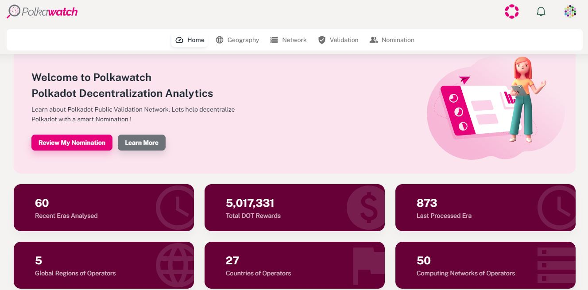
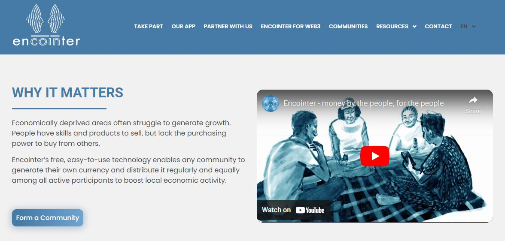
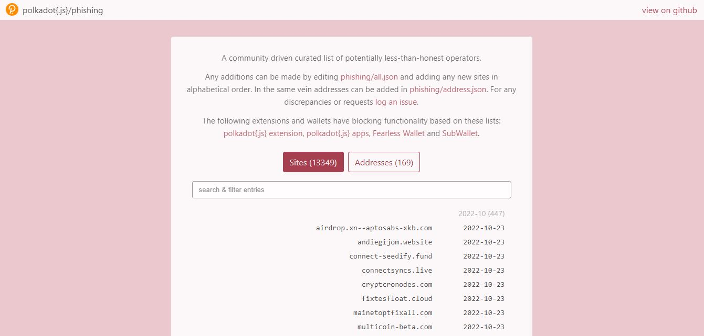
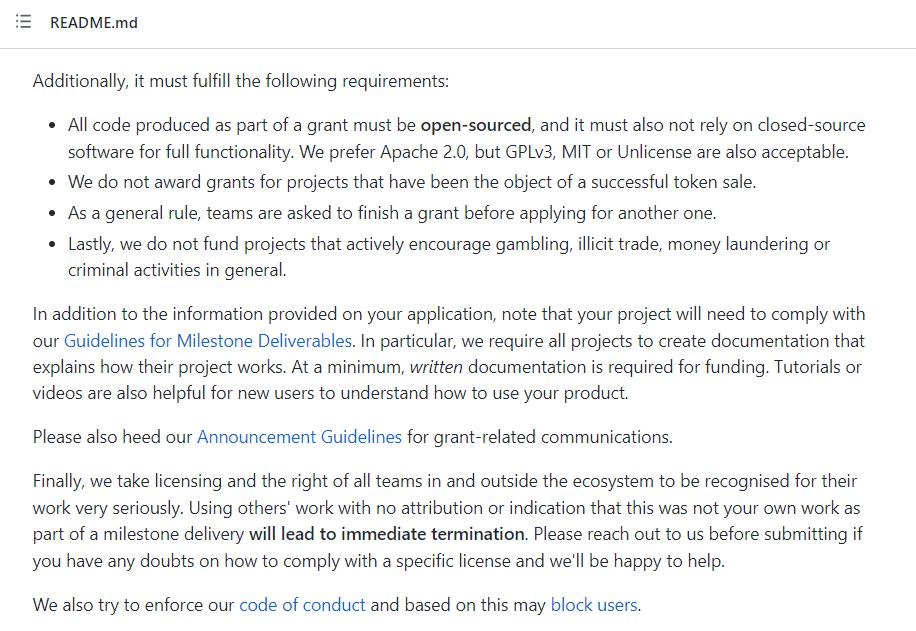
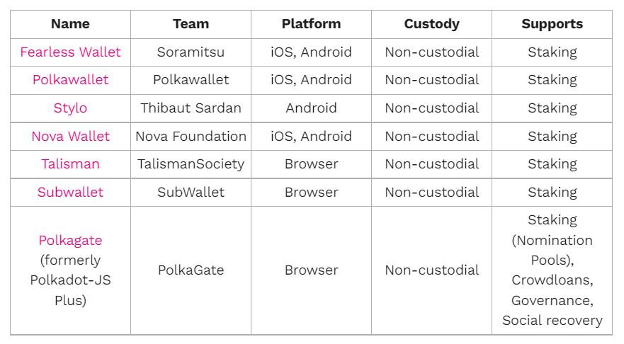

# Participation

_<mark style="background-color:red;">Disclaimer: This article is written by</mark> <mark style="background-color:red;"></mark><mark style="background-color:red;">**Dot.alert()**</mark> <mark style="background-color:red;"></mark><mark style="background-color:red;">contributors for educational purposes only. This article should not be used as a substitute for competent legal advice from a licensed professional lawyer or attorney in your country.</mark>_

Blockchain networks use a set of on-chain rules (also called "consensus mechanism") to assign specific responsibilities to participants. In the Polkadot ecosystem, Relay chains (also called Layer 0s) and Parachains (also called Layer 1s) coordinate their operations to provide an open-ended and permissionless environment to their contributors.&#x20;

## Legal Framework:&#x20;

### On-chain Roles

_Nominated Proof-of-Stake_ is the methodology used in the Polkadot ecosystem to determine the validity of transactions. In this context, Relay chain validators and Parachain collators are randomly chosen to stamp blocks of transactions and earn rewards for their operations. However, in order to qualify for this active role, they need to show their commitment to network security by locking a certain amount of coins in the system. [Nominators](https://dot-alert.gitbook.io/dot.alert/content/3.operations/staking/nominating) also contribute to this process by staking their coins with their chosen operators in exchange for some income.

<figure><figcaption>
<a href="https://polkawatch.app/">Polkawatch</a>'s analytics empower nominators to participate in Polkadot network's decentralisation.
</figcaption></figure>

The Polkadot ecosystem also implements sophisticated on-chain governance mechanisms to defer the decision-making to token holders. The initial version of governance operations on Polkadot network involved two special bodies (a Council and a Technical committee) as representatives of passive token holders. The upcoming governance 2.0 update will eliminate these privileged roles and introduce on-chain collectives from which token holders can take a more active role in directing the network.&#x20;

<figure><figcaption>
Polkadot network's upcoming <a href="https://polkadot.network/blog/gov2-polkadots-next-generation-of-decentralised-governance/">Gov2 update</a> pushes for more active participation from token holders.
</figcaption></figure>

From a regulatory perspective, decentralised networks can bring novel ways to make blockchain technologies work for and with existing government structures and national institutions. Some countries have welcomed the opportunity to run [sandbox experiments](https://www.atlanticcouncil.org/cbdctracker/) such as Central Bank Digital Coins and national payment systems on existing blockchain networks. Nevertheless, these initiatives are still limited in scope for lack of international coordination on legal directives.

### Off-chain Entities

Within the Polkadot ecosystem, various actors reuse existing toolkits to pursue their own separate goals. There are For-Profit projects that often obtain their initial funding through specialised Venture Capital firms (also called VCs) in order to launch their products on parachains. Fintech companies that operate in the blockchain space also participate in the ecosystem by integrating Polkadot protocols in their suite of commercial products. Finally, there is a growing number of Not-For-Profit associations launching as standalone chains before applying to become Common Good parachains and expand Relay chain's core functionalities.&#x20;

<figure><figcaption>
<a href="https://encointer.org/">Encointer</a> has deployed Common Good infrastructure for self-sustaining communities.
</figcaption></figure>

Beyond these classic structures, network participation can also take the form of Web3 services that establish a link between the digital and the real world. Registrars, attesters, legal officers are some examples of off-chain roles that can assist existing Relay chains and Parachains with handling identities in a decentralised manner. They can also play a crucial role in providing real-world certifications and oracle data to a wide range of DeFi, NFTs, and Metaverse projects.&#x20;

<figure><figcaption>
Overview of <a href="https://www.kilt.io/how-it-works/">KILT</a>'s Web3 services for self-sovereign decentralised identifiers.
</figcaption></figure>

A growing number of [countries ](https://complyadvantage.com/insights/cryptocurrency-regulations-around-world/)are looking to regulate some components of these off-chain structures to ensure that they do not work against their nations' and economic areas' interests. Because they run platforms as part of their operations, blockchain-based companies and organisations could be categorised as intermediaries between retail users and decentralised networks. As such, upcoming legislations are proposing that they adhere to [strict laws](https://www.linkedin.com/pulse/how-commission-set-out-torpedo-web3-without-even-realizing-?trk=organization\_guest\_main-feed-card\_feed-article-content) relative to asset provision and data protection.

## Risk Management:

### Operational Risks

Blockchain technologies are still an emerging industry with a lot of experimental developments that haven't necessarily been time-tested. Partaking in decentralised networks can be punctuated by critical software errors and unexpected hacks, which eventually threatens the security of protocols and assets. This can make project teams and their users extremely dependent on rather slow governance interventions to resolve fairly pressing issues.

<figure><figcaption>
<a href="https://polkadot.js.org/phishing/">Polkadot-JS Anti-phishing</a> libraries enable Polkadot native wallets to block dangerous websites. 
</figcaption></figure>

Furthermore, decentralised protocols require users to adopt self-custody solutions for their assets and funds, as a way to guarantee trustless ownership. But this also means that users will bear all consequences in case of mishaps. Since there is [no depositor protection/insurance](https://koinly.io/blog/crypto-scam-tax/), participants have no real recourse if they lose their Private keys or become the victim of a [phishing](https://www.forbes.com/sites/forbestechcouncil/2022/04/27/four-crypto-and-blockchain-phishing-scams-to-be-aware-of-before-you-get-excited-about-web3/?sh=63be25e025c5) attack.&#x20;

### Legal Risks

Whether they are For-profit companies or Not-for-profit organisations, blockchain projects primarily build their networks through open-source Software Development Kits (also called SDKs) and code. Unlike proprietary software, open-source licensing ensures that protocols can be reviewed and updated by any contributor willing to join in the engineering effort.&#x20;

<figure><figcaption>
The <a href="https://github.com/w3f/Grants-Program">Web3 Foundation Grants Program</a> outlines clear rules for managing open-source code attributions.
</figcaption></figure>

Nevertheless, project teams need to pay attention to the terms and conditions of the licenses attached to the original code that they are forking. This is because the consequences of inappropriate use of an open-source software can go much further than damaging the reputation of a project and interfering with its operations.[ Complex litigation procedures](https://brainhub.eu/library/open-source-licenses-to-avoid) can be brought in whenever there is a serious breach, which would eventually drain valuable resources from the project.

### Jurisdictional Risks

Although most blockchain networks strive to operate in a permissionless manner and lower the barriers to participation, it is not always the case in practice that every user can take advantage of Web3 services. In some areas of the world, borderless networks are perceived as an ongoing threat to financial sovereignty and social stability. This general perception has led to blanket bans on operations involving blockchain assets in some nation-states.

<figure><figcaption>
A list of <a href="https://support.polkadot.network/support/solutions/articles/65000068702-where-to-store-dot-polkadot-wallet-options">Polkadot</a> wallets designed for secure self-custody of ecosystem assets.
</figcaption></figure>

Government responses that are more moderate still view assets from decentralised networks as the medium of exchange of choice for unlawful organisations. As a result, most developed countries have taken drastic steps to [consolidate their laws](https://www.europarl.europa.eu/news/en/press-room/20220627IPR33919/crypto-assets-deal-on-new-rules-to-stop-illicit-flows-in-the-eu) in an attempt to gain some control over blockchain network participants.

