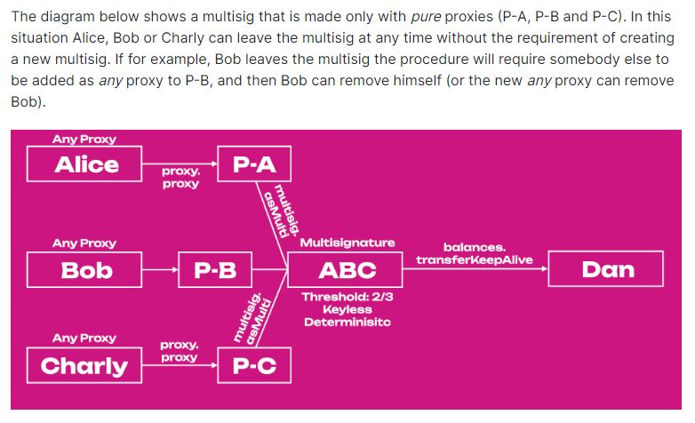
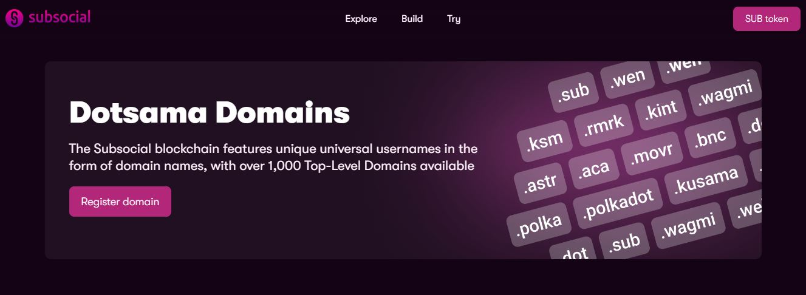
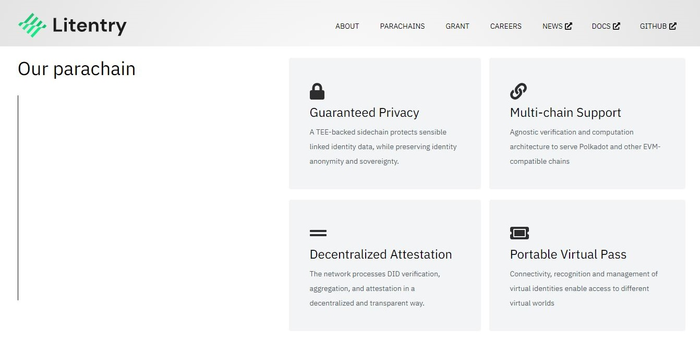
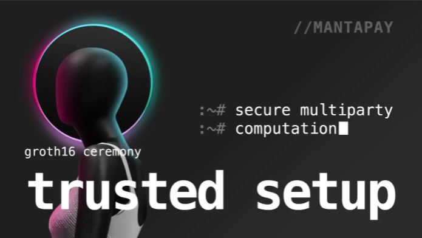
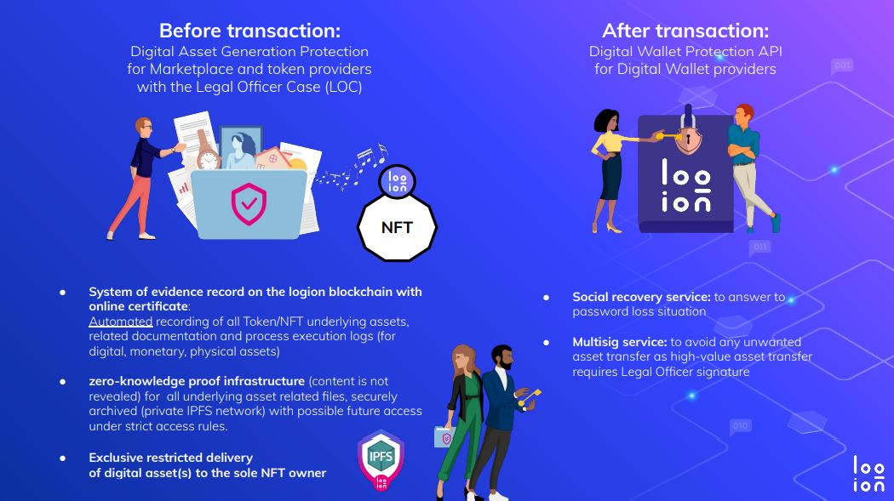
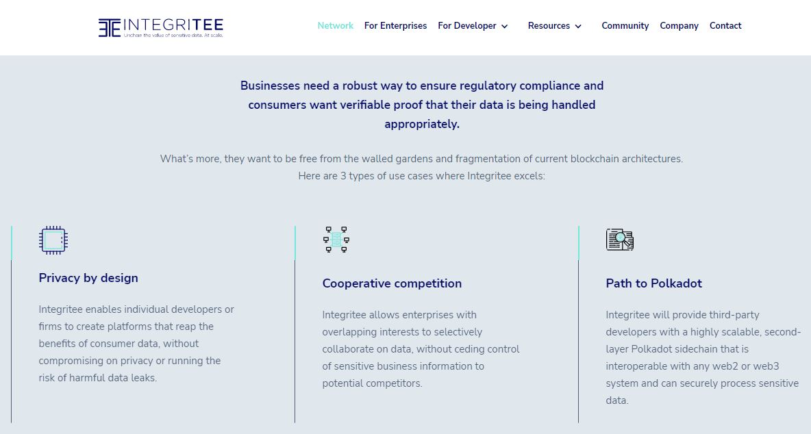
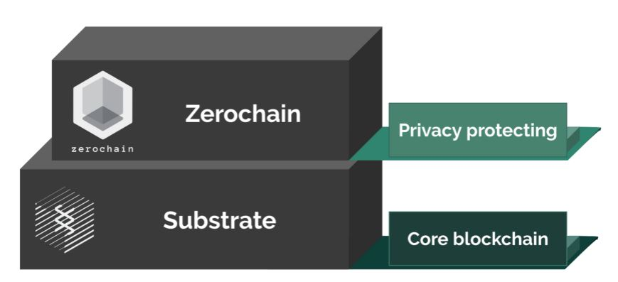

# Privacy

_<mark style="background-color:red;">Disclaimer: This article is written by</mark> <mark style="background-color:red;"></mark><mark style="background-color:red;">**Dot.alert()**</mark> <mark style="background-color:red;"></mark><mark style="background-color:red;">contributors for educational purposes only. This article should not be used as a substitute for competent legal advice from a licensed professional lawyer or attorney in your country.</mark>_

Blockchain networks are primarily built to provide access to a ledger of finalised transactions and participants' data. In the Polkadot ecosystem, a growing number of builders are proposing an alternative standard for their network infrastructure. They are developing a variety of protocols and tools designed to give users more control over the type of information that they want or do not want to see stored on-chain.&#x20;

## Legal Frameworks:&#x20;

### Identity Management&#x20;

Public keys are universal identifiers for all accounts created on blockchain networks, with the digital ledger logging transactions between public addresses. Within the Polkadot ecosystem, [address formats](https://dot-alert.gitbook.io/dot.alert/content/1.acquisition/address-formats) are variations in the use of public keys which allow pseudonymous stakeholders to use their accounts across different chains. Network participants further have the option to customise their account addresses by generating Vanity addresses and Account indices. Finally, Pure proxies (i.e accounts devoid of private keys) can serve as placeholders in multisig setups, hereby bypassing the link between pseudonymous ownership and account management.&#x20;

<figure><figcaption>
An example on how to use <a href="https://wiki.polkadot.network/docs/learn-proxies#why-pure-proxy">pure proxies</a> for an open-ended multisig setup.
</figcaption></figure>

Other solutions exist to help prominent network entities anchor their organisation or brand as part of their staking, voting, and [crowdfunding](https://dot-alert.gitbook.io/dot.alert/content/3.operations/crowdfunding) operations. At a basic level, they can register on-chain identities to link their contact details to all the accounts that they own. They also have the option to use naming services and custom domains when disseminating important information in the community, in a process that is both trustless and verifiable. Finally, members of these organisations can create Decentralised Identifiers (also called DIDs) to provide professional credentials, KYC information, and unique user profiles across various Web3 platforms.

<figure><figcaption>
<a href="https://subsocial.network/technology">Subsocial</a> offers domain registration services.
</figcaption></figure>

Regulators have long advocated for caution when interacting with public ledgers, due to [the pseudonymous nature of blockchain networks operations](https://www.nortonrosefulbright.com/en/knowledge/publications/c5a7c134/anonymous-no-more-blockchain-analytics-in-the-courts). This is because transactions are permanently available and can be used to link individuals with their public addresses. Nevertheless, they acknowledge that Decentralised Identity protocols can contribute to compliant authentication procedures in the digital realm, which could support the onboarding of financially-excluded population (also called "the unbanked") into financial services. Another important use case for Decentralised identities could emerge to facilitate individuals' access to digital assets in the context of inheritance. &#x20;

<figure><figcaption>
<a href="https://litentry.com/">Litentry</a> is building toolkits that users can leverage to generate and manage DIDs by themselves.
</figcaption></figure>

### Privacy-preserving Protocols&#x20;

Zero-knowledge proofs (also called ZKPs) are cryptography protocols that empower participants to verify a statement against a claim without revealing the statement itself. This makes ZKPs ideal for managing personal information privately within Web3 services such as DID, DeFi, Metaverses land sales, NFT issuances, or DAOs. In the Polkadot ecosystem, ZK SNARKS are integrated as a core technology for use cases such as obfuscating Public addresses, issuing private tokens, encrypting account balances, and certifying/recovering digital assets. These privacy add-ons require willing contributors for trusted setups (i.e the more participants, the better) ahead of the full deployment of network infrastructure.&#x20;

<figure><figcaption>
Manta network has scheduled a large <a href="https://mantanetwork.medium.com/trusted-setups-and-why-they-are-important-to-manta-network-27a9ac5cd609">trusted setup ceremony</a> for its operations.
</figcaption></figure>

Trusted Execution Environments (also called TEEs) are special areas within computing hardware where code is run in isolation and data is processed privately. They are used to protect applications against attacks and to prevent access to sensitive data by third-party programmes. In the Polkadot ecosystem, TEEs technologies give stakeholders the opportunity to migrate from centrally-controlled cloud providers, into confidential computing as part of their node operations. Another privacy-focused solution involves the deployment of Decentralised private clouds infrastructure alongside private smart contracts.

<figure><figcaption>
Phala network proposes <a href="https://wiki.phala.network/en-us/build/general/why-use-it/">privacy-preserving services</a> within the Web3 stack.
</figcaption></figure>

Current data protection laws mandate that digital platforms, regardless of their nature, should [implement the principle of "data protection by design"](https://iapp.org/news/a/blockchain-technology-is-on-a-collision-course-with-eu-privacy-law/), which includes the right to be forgotten. This is because a lot of economic value is extracted from personal data generated by millions of individuals upon verification, authorisation, and processing of credentials. Within permissionless and decentralised blockchain networks, privacy-preserving protocols follow through on these regulatory guidelines because they ensure that users' data can never be accessed in the first place.&#x20;

## Risk Management:

### Operational Risks

Although there has been a lot of research done in relation to cryptographic proofs and encryption algorithms, [the practical implementation of privacy technologies is still experimental](https://medium.com/phala-network/technical-analysis-of-why-phala-will-not-be-affected-by-the-intel-sgx-chip-vulnerabilities-e045b0189dc2). The most established privacy solutions have traditionally involved the creation of a special-purpose blockchain in combination with the issuance of dedicated coins. This contrasts with current propositions that focus on providing privacy services on top of permissionless public blockchains.&#x20;

<figure><figcaption>
<a href="https://logion.network/">logion network</a> uses ZKPs to restrict access to digital assets.
</figcaption></figure>

Since the focus of privacy developments has been shifted on to [customising the way platforms handle users data](https://financialservicesblog.accenture.com/cryptocurrency-managing-data-privacy-risks), the possibility of a glitch in the de-anonymisation process becomes more likely. A failure in these decentralised protocols could end up revealing sensitive/personal information, which would leave users/entities with no real recourse. The onus is therefore on privacy services providers to continuously review and upgrade their solutions to meet the highest standards for data security.

### Legal Risks

In the context of privacy-preserving protocols, [the nature of the data stored on-chain itself is still the subject of many discussions and debates](https://www.davispolk.com/sites/default/files/blockchain\_technology\_data\_privacy\_issues\_and\_potential\_mitigation\_strategies\_w-021-8235.pdf). This is because the definition of what constitutes "personal data" can vary from one law to another, and from one country to another. More often than not, it is in the course of lawsuits and trials that a relevant definition emerges, which can muddle the mission of privacy services providers in the long run. &#x20;

<figure><figcaption>
IntegriTEE's <a href="https://integritee.network/integritee">privacy solutions</a> work within the scope of data and consumer protection laws.
</figcaption></figure>

While privacy-focused services architect their solutions in response to users' and businesses' needs, [they do not always take into account recommendations from legislators](https://www.dentons.com/en/insights/articles/2022/june/9/the-privacy-paradox-in-blockchain-best-practices-for-data-management-in-crypto). Most projects are touted as a bold move against Big data extraction by proprietary platforms, which is seen as a mean to empower users to control their data. However, the non-personal data processed between platforms might still contain some personal information in the eyes of the law.

### Jurisdictional Risks

Privacy-by-default is an approach that has garnered a lot of support from blockchain and non-blockchain users, in light of recurrent hacks and tampering done on centralised platforms. This has given birth to formal activist movements that pro-actively fund, research, and develop privacy solutions within the Web3 stack. But there are also more and more individually-maintained initiatives and dapps specifically [designed to counter governments' surveillance](https://home.treasury.gov/news/press-releases/jy0916). &#x20;

<figure><figcaption>
<a href="https://medium.com/layerx/announcing-zerochain-5b08e158355d">LayerX (formelly Zerochain)</a> was among the first Substrate chains to deliver privacy-preserving infrastructure for Dapps.
</figcaption></figure>

Regulators acknowledge that, while anonymisation protocols might help decentralised platforms comply with certain policies, it can also go against others laws. Privacy tools are still [a long way from gaining legitimacy](https://www.coindesk.com/policy/2022/11/15/privacy-enhancing-crypto-coins-could-be-banned-under-leaked-eu-plans/) in most countries, because they are generally associated with use cases involving unlawful activities, tax evasion, and money laundering.&#x20;

