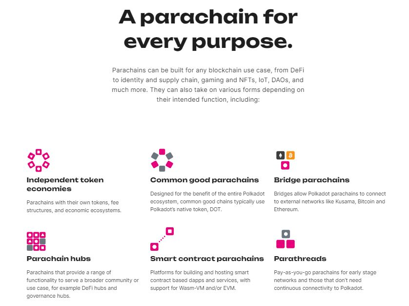

# Platforms

In the Polkadot ecosystem, Parachains are strictly distinct from Relay chains because they are tailor-made to support a wider range of applications and products such as price oracles, token swaps, NFT marketplaces, DAO interfaces, etc.&#x20;

However, it is the modularity of Relay chains' shared security and interoperability protocols that brings forward a model whereby platforms can integrate each other's functionalities without hitting any form of centralised control or censorship.

<figure><figcaption>
An overview of functionalities that can be deployed onto <a href="https://polkadot.network/parachains/">parachains</a>.
</figcaption></figure>

In this open-ended environment ripe for experimentation and exploration, users are given access to [unlimited token-based services](services.md); which contrasts with the licensing schedules followed by centralised platforms and the compliance requirements imposed onto their operators.&#x20;

