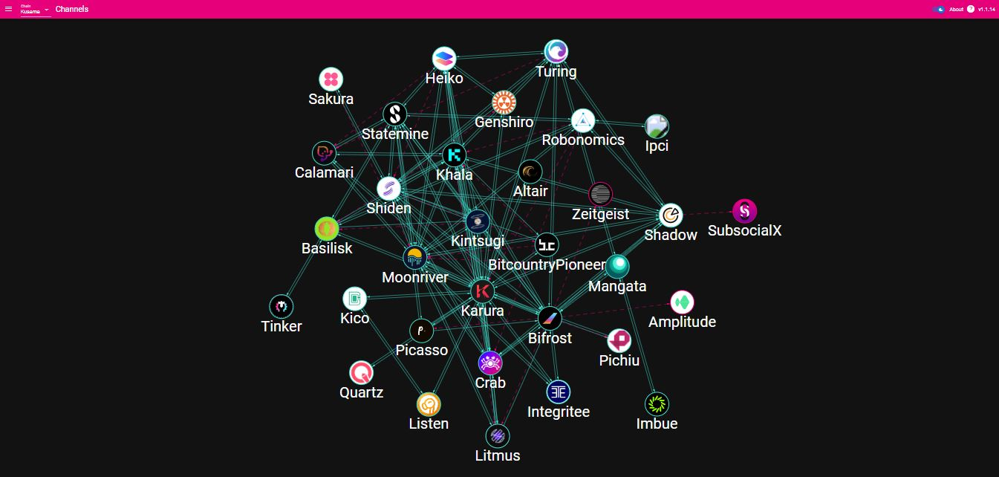

# Compliance

_<mark style="background-color:red;">Disclaimer: This article is written by</mark> <mark style="background-color:red;"></mark><mark style="background-color:red;">**Dot.alert()**</mark> <mark style="background-color:red;"></mark><mark style="background-color:red;">contributors for educational purposes only. This article should not be used as a substitute for competent legal advice from a licensed professional lawyer or attorney in your country.</mark>_

Blockchain technologies pave the way for Research & Development that aims to put data ownership, storage, and management entirely in the hands of everyday users. In the Polkadot ecosystem, the Parachain model of customisable [networks](../networks/) and interoperable dapps enables the creation of decentralised products to rival Web2 platforms and their app stores.

## Legal Frameworks:

### Web technologies

The current web (also called "Web2") is populated by [platforms](./) owned by centralised entities and built around a corporate model. In this context, an established parent company is incentivised to acquire budding projects and integrate their solutions or revoke their business models altogether. Web2 corporations act as gatekeepers for technological innovations because they drive the demand for tech products on a global scale. Over time, this has led to the emergence of a few dominant players in the sector (also called FAANG) who are now in a position to censor any initiative that goes against their interests.

By opposition, the rise of Web3 platforms is powered by a grassroot approach whereby participation in network operations [requires project teams to hold on to their stake](https://research.web3.foundation/en/latest/polkadot/NPoS/index.html), which is represented by a token. In this cooperative model, innovation converges towards ensuring censorship-resistance, so that no single entity can ever take hold or destroy a network. In the Polkadot ecosystem, decentralisation efforts are sustained by trustless blockspace renting mechanisms that allow parachain teams to sign in and out of the ecosystem as they see fit. In addition, interoperable protocols lay the groundwork for collaborative ventures between project teams that can then work organically towards accelerating the adoption of their native technologies.

Regulatory bodies have understood the need to provide a legal framework under which tech companies, and tech corporations in particular, must operate. However, this is a process that still has to catch up with the realities of a fast-moving industry, as evidenced by the recent history of lawsuits, trials, and fines brought upon some of the biggest tech conglomerates. While anti-trust laws are there to help level the playing field for Web2 projects, enforcing such legislations within the decentralised web is a challenging task. Instead, regulators' focus is on investigating fraudulent [Web3 projects that operate from a centralised structure to manage assets](https://www.bis.org/publ/qtrpdf/r\_qt2112b.htm) (i.e tokens and stablecoins) and fail to comply with the requirements mandated for Virtual Assets Services Providers (also called VASPs).

<figure><figcaption>
A visualisation of active HRMP ("XCMP light") channels between Kusama network's parachains.
</figcaption></figure>

### Commercialisation&#x20;

Applications developed within the realm of Web2 are first and foremost concerned with giving users the means to create and share content so that it can be accessed by other users. By design, these centralised platforms are easy to access to novices and score high on performance metrics to offer a seamless browsing experience. Their end goal is to encourage regular users to build and monetise a multinational audience, which in turn helps onboard new users. Though interactions between users happen on a global scale, restrictions are often imposed on certain areas of the world for geo-political and economic reasons. This alone is further evidence that [user-generated content](../../4.social-support/youtube.md) and its related data do in fact belong to the tech companies that develop and distribute the software.

Permissionless blockchain networks provide users with the tools and products they need to manage their transactions as they see fit. The data itself can always be publicly verified, but direct interactions are strictly managed by users themselves as the rightful owners (also called Proof-of-Keys). Web3 dapps aim to become borderless by integrating as many networks as possible to facilitate users' operations. Parachains of the Polkadot ecosystem are built to this end because, unlike Smart Contracts, they represent a customisable base layer with extendable business logic. Nevertheless, dapps adoption remains limited by poor UX and complex interfaces, as these [do not always address the needs of average users](https://builtin.com/blockchain/web3-ui-sucks) who are not familiar with Web3 technologies.&#x20;

From a legislator's perspective, dapps developers need to make a concerted effort to identify and isolate bad actors in the course of their operations. This is because a lot of Web3 platforms are still being [deployed for unlawful ends](https://go.chainalysis.com/2023-crypto-crime-report.html), in particular hacks, scams, forgery, and copyright infringements. The availability of on-chain data does not equate full transparency in practice, and it is the responsibility of project teams, whether they are backed by Not-For-Profit foundations or For-profit VCs, to prove that they comply with international legislations relative to AML, Anti-Terrorism Financing, and Intellectual Property.

## Risk Management:

### Operational Risks

Permissionless blockchain networks make all the data stored in their digital ledger publicly available to end-users. This means that, with the right tools, it is possible to link users' on-chain addresses with their real life identities and also [establish user profiles](https://www.fatf-gafi.org/en/publications/methodsandtrends/documents/virtual-assets-red-flag-indicators.html) based on this information. In the Polkadot ecosystem, Web3 protocols built with the Substrate Framework have the distinct advantage that they can be upgraded to integrate Privacy features. Such functionalities will eventually empower users to obfuscate some of their transactions and prevent tracking tools from exploiting their digital footprint.&#x20;

Web2 platforms on the other hand are too monolithic to offer the same benefits regarding privacy and secure data handling to their users. This is because they use centralised servers that are easier to shut down during emergency situations as well as proprietary software that can be difficult to adapt in response to [emerging use cases](../../3.operations/). Furthermore, these platforms are often incentivised to collect more user information than strictly required by compliance procedures, so that this data can be funnelled into Big Data platforms and help generate new business models for more revenue. For this reason, registered centralised crypto platforms are often the targets of hacks and blackmailing that seek to obtain funds before administrators' access to databases can be restored.

It is in this context of increasing cyber security threats and attacks that regulatory bodies are pushing for [more stringent compliance metrics within the digital space](https://www.imf.org/en/Blogs/Articles/2023/03/02/mounting-cyber-threats-mean-financial-firms-urgently-need-better-safeguards). Data leaks are being systematically investigated to determine whether there was mismanagement from the part of software operators, and platforms are now required provide customer records whenever breaches lead to substantial asset losses. As a result, a growing number of centralised and decentralised platforms are incorporating the use of compliance software in their day-to-day operations.

<figure><figcaption>
<a href="https://www.polimec.org/">Polimec</a> delivers decentralised crowdfunding with trustless compliance checks that reduce counterparty risks.
</figcaption></figure>

### Legal Risks&#x20;

The majority of Web2 tech corporations emerged in the 2000s to become a dominant force within a decade. Within the crypto space, Centralised exchanges are following a similar trend, with a focus on onboarding users through simple interfaces that eliminate the need for [self-custody ](../../2.storage/)of crypto assets. Essentially, their power lies in their ability to monetise user data obtained through KYC procedures and supply it to national agencies in the context of AML and CFT legislations. Just like tech companies, they have the ability to carry out extensive surveillance on users' transactions and cancel users' access to their platform at anytime.

By opposition, Web3 projects don't routinely implement screening procedures when onboarding users onto their dapps. In this budding industry that is yet to secure mass adoption, the focus is on optimising the services offered by decentralised protocols to address the needs of a wide range of users. Nevertheless, project teams of the Polkadot ecosystem are encouraged to join [on-chain collectives](https://polkadot.network/blog/proposal-for-common-good-parachains) such as _The Polkadot Fellowship_ and _The Polkadot Alliance_ to work on establishing a set of standards for consumer products and services. Over time, these community-led initiatives will help shape a common code of ethics for the ecosystem through which they can denounce unscrupulous projects, websites, and on-chain accounts.

In the early days surrounding the rise of blockchain technologies, legislators had adopted [a negative stance towards decentralised platforms and their stakeholders](https://www.imf.org/en/Blogs/Articles/2018/03/13/addressing-the-dark-side-of-the-crypto-world), likening their tokenomics, transactions, operations, and seed investments to ponzis, money-laundering, fraud, and gambling. More recently however, regulation authorities have been compelled to revise their position because they need the cooperation of Web3 operators to carry out industry-wide consultations and investigations. As users and developers of Web3 platforms continue to seek recommendations from established lawmakers, additional compliance requirements such as spend limits, transaction monitoring, and KYB could very well be introduced in the lifecycle of decentralised projects.

