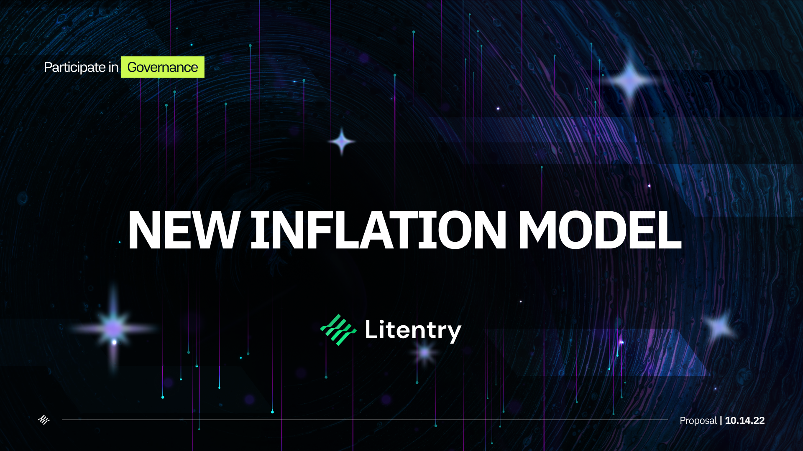
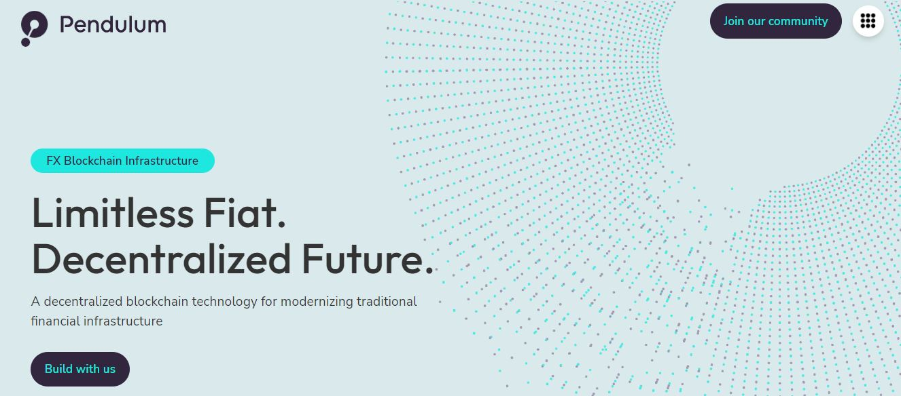
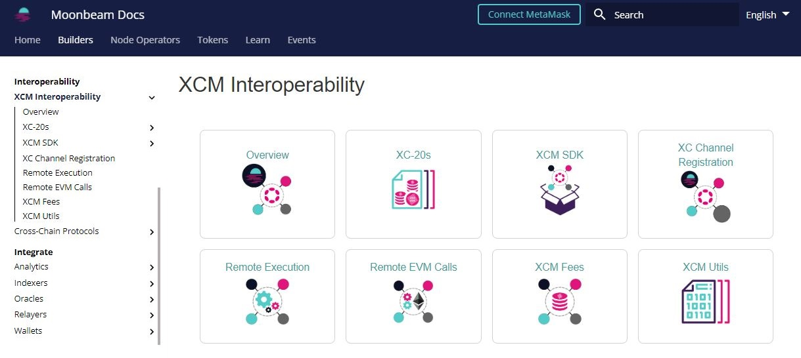
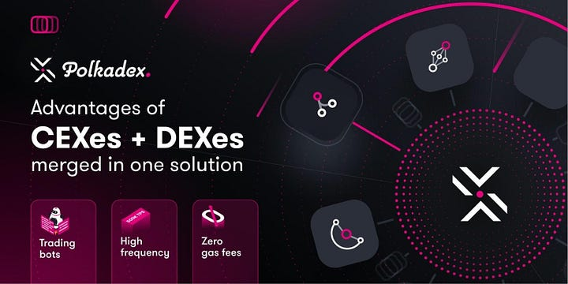
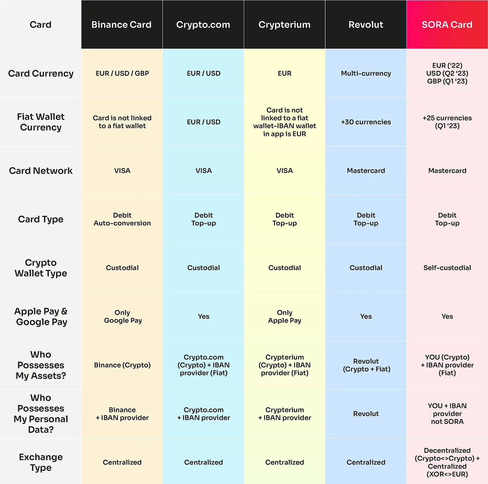
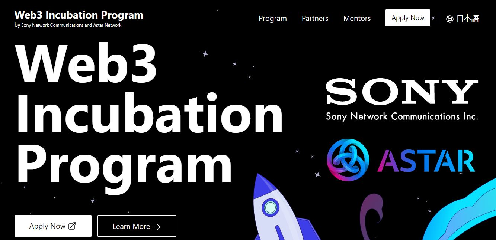
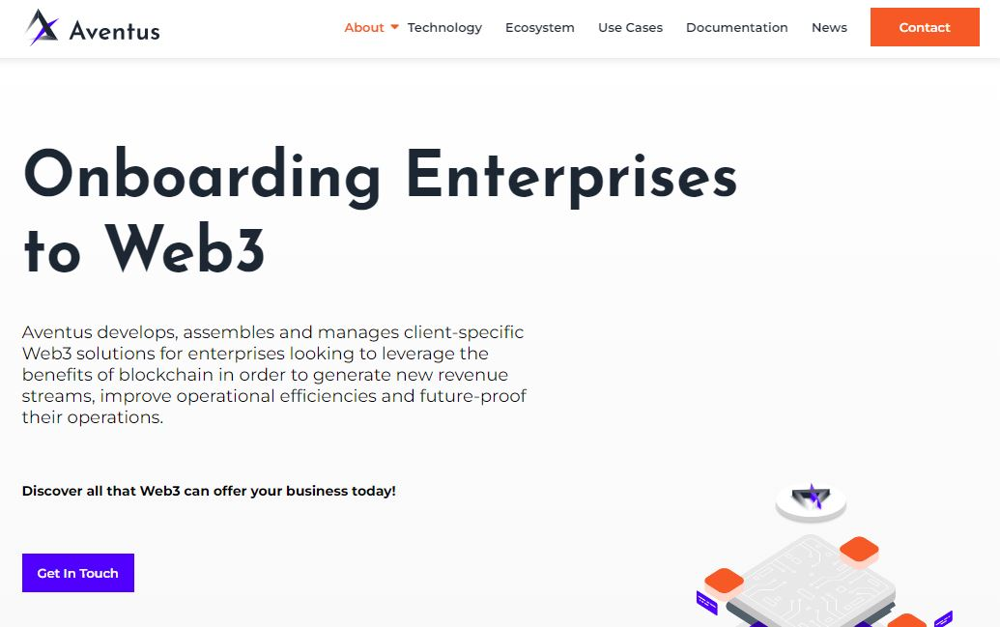

# Licensing

_<mark style="background-color:red;">Disclaimer: This article is written by</mark> <mark style="background-color:red;"></mark><mark style="background-color:red;">**Dot.alert()**</mark> <mark style="background-color:red;"></mark><mark style="background-color:red;">contributors for educational purposes only. This article should not be used as a substitute for competent legal advice from a licensed professional lawyer or attorney in your country.</mark>_

Blockchain technologies shape an emerging industry in which various economic actors are partnering to build new platforms and serve their targeted demographics. In the Polkadot ecosystem, the novel architecture of Parachains drives the resilience of dapps against the traditional business model of centralised platforms.

## Legal Frameworks:

### Business models

Dapps or decentralised applications are the sum of programmes and interfaces that facilitate users' access to blockchain networks' services. They can be customised at code-level to support a wide range of transactions, including transactions between users, between Smart Contracts, and between blockchain networks. In the Polkadot ecosystem, Relay chains and Parachains manage their operations through [decentralised governance](../../3.operations/voting/), which empowers token holders to make decisions about network improvements and the services offered by the dapps built atop of them.

<figure><figcaption>
<a href="https://www.litentry.com/">Litentry</a> submitted an on-chain referendum to consult token holders about changes in the network's tokenomics.
</figcaption></figure>

By contrast, CEXes or Centralised exchanges are self-contained business entities that operate as intermediaries between blockchain networks and the broad economy. They are financial institutions that primarily offer support for transactions involving the conversion of fiat currencies into cryptos and the exchange of various cryptocurrencies. As for-profit businesses, CEXes have an identifiable leadership structure similar to a board of directors from which all decisions regarding operations originate.

<figure><figcaption>
<a href="https://pendulumchain.org/">Pendulum</a> is establishing decentralised fiat on-ramp infrastructure for DeFi protocols.
</figcaption></figure>

Lawmakers acknowledge the challenges of regulating a complex and fast-moving industry where cutting-edge protocols and new brokerage bureaus can rise in popularity and valuation rather suddenly. For this reason, numerous countries have chosen to adopt a framework in which [CEXes must be registered with financial overseers or obtain operating licenses from government bodies](https://www.offshore-protection.com/how-to-set-up-a-crypto-exchange-licence) before they can take custody of retailers' funds.&#x20;

### Software

Second and third generation blockchains rely on the principle of programmability to offer Web3 services to end-users. This means that dapps can be seamlessly integrated into different blockchain ecosystems and upgrade their features while maintaining a unique user interface. Parachains of the Polkadot ecosystem extend this core value proposition of modularity and interoperability through their application-specific design. Since each parachain specialises in a given category of blockchain transactions, these networks will eventually develop more functionalities over time by outsourcing their services to each other.&#x20;

<figure><figcaption>
Moonbeam network has built a suite of tools for developing various <a href="https://docs.moonbeam.network/builders/interoperability/xcm/">XCM uses cases</a>.
</figcaption></figure>

Instead, CEXes have adopted a traditional software development model based on in-house expertise. To establish their dominance in the blockchain sector, centralised platforms tend to ramp up their offerings to match the speed of developments in the field. Over time, they have grown to provide fintech services such as savings, loyalty rewards, and also high-risk investment strategies such as margin trading and launchpad-based financial instruments. &#x20;

<figure><figcaption>
<a href="https://polkadex.trade/">Polkadex</a> is a decentralised platform that offers services traditionally found on Centralised exchanges.
</figcaption></figure>

For many regulatory bodies, dapps, DEXes, and other network-hosted programmes still remain out of scope of their proposed bills and laws. This is because most software under open source licence is considered public good: the product of borderless and distributed collaboration. Consequently, many legislators have shifted their [focus onto CEXes to scrutinise their management of consumer data and assets](https://www.austrac.gov.au/business/industry-specific-guidance/digital-currency-exchange-providers) in the context of Anti-money laundering and Anti-terrorism financing laws.&#x20;

## Risk Management:

### Liquidity Risks

DEXes or DeFi-centric decentralised protocols often adopt similar Automated Market Maker (also called AMM) mechanisms. In this setup, users only need to deposit token pairs in liquidity pools for other users to start trading or swapping as they need. In the Polkadot ecosystem, parachains have the option to open cross-chain communication channels with each other to leverage a bigger pool of assets, well beyond their own pallets and Smart Contract capacities. However, the Total Value Locked (also called TVL) in DeFi protocols tends to be fragmented across many platforms, which places depositors at a greater risk during periods of volatility.

<figure><figcaption>
<a href="https://www.mangata.finance/">Mangata Finance</a> supports the trade of cross-chain assets from Bifrost and Moonriver network. 
</figcaption></figure>

CEXes follow a slightly different approach because they aim to cement their reputation based on the value of assets under their custody. While DEXes users can withdraw their liquidities at any time, CEXes retain full ownership of their customers' assets for their own endeavours. Where liquidities held on DEXes are well-documented and tracked round the clock through trustless protocols, it is often difficult to establish whether CEXes are solvent at any point in time. To establish some degree of accountability, some centralised platforms regularly conduct Proof-of-Reserves events during which they publish the value of all assets held in their books on behalf of their clients.

<figure><figcaption>
<a href="https://medium.com/sora-xor/sora-card-vs-other-crypto-cards-and-wallets-3459c570214a">SORA card</a> proposes a decentralised non-custodial payment system that contrasts with offerings from centralised platforms.
</figcaption></figure>

Nevertheless, CEXes still remain the target of recurring and widespread investigations from regulatory bodies. This is because bear markets systematically bring to light episodes of mismanagement and fraud conducted by some licensed centralised platforms, which have a devastating repercussions on the entire industry, and beyond. Unfortunately, [current legal directives are insufficient to provide stability](https://deliverypdf.ssrn.com/delivery.php?ID=488007067005081123094098083064080110058022049054058085108021084027104004025090120018122027044107111060037066098095079095109115006036025010060126120072026079074119025054007078010126102123112123115065003020066114022103118121071001021103087090125101073\&EXT=pdf\&INDEX=TRUE) in the medium term, due to the absence of special-purpose credit facilities for cryptos payment providers.

### Operational Risks

At a basic level, dapps come with functionalities that can be deployed across multiple network and ecosystems. This makes them very easy to replicate and adapt to various markets. Dapp developers of the Polkadot ecosystem have the added advantage that their products can evolve through interoperable services and ongoing technical support from parachain teams. In an open source environment, real world adoption is often what positions dapps favourably in the eyes of new entrants, even though protocols can still fail at governance level due to low turnouts.

<figure><figcaption>
Astar network has partnered with SONY to create an <a href="https://astar.network/incubation/">incubation programme</a> to mentor dapp developers in building secure and successful Web3 products.
</figcaption></figure>

Meanwhile, CEXes have more pressing requirements in terms of Return On Investment (also called ROI) because they carry out their own corporate objectives. They routinely take advantage of the novelty factor of blockchain technologies to tap into new markets, whether they be institutional or offshore. Unsurprisingly, the volatile nature of crypto assets is what drives the rapid expansion of centralised platforms, because risk spread and diversification are paramount in the field. Consequently, most of the biggest CEXes have worked on establishing insurance funds to cover periods of high demand and withdrawals from users.

<figure><figcaption>
<a href="https://www.aventus.io/">Aventus network</a> promotes the adoption of Web3 solutions with no intermediaries by traditional businesses.
</figcaption></figure>

Legislators and commissioners have observed that centralised platforms remain vulnerable to exploits targeting the data and the assets in their custody. Because CEXes operate with an hybrid architecture of centralised Web2 applications on decentralised Web3 protocols, they offer a much larger attack surface to unlawful organisations and groups. Recommendations from legal supervisors are evolving to mandate the standardisation of software audits and risk assessments procedures to prevent hack-related losses. Still, these emerging systems rely on different components and services that can be [hard to oversee from a non-technical perspective](https://www.sec.gov/news/press-release/2023-32).

