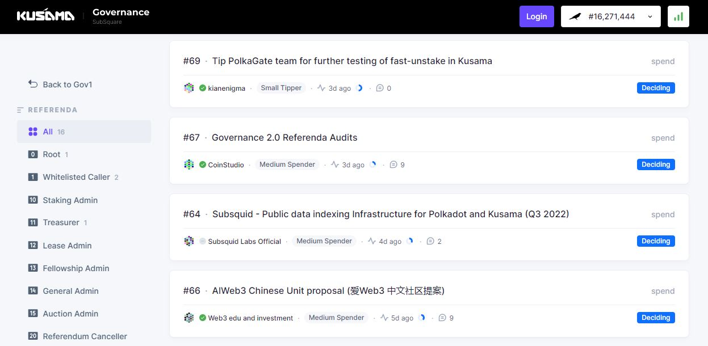
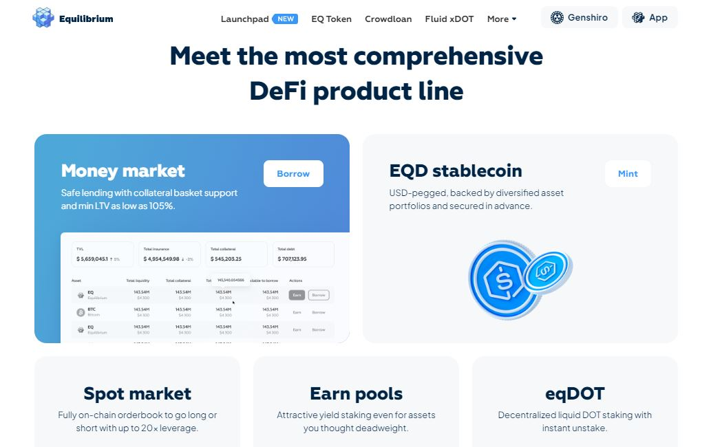
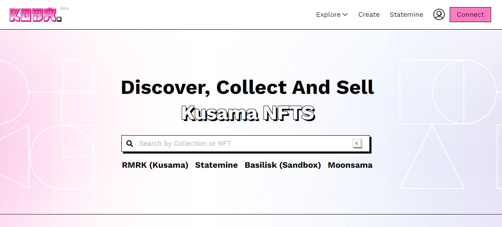
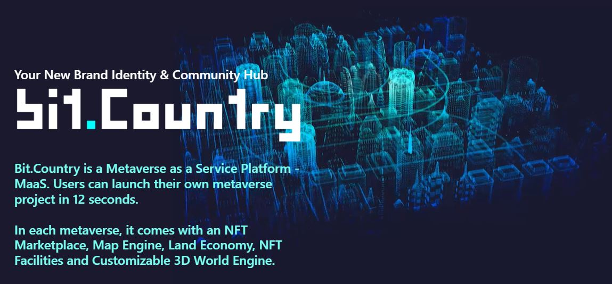
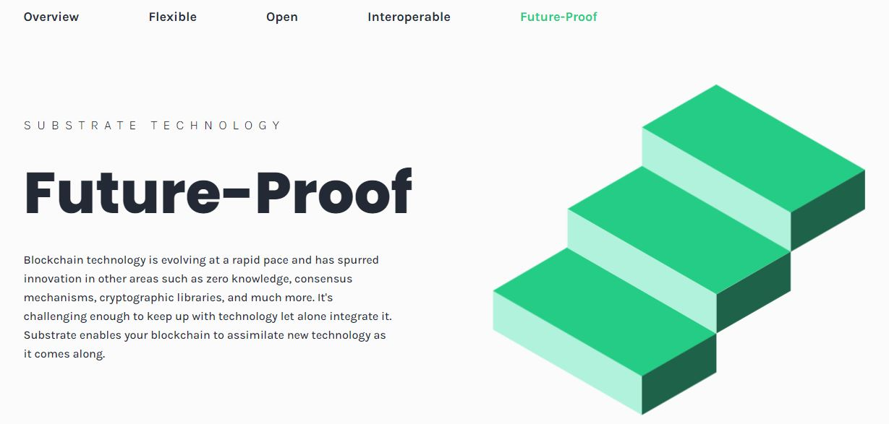
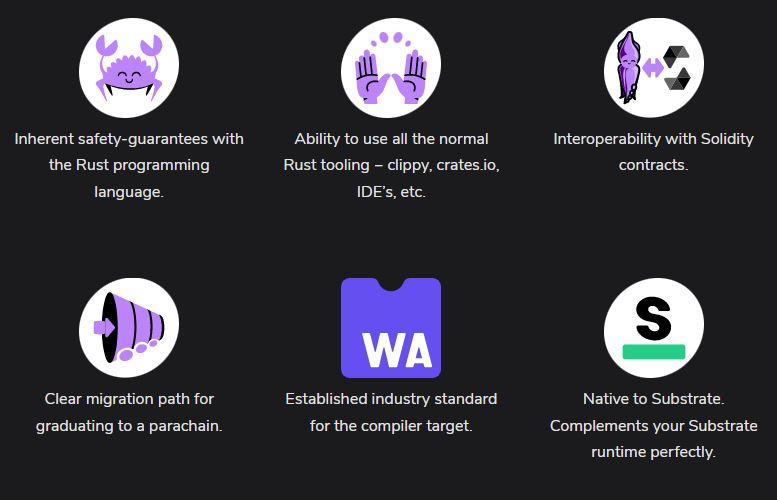
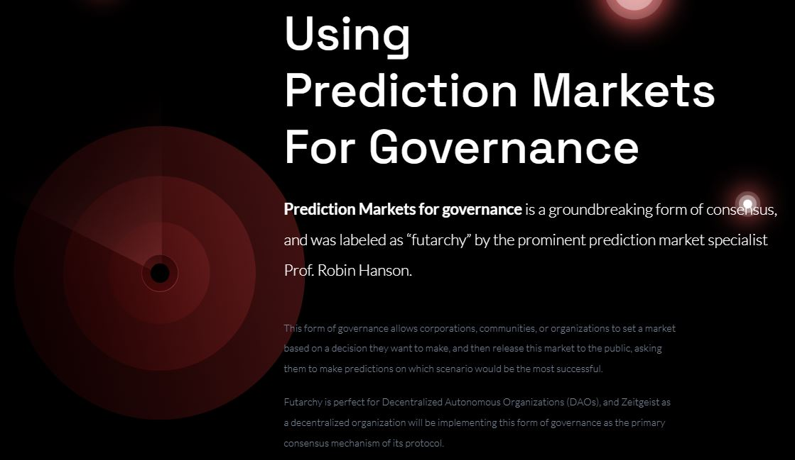
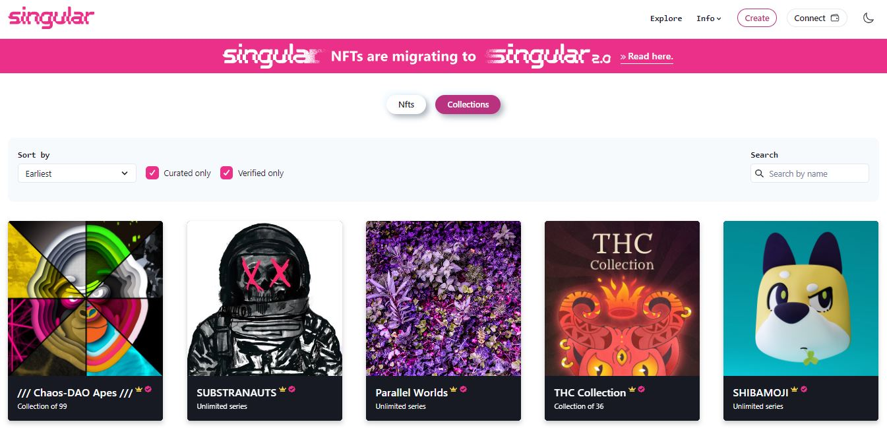
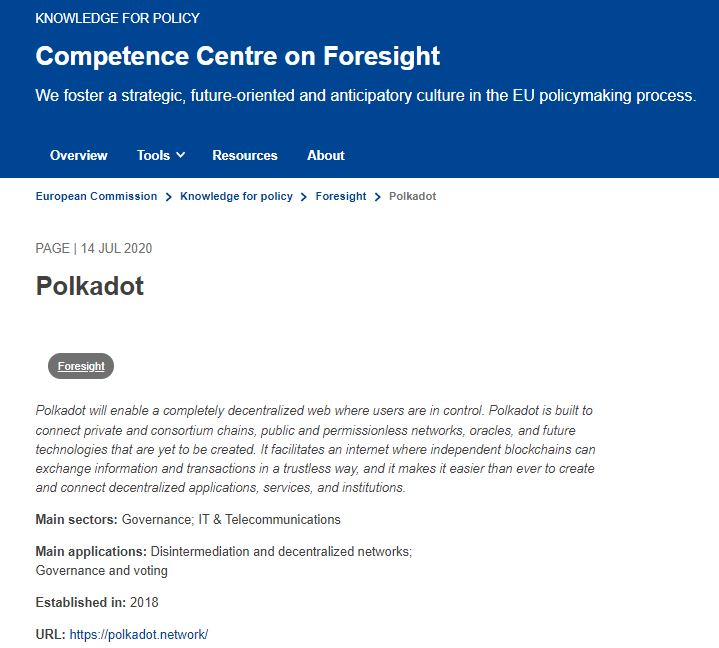

# Services

_<mark style="background-color:red;">Disclaimer: This article is written by</mark> <mark style="background-color:red;"></mark><mark style="background-color:red;">**Dot.alert()**</mark> <mark style="background-color:red;"></mark><mark style="background-color:red;">contributors for educational purposes only. This article should not be used as a substitute for competent legal advice from a licensed professional lawyer or attorney in your country.</mark>_

Blockchain technologies sustain a diversity of platforms from which token holders can access a wide range of digital services. In the Polkadot ecosystem, this convergence of custom-made applications, token-based economies, and trustless interactions is giving birth to a mesh of decentralised solutions called "[Web3](https://gavofyork.medium.com/why-we-need-web-3-0-5da4f2bf95ab)".

## Legal Frameworks:&#x20;

### Financials

Proof-of-Stake blockchains are designed to offer incentives to their participants so that they can help grow the value of the networks over time. In the Polkadot ecosystem, staking allows users to secure Relay chains' operations and earn some income. Meanwhile, [contributing to crowdloans](../../3.operations/crowdfunding/crowdloans.md) enables participants' access to services that cannot be provided on Layer-0 protocols. Additionally, networks come with on-chain treasuries that automatically accumulate a pool of native coins for their communities. Through on-chain governance, these funds can be unlocked to offer direct financial support to individuals and projects that build, maintain, or promote the networks.&#x20;

<figure><figcaption>
A list of Treasury spends submitted to the Kusama community on Subsquare.
</figcaption></figure>

Decentralised Finance (DeFi) represents a suite of financial services available on Parachains that expands on the utility of Relay chain coins. Dapps are built to facilitate operations such as [swapping tokens](../../3.operations/swapping/pairs-availability.md), borrowing by using prominent coins as collateral, paying transaction fees with various tokens, and lending coins. DeFi protocols allow network participants to make the most of their assets by introducing liquidity-generating solutions in staking, crowdloans, Non Fungible token (NFT) holding, and Real World Asset (RWA) tokenisation.  Furthermore, exchanging assets between networks no longer requires third-party bridges or routers. Instead, Parachains within the Polkadot ecosystem use a native cross-consensus communication system that is both fast and secure.&#x20;

<figure><figcaption>
Equilibrium proposes an expansive suite of DeFi services.
</figcaption></figure>

<figure><figcaption>
KodaDOT serves both Marketplace developers and NFT creators. 
</figcaption></figure>

Financial transactions also involve [peer-to-peer exchanges of assets within communities of like-minded individuals](https://anaelleltd.company/blog/2020/11/10/how-web-technologies-became-the-cornerstone-of-human-development-part-2/). Social Finance (SoFi) is a category of services that support the trade of resources linked to social standing and achievements. Decentralised Autonomous Organisations (DAOs), Metaverses, and Gameverses in the Polkadot ecosystem create or reuse marketplaces so that their members can purchase or sell valuable possessions (i.e limited edition pieces or rare collectibles) in exchange for their native coins. By contrast, decentralised social media platforms and DAO incubators encourage high standards of accountability and integrity through reputation systems in which participants can get rewarded in any currency.

<figure><figcaption>
Bit.Country is a full-featured platform for Metaverse services.
</figcaption></figure>

Commissioners and representatives from regulatory bodies are aware that, despite their novelty, financial solutions proposed in the blockchain space tend to reproduce structures seen in traditional markets. Given that DeFi processes rely almost exclusively on programming languages and on-chain data, [information asymmetry persists and tends to be reinforced over time](https://www.sec.gov/news/statement/crenshaw-defi-20211109). This creates a range of opportunities for those who are privy to market-moving information at the expenses of other less digitally-literate participants.&#x20;

### Technologies

Blockchain networks have given birth to a renewed digital infrastructure that contributes to its decentralisation and adoption by the general public. Engines, nodes, explorers, wallets, and APIs form the core of these global systems that strive to beat censorship and remain "unstoppable". In the Polkadot ecosystem, Substrate proposes re-usable code that infrastructure builders can quickly adapt and extend to create, test, launch and maintain their own permissionless blockchain network's operations.&#x20;

<figure><figcaption>
<a href="https://substrate.io/technology/future-proof/">Substrate</a> is the blockchain development framework that powers Polkadot technologies.
</figcaption></figure>

Blockchain transactions are the most basic operations needed to submit information on-chain so that the state of the network can be changed. This transmission of data between participants underpins the value proposition of decentralised networks because it relies on programmes (i.e Dapps, Smart contracts, and Bridges) as authenticators, agreements, and routers. Within the Polkadot ecosystem, application-specific blockchains secure the execution of native (i.e WASM-based) programmes via an innovative deposit system for on-chain deployment and storage.

<figure><figcaption>
A summary of the core features of <a href="https://use.ink/">Ink!</a> programming language for Smart contracts.
</figcaption></figure>

By design, data stored on permissionless blockchains remains permanently accessible to the general public on a global scale, due to the distributed nature of digital ledgers. It is this unique characteristic of blockchains that is now powering experimental use-cases that were previously considered too niche to yield public interest. Currently, parachains of the Polkadot ecosystem are delivering advanced services such as a subscription model for IoT transactions fees, an auto-compounding facility for staking rewards, a protocol for prediction markets, a bot-friendly decentralised exchange for high-frequency trading, and a full-featured creative suite for metaverse builders.

<figure><figcaption>
Zeitgeist enables network participants to collect unique insights within their communities.
</figcaption></figure>

For policy makers, the technologies that surround blockchain networks are mostly perceived as profoundly disruptive because of the radical changes they introduce in the way governments, businesses, societies, and people interact with each other.  Influential world leaders consider blockchain solutions to be part of the [Fourth Industrial Revolution](https://www.weforum.org/about/the-fourth-industrial-revolution-by-klaus-schwab), which can be supportive of Human development in the long term. As a result, there has been a push for more educational reports and special investigations focused on blockchain technologies to inform the observations and decisions of lawmakers.

## Risk Management:

### Operational Risks

In emerging ecosystems, platforms that conveniently consolidate a range of services from one interface drive the adoption of their underlying blockchain technologies. Unfortunately, network participants looking to build, operate, or conduct business are often quick to onboard these new platforms without exercising due diligence on behalf of their customers. In recent times, numerous NFTs holders have reported on their loss of valuable digital assets as a result of hacks and [fraudulent operations on decentralised platforms](https://www.justice.gov/usao-edny/pr/non-fungible-token-nft-developer-charged-multi-million-dollar-international-fraud).&#x20;

<figure><figcaption>
Singular facilitates users' access to unique NFT collections through a verification process.
</figcaption></figure>

Blockchain technologies and the services that they host tend to fall outside the scope of regulators' oversight. In some countries, government officials are choosing to warn dapp builders and users about assets security risks and the need to have appropriate mitigating strategies in place. In other geographical areas, blanket bans of decentralised platforms have been declared but remain a challenge to implement in practice without an educated taskforce.&#x20;

### Jurisdictional Risks

The proliferation of DeFi protocols targeting retail users and institutional traders have put platforms that offer decentralised services under the spotlight of regulators and government representatives. In a bid to enforce consumer protection across these decentralised industries, some legislators are proposing that [software engineers and developers be accountable and legally responsible for damaging bugs](https://www.linkedin.com/pulse/how-commission-set-out-torpedo-web3-without-even-realizing-?trk=public\_post-content\_share-article).&#x20;

<figure><figcaption>
Polkadot is one of 10 projects selected by the <a href="https://knowledge4policy.ec.europa.eu/foresight/topic/dlt4good-scanning_en">#DLT4GOOD Scanning</a> initiative from the EU commission to showcase the diversity in the field of blockchain technologies powering Social and Public good.
</figcaption></figure>

Lawmakers have doubled up their efforts to provide legal guidance to stakeholders of decentralised networks through various publications. But there is still a gap in regulators' knowledge and understanding of these technologies that is causing friction with individuals and entities that are spearheading industry innovation. Meanwhile, the debate on which commissions or cabinets should overlook cross-border blockchain-based services is still ongoing.

